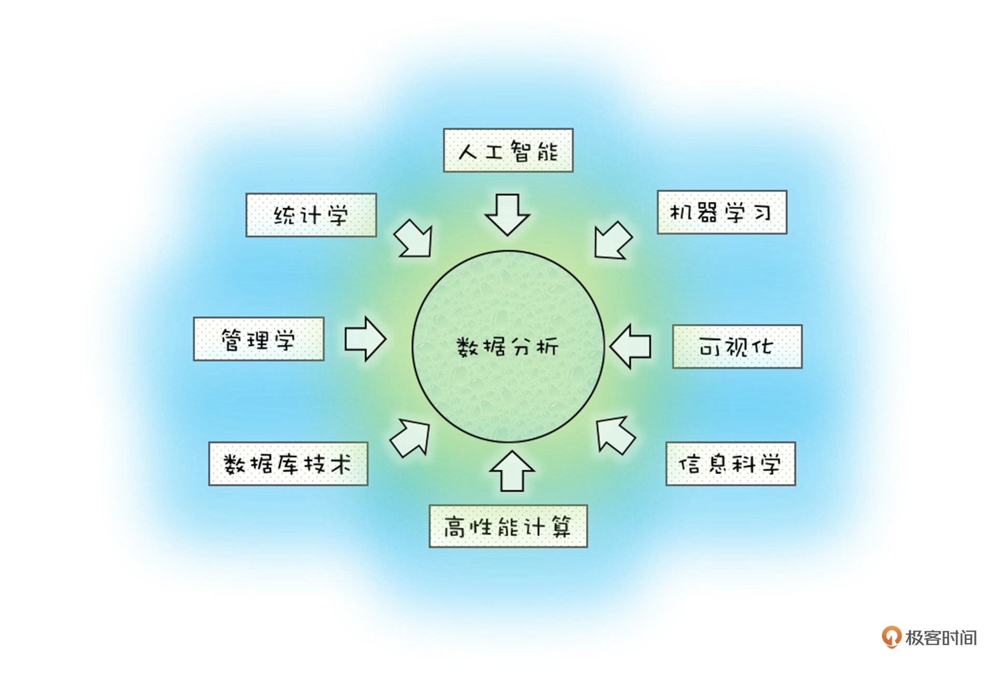

# 数据分析思维课
数据看似客观，人看似主观

# 数据时代，思维的小把戏
***辛普森悖论***
*** 赌徒谬误***
在这个数据多的时代，我们缺乏的不是工具、算法，而是数据思维。

再看待同一件事情的维度和以前不一样了，你可以用数据的维度来诠释你身边发生的事情，用数据的思维来做出你的判断。

这个是一门通识课，而非一门专业课。

**场景化**，而非图像化

数据分析远非如此：
再比如，你带了一个十人的团队，每个人都有自己的优缺点和性格，每次一提到团队管理你就头大，因为内心总是混乱的，没有一条主线。但是不知道你想过没有，这十个人也是数据，你可以根据“四象限法”对他们进行分类，能力是纵轴，意愿是横轴……最后看看谁是你最应该提拔的人才。

所以，其实只要你有心，生活之中，处处都藏着数据的学问。

买东西最低五折，只有少量商品是这样，还是过季商品，是极端值影响
作者回复: 是的，消费者被骗了就不再相信这个套路了。所以，有商家反其道行之，就是整体是正态分布，给出底均价，那就是十元店。美国的2家十元店叫dollargeneral和dollertree都进入世界500强了，反观这些最低五折的企业有多少能进入世界500强？坚持均值的长期主义才会胜利。

基金定价100，第一年末跌到90，第二年末涨回100，结果基金描述和我说，2年的平均增长率是正的…
作者回复: 哈哈，的确，数字是争取的，但是数字的逻辑是错误的

万物皆数据，小到数量的计算，大到宏观科学的分析。

我们要培养的是数据背后的思维，多一分思考，决策更有可能优选，使得利益更大化~
作者回复: 是的，要透过现象看本质

拼多多的微信现金提现，提现成功得耗一圈人脉和资源，顺带帮其打品牌广告

现金22.6元奖励，是某商品的满减2元，还必须是指定pdd的支付方式。

数据带我们看清背后的真相！！

------

在大数据里面我们针对的是个人的数据，这些数据量虽然很大，但是每行数据蕴含的信息量（也叫熵）很小，所以我们会用很多人工智能的数据挖掘算法，来帮我们在浩如烟海的数据里找到其中的珍珠。

而小数据往往是在企业经营范围内产生的，他们的数据量很小，但是他们蕴含的数据价值（熵）会非常大，所以分析的时候要更讲究，因为每一个数据背后都蕴含着大量的知识，我们要了解它背后的规律才能掌握数据的命脉。

