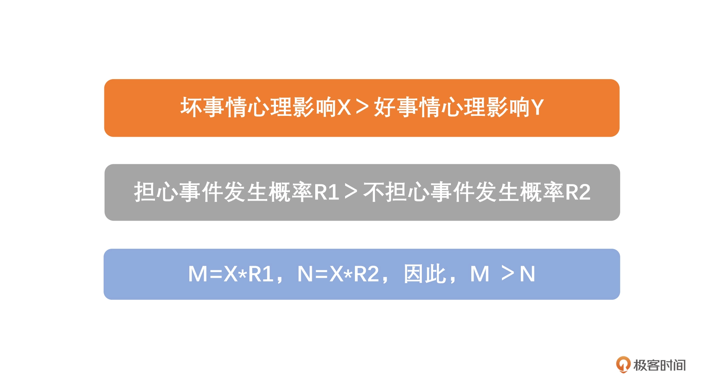

# 03 | 数据的期望值

生活中，一些小概率事情发生。
比如：不希望某件事情发生，这件事往往会发生。

## 墨菲的一个玩笑

1949 年，美国的一位航空工程师爱德华·墨菲与美国空军共同研究高速载人火箭“雪橇 MX981”，需要把 16 个精密传感器装在超重实验设备上测试耐压性。可即便是超重实验设备在巨大压力下都变形了，传感器也没有任何的指示。检查后才发现，原来是负责装配的三个同事把这 16 个传感器全都装反了。

对此，墨菲不经意间开了一个玩笑：“如果一件事情有可能出错，让他去做就一定会弄错”。随后的记者招待会上，他的上司斯塔普把这句话称为**墨菲定律**，并表述为：“如果有两种或两种以上的方式去做某件事情，而其中一种选择方式将导致灾难，则必定有人会做出这种选择。”

## 背后的数学原理

期望值：就对可能出现的结果以概率为权做加权平均。

## 解释墨菲定律
一般人有一个特殊的心理机制：就是倾向记住一些不好的事情。
墨菲定律的原理其实就是由我们对于**好事情和坏事情**的期望值差异造成的。

## 如何看待墨菲定律
在了解了墨菲定律后，我们可能会增加`备份计划`,降低预期等等。
对于风险来说，可以采取优化流程，提高自身能力，尽可能减少坏事情发生所引起的影响。

这些仅仅停留在方法层面。

不太自然，《中庸》上有讲：
**苟能己尽其性，则能尽人之性；能尽人之性，则能尽物之性；能尽物之性，则可以赞天地之化育；可以赞天地之化育，则可以与天地参矣。**

最终还是得回到自己身上，提高自己的见识，修养，自然物来就我，境随心转。