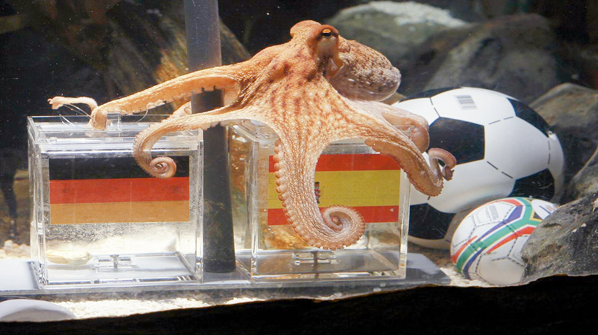

# 04 | 随机对照试验：章鱼保罗真的是“预言帝”么？

生活中，我们所接触到的随机，其实都是"伪随机"。

我们来玩一个小游戏：你现在闭上眼睛，马上在 0 到 20 之间想一个数，然后我来猜。

好，想好了吧？我可以告诉你，大概率你不会选 5 和 15 这两个数字。

不信的话，你不妨试一试，或者和朋友们玩一下这个小游戏。为什么我会这么确信你大概率不会选 5 和 15 呢，因为人脑在选择随机数的时候，会刻意规避一些有规律的数字，这反而让这些随机数变得“不随机”了。

同样，一般说的用户反馈的例子就很典型。大部分用户其实并不愿意花时间填写设计的调查问卷，一般愿意填写的都是对这个产品比较感兴趣的人，或者使用度比较高、希望产品能有一些改进的人。因此这样让用户填写反馈，往往会产生“伪随机”这个问题。

## 随机对照试验
随机对照试验是由"现代统计学之父"、数据分析的老祖宗---罗纳德·艾尔默·费希尔在《试验设计》一书中提出的。

当我们不知道客观世界里一个问题的真正答案时，可以用少量数据来验证非常大的数据规律。

随机试验的特点:一是`"随机"`,二是`对照试验`。

## 幸存者偏差并不是随机对照试验

这个是特别容易和随机对照试验混淆的概念。

**幸存者偏差**就是当取得资讯的渠道仅仅来自于幸存者时，我们得出的结论不符合实际情况。

幸存者偏差这个概念来源于二战时期，那时候有各种地面防空作战和空战，在密集的炮火下，战机机身上几乎所有地方都可能中弹，因此需要用统计学研究战机被击中的部位，从而确定哪个部分需要额外加强装甲。

对于返航的飞机样本来说，即使机翼中弹，飞机也有很大的纪律能够返航。但对于那些单孔话不多的部位来说（比如驾驶舱、邮箱和机尾巴),当这些部位中弹是1，飞机连飞回来的机会都没有了。

类似"预言帝"章鱼保罗,

你要知道：只要样本量足够大，就一定会出现一个“幸运儿”，能够“碰巧地”预测对所有的场景。世界杯的预测也是如此，这样大规模的赛事，会有很多人、很多生物参与赛果预测，如此大的样本量自然就诞生了本次预测的“幸运儿”，只是它的名字碰巧叫章鱼保罗罢了。没有章鱼保罗，我们还会有另一个“幸运儿”猫咪汤姆（这当然只是我杜撰的名字）

其实，**并没有预言帝和赌神的存在，我们看到的只是大规模数据背后的"幸存者"。**

所以我们要验证章鱼保罗能力的话，我们应该从一开始就把它安置在一个没有任何信号干扰的环境里让它连续预测十次，这样它的成功概率是 1%，我们还可以提高预测次数来检测它是不是真的有那么神奇的预测能力。

所以当你再看到类似“读书无用论”、“工作都是别人的好”之类的说法时，请你留个心眼，想想我们这节课讲的知识，这些说法到底是不是一种幸存者偏差？以及当你看到一些“成功学大师”向你兜售一些成功心法时，不要盲从所谓的权威，如果有可能，我们最好站得高一些，从多个经济周期的维度去评判某件事物或者某个人。

最后，不要总想着如何从成功者那里学习如何成功，也要从失败的人那里总结为什么会失败，因为成功很大程度上来说，就是一个去避免失败的过程。毕竟别人的成功你不一定能复制，但别人踩的坑，你若不注意，很大几率你也会摔一跤。
