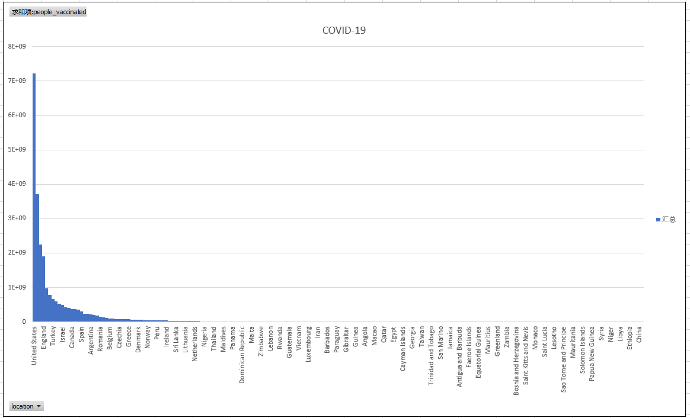

# 05 | 直方图与幂分布：为什么全世界1%的人掌握着50%的财富

## 直方图与柱状图

1.   直方图是展示数据的`分布`，而柱状图是比较`数据的大小`;
2.   直方图是针对定量数据的**定性**分析，柱状图是对分类数据的**定量**数据分析;

-   *从表现形式上来对直方图与柱状图加以区分*

1.  从柱子的间隔来说，直方图的柱子之间**没有间隔**，而柱状图之间柱子是**有间隔**的。
2.  从柱子的宽度来说，直方图的柱子宽度可以不一样，而柱状图的柱子宽度必须一样。

对直方图来说，它的柱子宽度代表区间的长度，根据区间的不同，柱子宽度可以不同。但柱状图的柱子宽度没有数值含义，所以宽度必须一致。你可以看看下面的这张图，这是美国人口普查局（The U.S. Census Bureau）调查 12.4 亿人的上班通勤时间的直方图，最后右侧的直方柱子就像一个矮胖子一样，直接蹲在地板上了。

## 直方图的神奇
直方图最早是由数据统计学家Karl Pearson在1891年引入的。

但是当我们用直方图把这些数字给表示出来的时候，神奇的事情发生了。你会清晰地发现，拿全球所有的国家这个范围来看，其实绝大部分的病例都发生在极少数的国家里，就像下面这幅图一样。

而且这样的分布并不是个例，我们现在把目光转向亚马逊丛林。亚马逊地区有着全球树种最丰富的雨林，科学家已将亚马逊地区将近 16000 种树种编入物种目录。尽管亚马逊雨林呈现出如此多彩的物种多样性，科学家们还是发现在其中有 227 种树种牢牢占据主导地位，这些树种的分布面积几乎占到了整个亚马逊雨林面积的一半，也就是说仅 1.4% 的树种就占据了整个地区的 50%，画出图来也和上面的图形类似。

直方图所体现出来的呈指数下降或者上升的分布形式，科学家们把它叫做"幂律分布"。

同理，短视频平台也是如此：

同理：

在语言的使用和病毒的传播当中也是同理。开始的微妙的优势会随着时间逐步加强，最后就能占领绝对优势，就像滚雪球一样，越滚越大。

拿美国来说，它的医疗水平能力确实很强，但是由于美国对待疫情的态度并不够重视，病毒在美国其实是占据传播的优势的。所以强如美国，最后也被新冠给好好上了一课。

我们从直方图讲到了幂律分布。这个统计学规律告诉我们，我们身处的世界是赢者通吃的世界，开始时细微优势最终将带来无穷多的回报。

反之，最初的细微劣势也将导致最终一无所有。这个现象也有人称之为`“马太效应”`，在圣经《新约·马太福音》中是这样描述的：“ 凡有的，还要加给他，叫他多余。没有的，连他所有的也要夺过来 ”。

我们耳熟能详的`帕雷托法则`（也就是`二八法则`）、`马太效应`都是来自`幂律分布`。这个数字分布其实有很多点值得我们去思考，你可以尝试多在日常的工作以及生活里用一下它，或许能够给你一些意想不到的惊喜。 

## 总结：
天之道，损有余而补不足；人之道，损不足而奉有余。孰能有余以奉天下？唯有道者。越是自然形成的越符合正态分布，越是人为制造的越符合幂律分布。法天相地，终究不可得。然此不可得，正是有所得。得失之道，名为人道，实乃天道。
