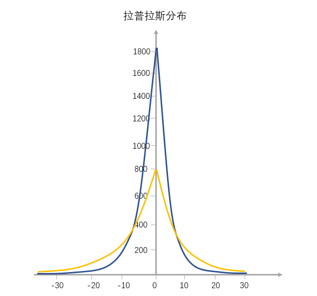

# 06 | 数据分布：房子应该是买贵的还是买便宜的？

其实在实际生活中，最常见的是正态分布和拉普拉斯分布，这两个分布反映了现实生活当中隐藏数据背后的“势”。

-   正态分布
    -   人的身高分布或者体重分布
    -   A/B 测试、用户反馈都是随机分布的（符合正态分布）
-   拉普拉斯分布
    -   房价，股市
  
## 正态分布

课本上曾经学过的，两头低，中间高然后左右轴堆成的种形曲线。
最早用正态曲线描述数据的人，就是那位德国人高斯，为了纪念他，有时候我们也把正态分布称为**高斯分布**。

但是，正态分布这个名字不是高斯取的，而是达尔文的表兄弟弗朗西斯·高尔顿命名。高尔顿开创了遗传学的统计研究，并用正态曲线来表明他的研究结果，这个名字后来广为流传。

学术上的定义：
**如果一个量是由无多微小的独立随机因素影响的结果，那么就可以认为这个量具有正态分布。**

### 中心极限定理和大数定律的区别

我看到网上很多人都把`中心极限定理`和`大数定律`放到一起来谈，你可能听过这样一句话：“在随机原则下，当抽样数目足够多的时候，样本就会遵照大数定律而呈正态分布”，这其实是不对的。

大数定律研究的是随机变量序列依概率收敛到其均值的算术平均，说白了就是为了说明**频率在概率附近摇摆**，也为我们将频率当作概率提供了依据。

而中心极限定理要求的是`独立随机样本`, **中心极限定理下，随着样本趋于无穷大，`独立随机样本和`的分布会越来越像正态分布**。

### 拉普拉斯分布

全国的城市房价分布、一个城市当中的小区房价分布现在也是符合拉普拉斯分布的。因为在信息透明和市场竞争的情况下，工资、房价、股票都会符合一个特点：越塔尖的个体越具有**资源吸附能力**。

那么在整体资源恒定的情况下，这已经不是一个简单的符合随机分布的市场了，简单来讲，“大势”变了。

>其实，越是人为的因素加的多，那么这个分布会越“尖”

比如说在改革开放之前信息不对称，资源也相对没有那么聚集，人们拿到的工资是一个正态分布的。但是到了现在，就我们程序员的工资来说，一个顶尖的程序员和普通的程序员的工资收入可能会差十倍都不止，这就会导致更厚的尾部和更高的峰度。

所以当你在做数据分析的时候，一定得先考虑一下，原有的数据分布模型是否还适用于现有的市场情况？准确把握住数据分布这个大势，我们才能够做出更为正确的决策。就拿买房这件事来说吧，买房是一个我们基本都绕不开的话题，在你买房前，你可以先判断一下你要买的房屋的房价在这座城市里是正态分布还是拉普拉斯分布。

## 小结
更进一步来说，这两个数据分布其实给我们的工作生活也有一个大的启示，那就是为什么会有这样一句话的流行：**“Work Hard, Play Hard”**，因为这句话背后的含义其实是指当你要获得更多的自由的时候，你也要付出同等的甚至更多的自律（控制自己既能使劲玩也能使劲工作）。当今社会的人才分布是呈拉普拉斯分布的，我们要争取做顶尖，这样才会有更多的资源和机会。