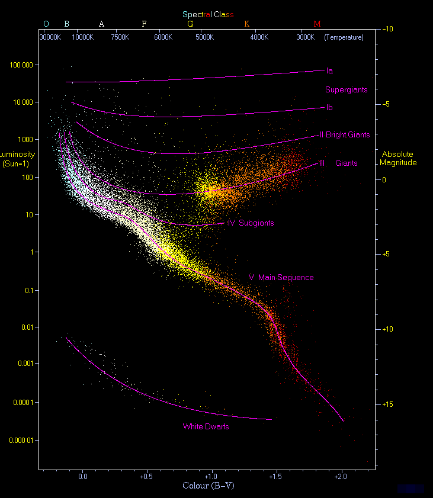
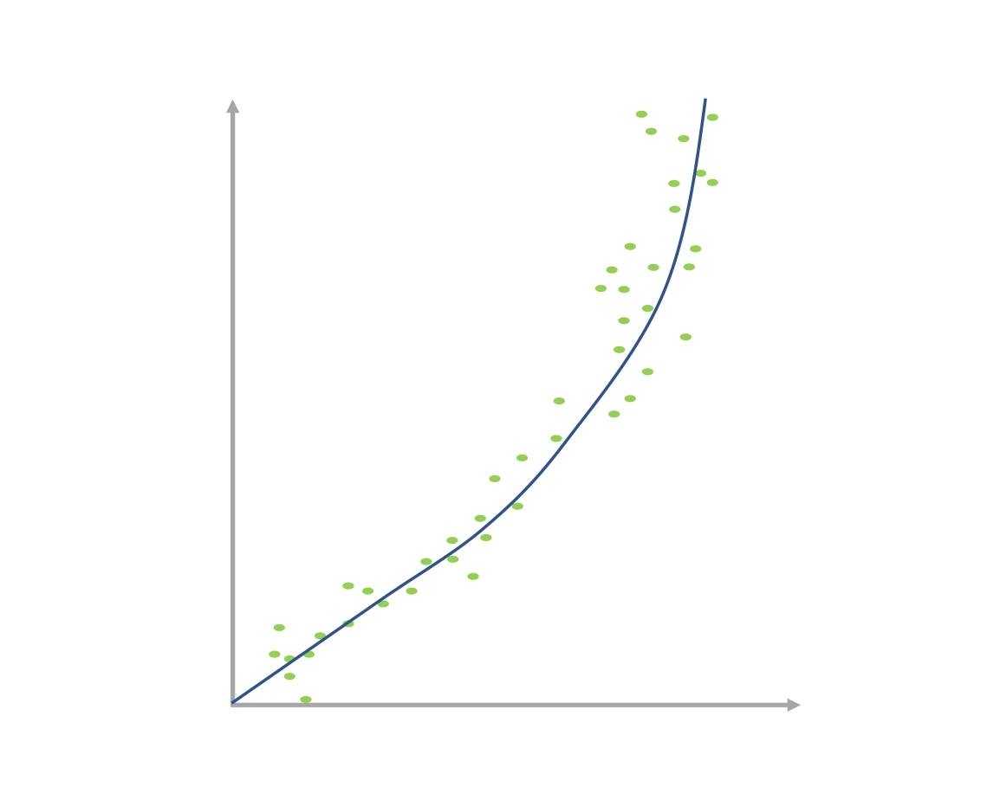
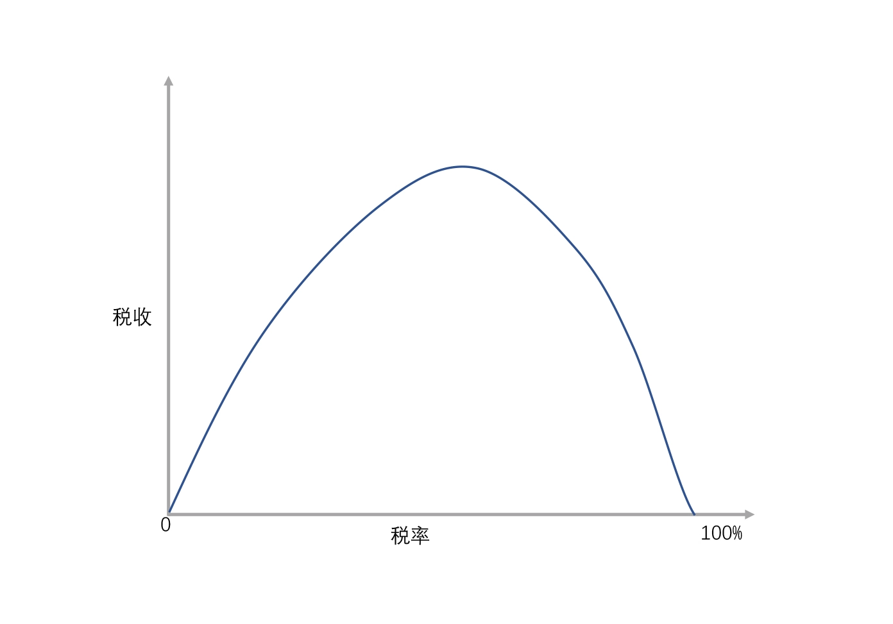

# 07 | 散点图和相关性：从数据中找到规律

一个简单的发现数据趋势规律的工具。

## 散点图的历史
散点图被称为万图之王。在1913年，美国一个叫亨利·诺里斯·罗素(Herry Norris Russell)的天文学家用散点图把宇宙的趋势揭示了出来。

罗素同学利用散点图把 2200 颗恒星按光谱和亮度两个参数进行分析，将恒星光度（或绝对星等）为纵轴、以恒星的光谱类型（或表面温度）为横轴:

通过这个散点图，罗素画出了一条趋势线，这条趋势线揭示了恒星从原恒星到红巨星到红白矮星、黑矮星的一个演变的过程，这就是著名的赫罗图。换句话说，这个散点图揭示了恒星这一生的秘密。

看，散点图可以帮我们解释宇宙的秘密。但这还没有结束，后来哈勃（对，就是以他的名字命名哈勃天文望远镜那位），也利用散点图找到了大爆炸理论和解释宇宙膨胀思想的一个关键证据。

## 散点图的制作原则

-   散点图反映的是**两个变量之间的关系**
-   为了能够明确展示数据之间的趋势，Y轴必须从0开始。另外，散点图坐标轴`颗粒度`要合适。
-   为了表示趋势的清晰，我们一般都会添加一条**趋势线**来表明背后的规律。

## 通过散点图寻找规律
一般是：
-   **正相关**，
-   **负相关**
-   指数增长

正 U 型趋势和反 U 型趋势，这两个也是比较常见的趋势线。它的样子其实就像字母的 U，或者是倒过来的 U（从零开始从零结束）。一个比较著名的反 U 型趋势就是经济学里面的“拉弗曲线”（ Laffer curve），这条曲线最典型地反映了政府税收收入和税率之间的关系。

U 型曲线在很多场合也适用，例如员工工作时长和公司收入的关系（适度 996，不要 007），客户满意度与公司利润的关系（没有口碑的公司破产了，不加控制让客户全部高度满意的公司也都破产了）。

而数据分析的艺术就在于通过数据分析和管理经验找到反 U 型最高点，如果你能很好把握你所在公司的反 U 型曲线高点，你大概率是公司的管理层了。

这些是常规的散点图。

### 散点图的易错点

-   趋势误判，没有正确的数据验证，千万不要轻易下结论（身高和体重在生长期是成正比的，你成年了自然也就不会再是正比了）；
-   实际数据是不是蕴含了所有的数据，还是只给你看来最有这种数据规律的数据。做事情无论成功了还是失败了，都不要用上天的安排来麻痹自己）
-   分析散点图看到了规律，还有连接最终这个规律形成的境况，不可轻易下结论。（不要片面看问题，别人家的孩子真的不比我们好多少）；

## 总结
在工作和生活当中，每天都会有各种各样的事发生，如果我们只是关注事情本身，而没有看到背后的规律，
那么我们就会像没有趋势线的散点图一样，都是零散的点，抓不住背后隐藏的那根线，感觉每天都是忙忙碌碌，但其实自己碌碌无为。

画这根线就是要找到你生命里的规律，在数据科学里我们叫做算法，生活当中我们叫做哲学

