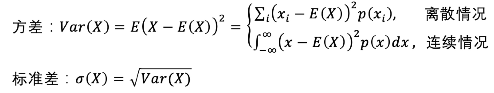

# 08 | 标准差：靠谱其实看标准差

了解了平均值之后，也讲了大数定律：那么
怎样能快速看清一组数据的大概情况

## 标准差
它表示一组数值和平均值相比分散开来的程度。

当然实际做数据的时候，我们常会用另外一个数据来规避这种问题，
**离散系数CV(coefficient of variation)**
计算公式：**离散系数 = 标准差 / 平均值**,这样的话就规避了单位或者其他因素的这些差异。

## 标准差的具体使用
同样，对应到做管理上，比如我做 CTO 管理程序员的时候，我会去留意大家提交代码的节奏。有的人就是喜欢所有事情都到最后一天才完成提交，有的人就喜欢平均用力，在各个时间段里都有提交。

用标准差来看，你就会发现有的人标准差非常大，属于突击型选手；有的人标准差很小，属于细水长流型选手。对于标准差比较大的人，他的风险就比较高，因为他有可能最后关头完美完成任务，也有可能拖延症拖到最后事情没有完成，最后整体的平均值都没有达到；而按部就班的人，他的标准差比较小，优势是比较稳定，但是突破性可能不够强。学到这里，你也可以试着评估一下你的工作节奏，你是属于哪一种选手呢？

而在做投资的时候，标准差也是一个重要的风险/收益衡量指标。比如，你看我们在银行储蓄，这个利率波动就很小，相应地标准差很小；股票的波动就会大一些，收益的标准差也会比较大；你再看比特币，一会儿马斯克一句话翻好几倍，一会儿跌 30%，炒币收益的标准差可能是银行收益标准差的上万倍，股票的上百倍。

## 标准误差
说完标准差，我们来说一下它的孪生兄弟：标准误差。

这两个概念之间最大的差别其实就是在于，标准差是针对确切一次的已知统计结果，反映的是在一次统计中，个体之间的离散程度，也可以说**标准差是针对具体实例的描述性统计。**

标准差代表一种推论的估计。

标准差（Standard deviation）= 一次统计中个体分数间的离散程度，反映了个体对样本整体均值的代表性，用于描述统计。

标准误差（Standard error）= 多次抽样中样本均值间的离散程度，反映了样本均值对总体均值的代表性，用于推论统计。

标准误差经常会被用于拿出一部分样品去判断整体产品线的产品质量，或者判断一个事情是不是属于常见范围。比如说我们常见的六希格玛（Six Sigma），

其实就是指所有的产品质量问题需要控制在 6 个标准误差里面。你听到的产品质量或者运维故障控制在 3 个 9 或者 5 个 9，说的也是误差范围。5 个 9 的意思就是 99.99966% 的产品是没有品质问题的。

6 个标准误差（也就是 6-sigma）也就代表着要控制到在生产的产品中，有 99.99966% 的产品是没有品质问题的（每一百万件产品中只有 3.4 件有缺陷）。

比如：日常生活中，常见的千足金。

## 总结：

看一个人、一个企业、一个投资产品靠不靠谱，除了人办事情的成功率、企业收入平均值和产品的盈利率，你还要看它标准差是怎样的。有可能这个所谓的“成功人士”只成功了一次，赚了一大笔钱，但是其实别的事他都失败了，那说明这人的标准差很大，有可能他就是靠运气，不太靠谱。
我们中国人其实是比较喜欢“中庸”的这种感觉，用标准差的视角来看，就是自己做事做人的标准差要小。

对标准误差来说，我送你一个成语，叫做“严于律己，宽于待人”。前半句是指我们在工作和生活中，要尽量少出错，甚至是不犯错，这样不仅做事漂亮，领导喜欢，而且这种不断追求完美的理念，会一直推着我们往前跑。你可以试试，把六西格玛的思想不仅用在工作中，也用在生活里，对自己高标准、严要求一段时间，相信你会获得更进一步的成长。后半句是说，躺平无罪，奋斗有理。我们可以用六个标准误差来要求自己，但是别人也有用一个标准误差要求自己的自由。如果用一句话来概括，希望你尽量把自己做人做事的标准差变小，提高对自己的标准差预期。

