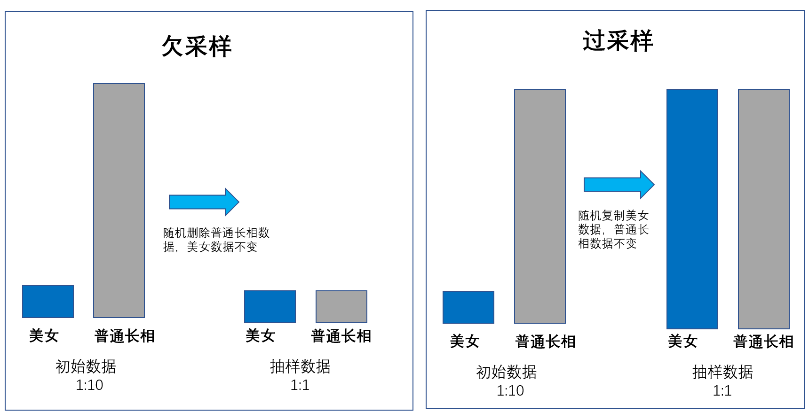

# 09 | 数据抽样：有大数据还需要抽样吗？

人口普查、调查问卷、人工智能训练过的采样等等都是抽样的方式。
之前学习的随机对照分布、直方图、散点图等等内容，它们数据的来源其实大部分也都是来自于抽样数据形成的数据。

用好了数据抽样，你就不必大费周章的去拿到每一个人的数据，可以“四两拨千斤”。

# 小数据下的抽样
-   简单随机抽样
    -   简单随机抽样就是从总体 N 个单位中随机地抽取 m 个单位作为样本，使得每一个样本被抽中的概率相同。
-   系统抽样
    -   系统抽样方法就是依据一定的抽样距离，从整体中抽取样本。
    -   系统抽样解决了在随机抽样执行过程中无法真正随机的问题。但是这个方法依然有缺点，比如我们即使在每个街区上去找人抽样，你会发现在印度外出的男人比较多，而且大部分都是成年人。
    -   
-   分层抽样
    -   分层抽样就是将抽样单位按某种特征或某种规则划分为不同的层，然后从不同的层中独立、随机地抽取样本，从而保证样本的结构接近于总体的结构，提高估计的精度。
    -   分层抽样的可执行性太差了，根本没法在印度当地细分出这么多的层，然后再让调查人员去分不同年龄段、不同地区、不同性别分别统计。
-   整体(群)抽样
    -   整群抽样就是将总体中若干个单位合并为组（这样的组被称为群），抽样时直接抽取群，然后对所选群中的所有单位实施调查。

# 大数据是否要抽样？
维克托·迈尔·舍恩伯格的《大数据时代》。
舍恩伯格提出的三种大数据时代的思维变革：要全体不要抽样、要效率不要绝对精确、要相关不要因果。

大数据也没有逃脱数学的法则，在允许一定误差的情况下，抽样可以大幅缩减参与计算的数据量，这和舍恩伯格提到的“要效率不要绝对精确”是一致的。所以在大数据下的统计分析可以沿用小数据的抽样算法，这一点是具有理论基础的。

其次，在做数据分析时，对数据质量的要求远远大于数据量的，所以数据并不是越多越好。而抽样过程能帮助我们控制有效数据的比重，了解数据的构成。

最后，从数据量级来看，每年的数据量级都以指数级增长，当 IoT 数据时代来临后更是爆炸式增长。我们期待的数据分析是可以数秒内反馈的，这样能提高数据分析师的分析效率，合理的抽样方法可以有效提升计算效率。

上次遇到舍恩伯格时，我问了他类似的问题。他给我的回答是：“大数据并不是否定统计学，大数据是一个综合了统计学、工程学、人工智能等的综合学科，扩展了这些学科的边界。”我想这也是对这个问题的正式回应，大数据并不是否定原有的统计学原理，而是用工程能力扩展了统计学和数学。

## 大数据中的抽样算法

### 蓄水池算法
想象一下上班时间的北京地铁

### 过采样和欠采样
大数据里因为数据非常多，所以往往某一类的数据远高于另一类数据，而这些数据都直接给我们下一章讲到的人工智能算法的话，我们造出来的人工智能可能就学坏、学歪了，因为人工智能就像一个小孩子，你教给它什么，它就学什么，你天天告诉它麻子脸的人是美女的话，将来它的审美就是如此。

师也过，商也不及。
过了和没过都是不及。

## 小结
数据其实不是数据抽样的终结者，无论是大数据还是小数据，它都无法逃离统计学、数学、集合论、数据结构等这些基础理论的约束。

合适的算法便是好的。