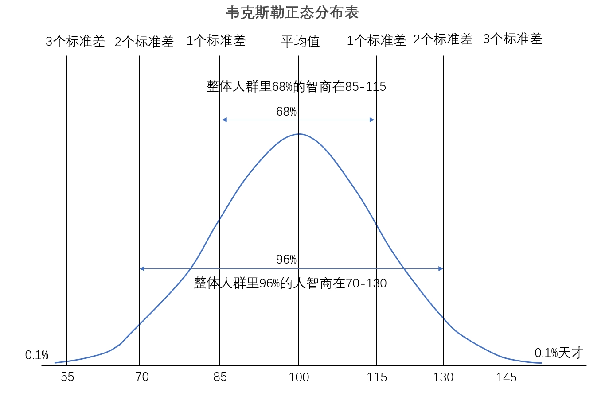

# 10 | 指数和KPI：智商是怎么计算出来的
用指数描述的东西，都是一个长期存在或者需要大分为衡量的事情。

-   空气污染指数
-   股票的上证指数
-   用户忠诚度指数到智力指数（IQ）

指数的定义
> 变量值 除以 标准值 乘以 100

## 智商（IQ）
我们能用一个固定公式来去囊括所有年龄的人吗？显然是不可行的。因为如果用大人的聪明程度去死板地衡量一个孩子，很可能就把一些特殊的聪明孩子给耽误了。

在 20 世纪初，法国心理学家比奈和他的学生编写了世界上第一套智力量表，后来心理学家推孟把这套量表介绍到美国，将其修订为斯坦福 - 比奈量表，并用标准测试题得出的心理年龄与生理年龄之比，作为评定智力水平的指数，这个比被称为智商。

IQ = MA(智力年龄即心里年龄) / CA(实际年龄) X 100
这个公式本身的问题。

所以目前最流行的智商计算方法：韦克斯勒的离差智商，它的基本原理就如同正态分布的原理一样。

韦克斯勒的量表是一个平均值为 100，标准差为 15 的一个正态分布曲线。在用韦克斯勒的方法测量智商的时候，你得先做一组标准的测验题，然后再将你的得分套用到韦克斯勒正态分布表（韦氏量表）中对应，这样就能得出你的智商值了。

当然，由于年龄差异的问题，韦氏量表也分为韦氏成人智力量表、韦氏儿童智力量表和韦氏幼儿智力量表这三套量表，可以用于检测所有年龄段的智商。

我们要制定某个指数，比方说设定 KPI 的时候，我们要注意不要光看公式的建立，而是要把一系列定义调整的制度算法规定出来，否则很多 KPI 项目最后 KPI 完成了，但其实公司目的并没有达成。

话说有一天，小王发现路边上有两个人在热火朝天地干活：一个人在前面挖坑，土坑挖完后，后面的那个人赶紧跑上去把坑重新填上。小王就很疑惑，这不纯属在瞎忙活嘛！于是小王上前询问二人为什么要这么干。最后一问发现，原来是负责种树的那个人请假了，只剩下挖土填坑二人组自己完成自己的 KPI，而没有完成种树这个目标。

所以最近新流行的管理方法 OKR，其实是为了规避 KPI 管理的一些缺点，在某种程度上借鉴了指数建立和调整的规则：建立好目标 O 之后， KR 可以进行动态监测和调整，并为之建立一套分层和计算调整体系。这里最关键的是对 K（也就是 key messuarement）的定义和相关的针对 O 的调整方法，和今天所讲的指标的定义和管理方法很类似，这套方法没定义好，不管是 KPI 还是 OKR 都很难有好的管理效果。

