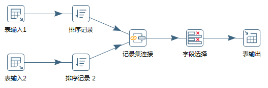

# 12 | 数据集成：这些大号一共20亿粉丝
    数据集成就是将多个数据源资源合并并存放在一个数据存储中（如数据仓库）,
    从而方便后续的数据挖掘工作。

    根据统计，大数据项目中80%的工作和数据集成有关，这里的数据集成有更广泛的意义，
    包括数据清洗、数据抽取、数据集成和数据变换等操作。

## 数据集成的两种的架构：ELT和ETL
    数据集成是数据工程师要做的工作之一，
    ETL 是Extract、Transform和Load的缩写
    即数据抽取、转换、加载

`一生二，二生三，三生万物。`

-   根据转换发生的顺序和位置，数据集成可以分为 ETL 和 ELT 两种架构

-    ETL的过程为提取(Extract)---转换(Transform)---加载(Load)
-    ELT的过程为提取(Extract)---加载(Load)---变换(Transform)
----------------

目前数据集成的主流架构是 ETL，但未来使用 ELT 作为数据集成架构的将越来越多。

## ETL 工具
    介绍完了这两种架构，你肯定想要知道 ETL 工具都有哪些？
    典型的 ETL 工具有:
-   商业软件：Informatica PowerCenter、IBM InfoSphere DataStage、Oracle Data Integrator、Microsoft SQL Server Integration Services 等
-    开源软件：Kettle、Talend、Apatar、Scriptella、DataX、Sqoop 等
    
    相对于传统的商业软件，Kettle 是一个易于使用的，低成本的解决方案。
    国内很多公司都在使用 Kettle 用来做数据集成。
    所以本文章重点给你讲解下 Kettle 工具的使用。

### Kettle 工具的使用
    Kettle 的控件比较多，内容无法在一节课内容中完整呈现，我只给你做个入门了解。另外给你推荐一个 Kettle 的开源社区：http://www.ukettle.org 

    Kettle 是一款国外开源的 ETL 工具，纯 Java 编写，可以在 Window 和 Linux 上运行，不需要安装就可以使用。
    
    Kettle 中文名称叫水壶，该项目的目标是将各种数据放到一个壶里，然后以一种指定的格式流出。Kettle 在 2006 年并入了开源的商业智能公司 Pentaho, 正式命名为 Pentaho Data Integeration，简称“PDI”。
因此 Kettle 现在是 Pentaho 的一个组件 [下载地址][1]

### 阿里开源软件：DataX    
    在以往的数据库中，数据库都是两两之间进行的转换，没有统一的标准.
    但 DataX 可以实现跨平台、跨数据库、不同系统之间的数据同步及交互，它将自己作为标准，连接了不同的数据源，以完成它们之间的转换。

### Apache 开源软件:Sqoop
    Sqoop 是一款开源的工具，是由 Apache 基金会所开发的分布式系统基础架构。
    
    Sqoop 在 Hadoop 生态系统中是占据一席之地的，它主要用来在 Hadoop 和关系型数据库中传递数据。
    
    通过 Sqoop，我们可以方便地将数据从关系型数据库导入到 HDFS 中，或者将数据从 HDFS 导出到关系型数据库中。
    
    Hadoop 实现了一个分布式文件系统，即 HDFS。Hadoop 的框架最核心的设计就是 HDFS 和 MapReduce。HDFS 为海量的数据提供了存储，而 MapReduce 则为海量的数据提供了计算。

[1]:https://community.hitachivantara.com/docs/DOC-1009855