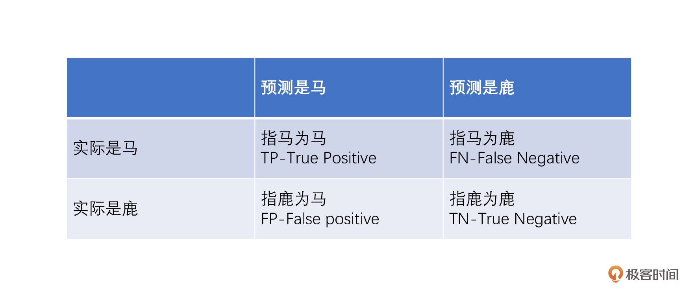
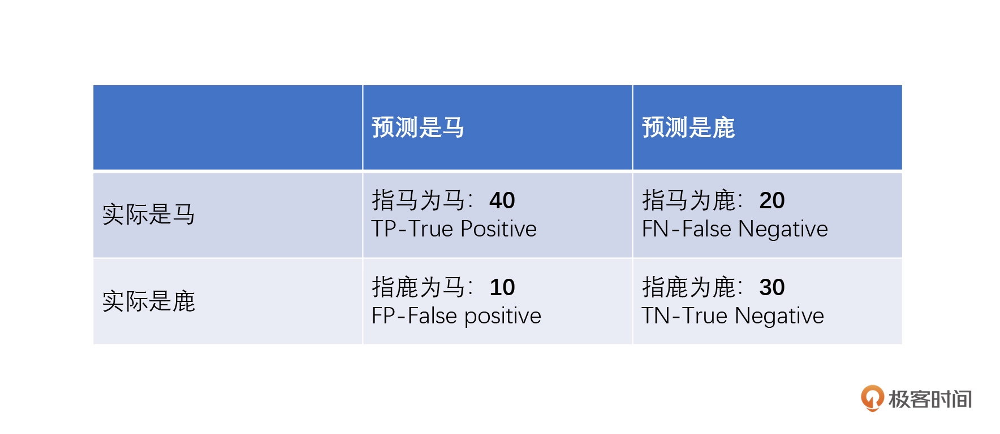

# 12 | 精确率与置信区间：那个好
评价算法模型的重要指标:准确率、精确率、召回率和置信区间

# 准确率/ 精确率/ 召回率
衡量算法准不准，第一感觉是看这个模型的准确率。`Accuracy`

准确率 = 预测正确的样本数量 / 预测总的样本数量

这个公式乍一看很有作用，但是用这样的方式来评估一个算法模型是有问题的。假设我设计了一个算法来辨别鹿的照片。我准备了 100 张图片，图片里边有 1 张鹿，99 张马。现在，我要让算法来识别这个图片里到底是鹿还是马。

那么，更好的去衡量这个算法模型，有个概念：精确率。`precision`

**精确率 =TP（指马为马）/(TP（指马为马）+FP（指鹿为马）)**

`那么 AI 算法模型精确率就是 40/（40+10）=80%。`

光有精确率不够，如果我们现在下个指令，要把那些指鹿为马的 AI 算法都给干掉，这样可以把精确率直接提到 100%（指鹿为马变成 0）。这样做，看起来精确度足够高、足够精确了。但却会导致最后很多的马识别不出来，因为 AI 看到很多稍微长得像鹿的马，完全不敢识别成马，宁愿说这些马是鹿。

召回率（recall，也叫作查全率）
**召回率 =TP（指马为马）/(TP（指马为马）+FN（指马为鹿）)**
所以，单一指标提高没有实际意义。

## 置信区间

置信区间(confidence interval)估计是参数估计的一种，它是用一个区间来估计参数值。

这时候准确率有了一个新名字，叫做置信度，比如刚刚提到的95%、100%就是置信度，【0，750】和【600，630】就是置信区间。

## 取舍艺术
比如自动驾驶，宁可将广告牌上的人当人，也不。。。
结合实际情况来设置参数，结合自己的业务场景选择最合适的算法。

