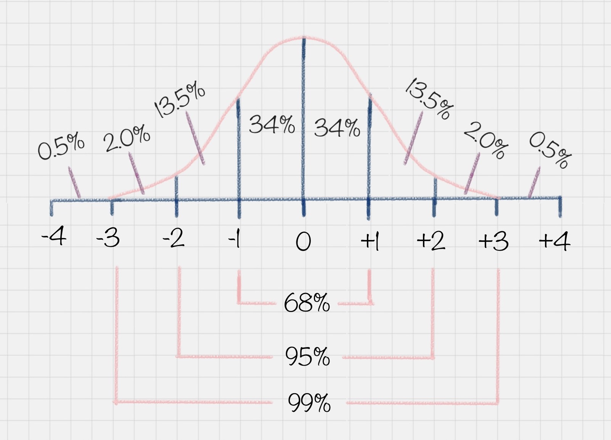

# 13 | 数据变换：考试成绩要求正态分布合理么？

    由于从小到大的考试成绩基本上都会满足正态分布的情况。
    正态分布也叫常态分布，就是正常的状态下，呈现的分布情况。

    为了让成绩呈正态分布，出题老师通常可以把题目分成三类：
-   第一类：基础题，占总分70%,基本上属于送分题；
-   第二类：灵活题，基础范围内+ 一定的灵活性，占20%；
-   难题，涉及的知识面较广，占10%；

## 数据变换扮演的角色
    将不同渠道的数据统一到一个目标数据库里。

    在数据变换前，我们需要先对字段进行筛选，然后对数据进行探索和相关性分析，接着是选择算法模型（这里暂时不需要进行模型计算），然后针对算法模型对数据的需求进行数据变换，从而完成数据挖掘前的准备工作。

从整个流程中看到，数据变换是数据准备的重要环节，它通过**`数据平滑，数据聚集，数据概化和规范化`**等方式将数据转换成适用于数据挖掘的形式。
1. **数据平滑**：去除数据中的噪声，将连续数据离散化。这里可以采用分箱、聚类和回归的方式进行数据平滑，我会在后面给你讲解聚类和回归这两个算法；
2. **数据聚集**：对数据进行汇总，在 SQL 中有一些聚集函数可以供我们操作，比如 Max() 反馈某个字段的数值最大值，Sum() 返回某个字段的数值总和；
3. **数据概化**：将数据由较低的概念抽象成为较高的概念，减少数据复杂度，即用更高的概念替代更低的概念。比如说上海、杭州、深圳、北京可以概化为中国。
4. **数据规范化**：使属性数据按比例缩放，这样就将原来的数值映射到一个新的特定区域中。常用的方法有最小—最大规范化、Z—score 规范化、按小数定标规范化等，我会在后面给你讲到这些方法的使用；
5. **属性构造**：构造出新的属性并添加到属性集中。这里会用到特征工程的知识，因为通过属性与属性的连接构造新的属性，其实就是特征工程。比如说，数据表中统计每个人的英语、语文和数学成绩，你可以构造一个“总和”这个属性，来作为新属性。这样“总和”这个属性就可以用到后续的数据挖掘计算中。

## 数据规范化的几种方法
### 1. Min-max 
    规范化Min-max 规范化方法是将原始数据变换到[0,1]的空间中。用公式表示就是：新数值 =（原数值 - 极小值）/（极大值 - 极小值）。

### 2. Z-Score 规范化
    z-score = (原数值 - 均值) / 标准差 标准差 = 方差的平方根 方差 = （原始值 - 均值）的平方和 / 元素总个数
### 3. 小数定标规范化

## Python 的 SciKit-Learn 库使用

### 数据挖掘中数据变换比算法选择更重要