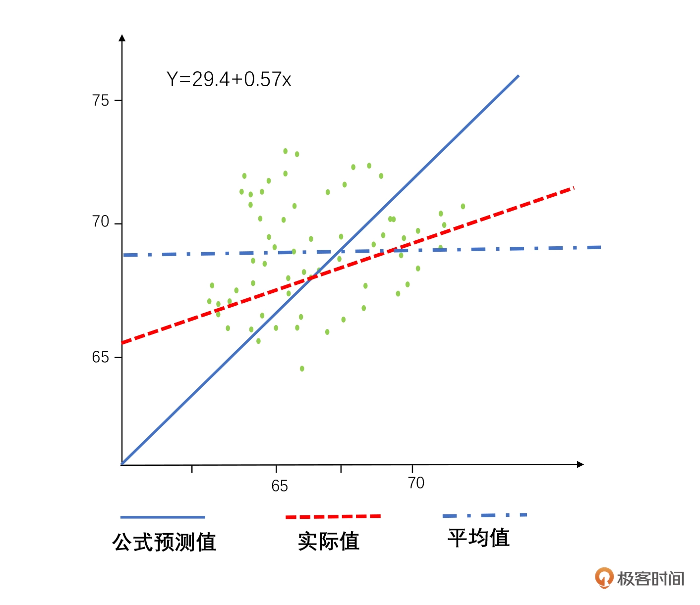

# 13 趋势分析与回归：父母高，孩子一定高么？

回归(Regression)就是研究一个变量和另外一个变量的变化关系。它是由英国生物学家 弗朗西顿·高尔顿(FrancisGalton)提出来的。

多元回归，就是研究一个因变量和多个自变量之间的关系。

## 回归算法种类与使用
-   线性回归、逻辑回归、多项式回归、逐步回归、岭回归
-   套索回归等等

### 线性回归
一元线性回归 **Y = a + bX**
如果是多元回归的话，目标就是要做少的自变量，也就是影响结果最核心的几个因素来生成这个公式，抓住主要矛盾。

由于回归分析对异常值非常敏感，往往一个异常值就把一个预测值带歪了。所以在做异常值的时候，经常会先通过聚类或者后续去他算法剔除这些异常点。这个是专业人员做的。

### 逻辑(log)回归
用于分类问题。
基本逻辑就是把离散的因变量Y变成了一个连续值，然后再做回归。

怎么把离散的 Y 值变成连续的 Y 值呢？这里我们把事件发生的概率比上事件不发生的概率，取 Log 值，这样做就把一个非连续的数据变成连续数据了，具体公式如下：

**Logit（Y）=Log （Odds Y）=Log（（Probability of Y event）/（Probability of no Y event））**

这个变化我们也叫做Logit变化，然后通过各种各样的线性回归或者分类算法，找到对应的关系。

### 多项式回归
可能出现多个指数的数据，这种回归最佳拟合的线也不是直线，很可能是一个曲线。比如人类身高增长速率和年龄的关系。

使用多项式回归的时候，最常见的问题就是**过拟合**和**欠拟合**

## 均值回归
通过这个计算得到了回归模型，就可以应用了，但是不会预测的那么好。

根据达尔文进化论，子代会越来越基于父代进行进化。也就是说理论上父母越高，孩子也会越来越高。而一般高个子的女孩子只会找比自己身高更高的男生结婚，生的孩子也应该更高。

一次类推，理论上经过千百年的进化，人类该分为巨人族和矮人族才对。
但是，不符合实际情况，高尔顿在试验中也发现了这一点。

高尔顿找到了 100 组家庭测量了他们父母和孩子的身高，通过一元线性回归分析建立了一个公式来预测孩子和父母身高的关系:

## 小结

其实这也是一种均值回归的情况，对于任何优秀的人和团队来说，很多时候其实是运气、能力、时机多种因素来造就成功的。

好的没你想得那么好，差的也没有你想得那么差，最终还是会回到平均水平。
就像我接触了很多大佬，我发现我们和最优秀的人之间，也没有那么大的智商和情商的距离，但是人家一直在坚持努力，同时再加上天时地利人和，所以他成功了。我们如果三天打鱼两天晒网，那就很难成功。

所以对我们自己的工作和生活来讲，用一颗平常心不断去提高自己的平均线水平才是正确选择。
