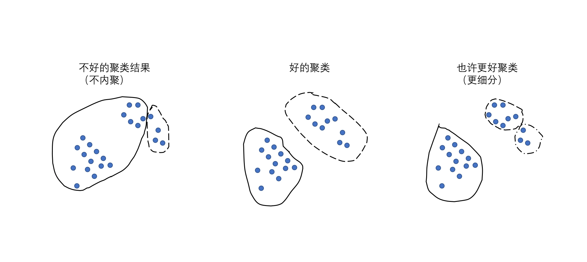
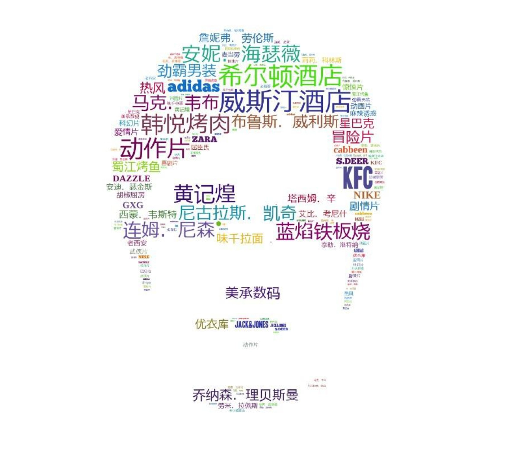
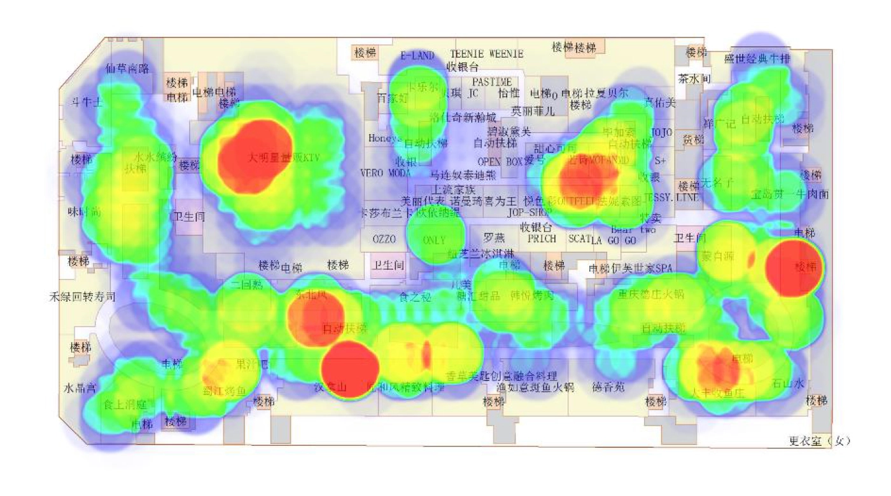

# 14 | 初识聚类算法：物以类聚，简单化

聚类就是通过一些算法，把这些事物全都聚集起来，让聚好的类别（花类和叶子类）达到内聚和分离的特性。

抽象一下，聚类算法输入就是一群杂乱无章的数据，输出是若干个小组，并且这些小组里面会把数据都分门别类。
组内的对象相互之间是相似的（内聚），而不同组中的对象是不同的（分离）。组内的相似性越大，组间差别越大，聚类就越好。

## 聚类算法初探
简单来讲，在算法的世界里，我们可以有各种方法把人和人之间的属性和行为的差异数字化，然后把它们算成“欧几里得距离”或者“余弦相似度”，你现在只需要理解，
最终任何事物的特征属性都可以变成类似距离的东西来计算就可以了。

常见的聚类算法除了 K-Means，还有 KNN、DBSCAN、EM 等等，所有的这些聚类算法其实都可以和 K-Means 类似简化成三种问题：
1. 选大哥，找聚类中心的问题；
2. 找小弟，解决距离表示的问题；
3. 帮派会议，聚类收敛方法问题。

这里要注意的是，使用聚类算法的时候要先把一些异常点尽量剔除掉，或者单独把它们单独聚成一类。否则有一些很异常的数据就会影响我们聚类算法最终的准确性。

## 未来场景

这种人流量图

