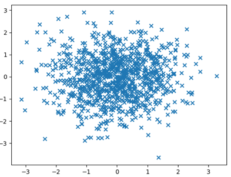
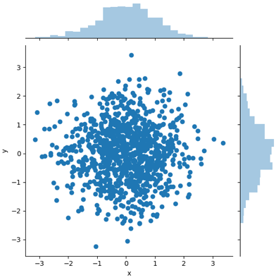
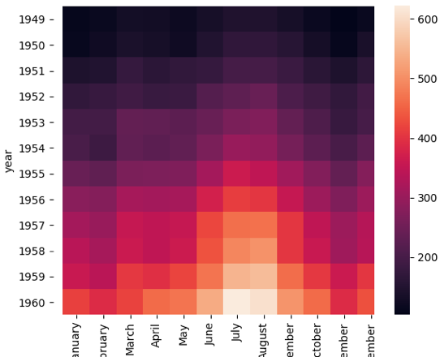
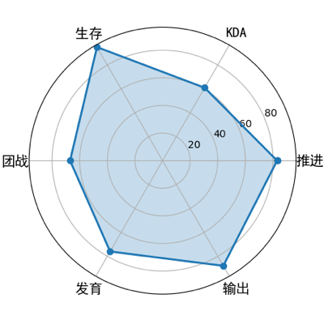
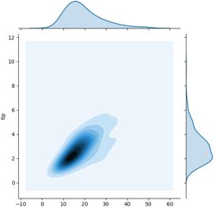
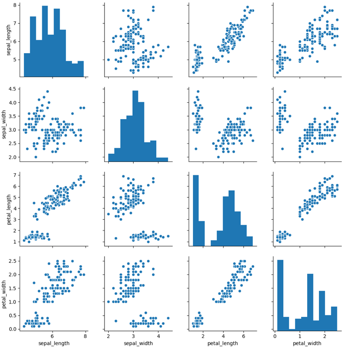
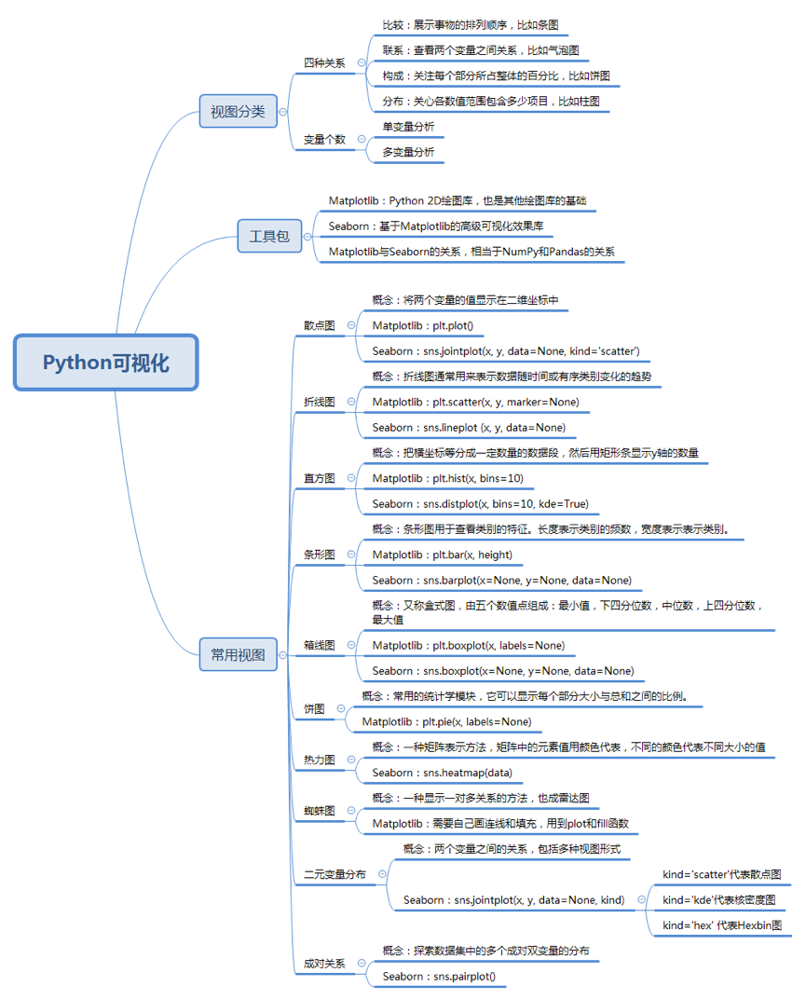

----
<details>
<summary>展开查看</summary>
<pre>

[1. 15 | 学会Python数据可视化的技能](#1-15--学会python数据可视化的技能)
[1.1. 可视化视图都有哪些？](#11-可视化视图都有哪些)
[1.2. -   分布：关注单个变量，或者多个变量的分布情况，比如直方图。](#12-----分布关注单个变量或者多个变量的分布情况比如直方图)
[1.2.1. 散点图](#121-散点图)
[1.2.1.1. Matplotlib 绘制：](#1211-matplotlib-绘制)
[1.2.1.2. Seaborn 绘制：](#1212-seaborn-绘制)
[1.2.2. 折线图](#122-折线图)
[1.2.3. 直方图](#123-直方图)
[1.2.4. 条形图](#124-条形图)
[1.2.5. 箱线图](#125-箱线图)
[1.2.6. 饼图](#126-饼图)
[1.2.7. 热力图](#127-热力图)
[1.2.8. 蜘蛛图](#128-蜘蛛图)
[1.2.9. 二元变量分布](#129-二元变量分布)
[1.2.9.1. 核密度图：](#1291-核密度图)
[1.2.9.2. Hexbin 图：](#1292-hexbin-图)
[1.2.10. 成对关系](#1210-成对关系)
[1.3. Summary](#13-summary)
</pre>
</details>

<div style="position:fixed;right:0px;" ><a name="122">[1.2.2. 折线图](#122-折线图)</a></div>

# 1. 15 | 学会Python数据可视化的技能
[名称](#1)
    数据可视化技术。

## 1.1. 可视化视图都有哪些？
    比较、联系、构成和分布
-   比较：比较数据间各类别的关系，或者是它们随着时间的变化趋势，比如折线图；
-   联系：查看两个或两个以上变量之间的关系，比如散点图；
-   构成：每个部分占整体的百分比，或者是随着时间的百分比变化，比如饼图；
1.2. -   分布：关注单个变量，或者多个变量的分布情况，比如直方图。
----
同样按照变量的`个数`,可以把可视化视图划分为`单变量分析`和`多变量分析`。

>可视化的视图可以说是分门别类，多种多样，今天我主要看看常用的 10 种视图，这些视图包括了散点图、折线图、直方图、条形图、`箱线图`、饼图、热力图、蜘蛛图、二元变量分布和成对关系。


- [1. 15 | 学会Python数据可视化的技能](#1-15--学会python数据可视化的技能)
	- [1.1. 可视化视图都有哪些？](#11-可视化视图都有哪些)
	- [1.2. -   分布：关注单个变量，或者多个变量的分布情况，比如直方图。](#12-----分布关注单个变量或者多个变量的分布情况比如直方图)
		- [1.2.1. 散点图](#121-散点图)
			- [1.2.1.1. Matplotlib 绘制：](#1211-matplotlib-绘制)
			- [1.2.1.2. Seaborn 绘制：](#1212-seaborn-绘制)
		- [1.2.2. 折线图](#122-折线图)
		- [1.2.3. 直方图](#123-直方图)
		- [1.2.4. 条形图](#124-条形图)
		- [1.2.5. 箱线图](#125-箱线图)
		- [1.2.6. 饼图](#126-饼图)
		- [1.2.7. 热力图](#127-热力图)
		- [1.2.8. 蜘蛛图](#128-蜘蛛图)
		- [1.2.9. 二元变量分布](#129-二元变量分布)
			- [1.2.9.1. 核密度图：](#1291-核密度图)
			- [1.2.9.2. Hexbin 图：](#1292-hexbin-图)
		- [1.2.10. 成对关系](#1210-成对关系)
	- [1.3. Summary](#13-summary)
### 1.2.1. 散点图

>scatter plot，它将两个变量的值显示在二维坐标中，非常适合展示两个变量之间的关系。

使用Matplotlib、Seaborn 进行散点图绘画。

#### 1.2.1.1. Matplotlib 绘制：


#### 1.2.1.2. Seaborn 绘制：


### 1.2.2. 折线图
可以用来表示数据随着时间变化的趋势。
### 1.2.3. 直方图
直方图是比较常见的视图，它是把横坐标等分成了一定数量的小区间，这个小区间也叫作“箱子”，然后在每个“箱子”内用矩形条（bars）展示该箱子的箱子数（也就是 y 值），这样就完成了对数据集的直方图分布的可视化。

### 1.2.4. 条形图
如果说通过直方图可以看到变量的数值分布，那么条形图可以帮我们查看类别的特征。在条形图中，长条形的长度表示类别的频数，宽度表示类别。

### 1.2.5. 箱线图
箱线图，又称盒式图，它是在 1977 年提出的，由五个数值点组成：最大值 (max)、最小值 (min)、中位数 (median) 和上下四分位数 (Q3, Q1)。它可以帮我们分析出数据的差异性、离散程度和异常值等。
    
    发现Seaborn 绘制的东西一般带有颜色

### 1.2.6. 饼图
饼图是常用的统计学模块，可以显示每个部分大小与总和之间的比例。在 Python 数据可视化中，它用的不算多。我们主要采用 Matplotlib 的 pie 函数实现它。

### 1.2.7. 热力图

`热力图`，英文叫 `heat map`，是一种`矩阵表示方法`，其中矩阵中的`元素值用颜色`来代表，不同的颜色代表不同大小的值。通过颜色就能直观地知道某个位置上数值的大小。另外你也可以将这个位置上的颜色，与数据集中的其他位置颜色进行比较。


### 1.2.8. 蜘蛛图
蜘蛛图是一种显示一对多关系的方法。在蜘蛛图中，一个变量相对于另一个变量的显著性是清晰可见的。


假设我们想要给王者荣耀的玩家做一个战力图，指标一共包括推进、KDA、生存、团战、发育和输出。


### 1.2.9. 二元变量分布
如果我们想要看`两个变量之间的关系`，就需要用到二元变量分布。当然二元变量分布有多种呈现方式，开头给你介绍的散点图就是一种二元变量分布。

这里我们使用 Seaborn 中自带的数据集 tips，这个数据集记录了不同顾客在餐厅的消费账单及小费情况。代码中 total_bill 保存了客户的账单金额，tip 是该客户给出的小费金额。我们可以用 Seaborn 中的 jointplot 来探索这两个变量之间的关系。
```python
import matplotlib.pyplot as plt
import seaborn as sns
# 数据准备
tips = sns.load_dataset("tips")
print(tips.head(10))
# 用Seaborn画二元变量分布图（散点图，核密度图，Hexbin图）
sns.jointplot(x="total_bill", y="tip", data=tips, kind='scatter')
sns.jointplot(x="total_bill", y="tip", data=tips, kind='kde')
sns.jointplot(x="total_bill", y="tip", data=tips, kind='hex')
plt.show()
```

在 Seaborn 里，使用二元变量分布是非常方便的，直接使用 sns.jointplot(x, y, data=None, kind) 函数即可。其中用 kind 表示不同的视图类型：“kind='scatter'”代表散点图，“kind='kde'”代表核密度图，“kind='hex' ”代表 Hexbin 图，它代表的是直方图的二维模拟。

#### 1.2.9.1. 核密度图：

#### 1.2.9.2. Hexbin 图：


### 1.2.10. 成对关系
如果想要探索数据集中的多个成对双变量的分布，可以直接采用 sns.pairplot() 函数。

它会同时展示出 DataFrame 中每对变量的关系，另外在对角线上，你能看到每个变量自身作为单变量的分布情况。它可以说是探索性分析中的常用函数，可以很快帮我们理解变量对之间的关系。

这里我们使用 Seaborn 中自带的 iris 数据集，这个数据集也叫鸢尾花数据集。鸢尾花可以分成 Setosa、Versicolour 和 Virginica 三个品种，在这个数据集中，针对每一个品种，都有 50 个数据，每个数据中包括了 4 个属性，分别是花萼长度、花萼宽度、花瓣长度和花瓣宽度。通过这些数据，需要你来预测鸢尾花卉属于三个品种中的哪一种。

```python
import matplotlib.pyplot as plt
import seaborn as sns
# 数据准备
iris = sns.load_dataset('iris')
# 用Seaborn画成对关系
sns.pairplot(iris)
plt.show()
```
这里我们用 Seaborn 中的 pairplot 函数来对数据集中的多个双变量的关系进行探索，如下图所示。

有 sepal_length、sepal_width、petal_length 和 petal_width4 个变量，它们分别是花萼长度、花萼宽度、花瓣长度和花瓣宽度。



## 1.3. Summary

