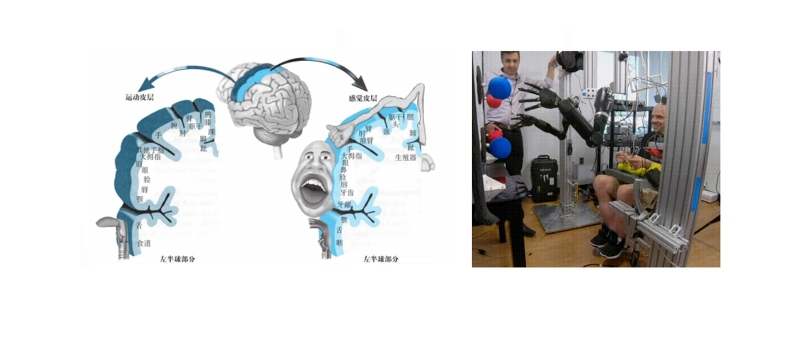

# 15| 初识分类算法：分而治之
比如说在上海做垃圾分类的时候，有这么一个段子：你去倒垃圾，一个阿姨就会在那里看着你，看到你就会问“你是什么垃圾？”你如果把垃圾分类做错了，她会告诉你榴莲壳属于干垃圾，瓜子壳属于湿垃圾。

## 分类算法
和聚类算法不同，分类算法其实是由训练数据集的。

分类也叫：有**监督学习**。

## 分类算法初探
以C4.5算法为例。
C4.5 决策树算法我把它也叫做“逐级找领导”算法。

-   第 1 步，我们把每一个属性都当领导全试一下
-   第 2 步，把按这个情况分群出来的差异性通过一个叫信息熵的指标计算出来。
-   第 3 步，我们要比对一下这几个领导做完决策之后各自信息熵的大小。
-   第 4 步，大领导有了，现在我们需要一些小领导。我们来重复前面的 123 步.
-   第 5 步，精简领导班子。
-   决策树算法里面还有一个东西叫做“剪枝”，就是把一些没有用的节点去掉。经过剪枝之后，就得到了我们最终要的这个决策树。

最终我们可以用一组测试数据来验证一下我们这棵树分得好不好，衡量的标准就是精准率和召回率。

## 展望
一般用于图片识别。

更先进的分类算法可以支持用脑机接口加上深度学习的方式去训练脑电波，让我们可以用意念来控制两只机械臂独立完成类似吃蛋糕这样的复杂任务，帮助四肢瘫痪的人重获自由。
