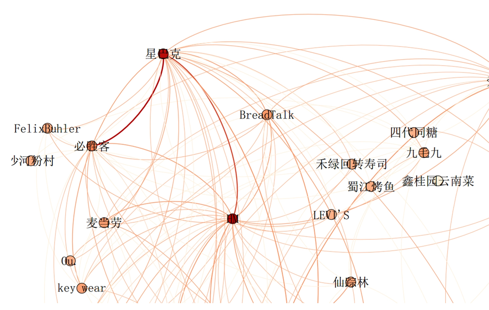

# 16 | 关联规则初探

蝴蝶效应，左眼跳财，右眼跳灾。
那么这么多事物之间，到底谁与谁有关联性，从而描述一些规律呢。

## 关联规则定义和使用场景
这个故事是这样的，当你去美国沃尔玛超市，你会看到一个非常有趣的现象：货架上啤酒和尿布经常放在一起售卖。这两个看上去是完全不相关的东西，为什么会放到一起卖呢？

Teradata 公司针对人们每次去超市一次交易清单里的物品进行关联挖掘，发现啤酒和尿布经常会在一次购买清单当中购买。这件事情上沃尔玛的管理者也非常不解，后来经过调研发现，妈妈们经常会嘱咐她们的老公下班后去给孩子买一点尿布回来（你知道孩子用尿布的速度是非常快的）。而丈夫买完尿布的时候，大多会顺手给自己买一瓶喜欢的啤酒。

Teradata 通过针对一年多原始交易的关联规则挖掘，发现了这个神奇的组合，于是就推荐沃尔玛将啤酒和尿布摆到一起销售。结果这两个产品放到一起后，造成了啤酒和尿布销售量整体增长，这个摆放的位置也就延续至今。

你现在去超市经常能看到很多商品也不是按照类别摆放的，例如卖方便面的地方经常有一些泡椒鸡爪、火腿肠、榨菜等等。这些其实背后都是关联规则数据挖掘在起作用。

当然，这个故事有很多人说是当时的人们杜撰出来的，因为那个时候数据分类无法那么精确，数据量也不够大。我觉得不用去讨论故事的真伪，它的意义在于在那个时代，让人们知道原来关联规则通过数据挖掘，我们能够发现一些我们自己完全想象不到的知识。

同样，在股票分析当中，美国高盛投行公司以及其他的量化交易公司会经常监测人们在 Twitter 和 Facebook 上发的一些新闻，根据这些新闻来动态调整股票的售卖。

## 关联算法再探
-   支持度(support):
    -   个体出现的次数占总体次数的比例。
-   置信度(confidence):
    -   在A发生的情况下B发生的概率。
-   提升度(lift):
    -   衡量A的出现对B的出现概率提升的程度
    -   提升度(A-->B) = 置信度(A->B)/支持度(B)
    -   提升度 >1，证明 A 和 B 的相关性很高，A 会带动 B 的售卖；
    -   提升度 =1，无相关性，相互没作用；
    -   提升度 <1，证明 A 对 B 有负相关，也就是这两个商品有排斥作用，买了 A 就不会买 B。

常见的算法：Apriori、FP-growth还有setm,Eclat等等。

目前的关联规则的挖掘过程大致可以总结为两步：
-   找出所有的频繁组合
-   由频繁组合产生规则，从中提取置信度高的规则。

当然关联规则有它的局限性，需要足够的数据才能发现这些规则，在现实中获得这些数据就不容易了。

## 未来场景
比如：客户引流

穿衣搭配

