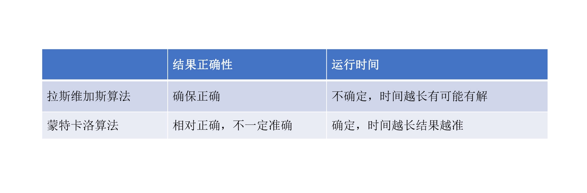

# 17 | 蒙特卡洛与拉斯维加斯：有限时间内如何获得最优解？
现实生活中，往往没那么多的资源和事件来得到最佳的结果。

## 算法来源
两个算法的目标都是利用随机的方法来简化整体的算法过程，解决一些看上去没有办法通过正常算法解决的实际问题。

蒙特卡洛算法:

那个时候，正值美国在第二次世界大战，乌拉姆和诺伊曼都是“曼哈顿计划”（美国原子弹计划）计划的成员，而第一台电子计算机 ENIAC 在发明后就被用于“曼哈顿计划”。在参与这个计划过程中，乌拉姆想到在计算机强大计算能力的帮助下，可以通过重复数百次模拟核实验的方式来对核裂变的各种概率变量进行演算，而不用实际进行那么多次实验。

诺伊曼立即认识到这个想法的重要性并给予乌拉姆充分的支持，乌拉姆将这种统计方法用于计算核裂变的连锁反应，大大加快了这个项目的节奏。由于乌拉姆常说他叔叔在摩纳哥的赌城“Monte Carlo”输钱，他的同事 Nicolas Metropolis 戏称该方法为“蒙特卡罗”，这个名字也就沿用到了现在。

原理：每次计算都尽量尝试更好的结果路径，但不保证是最好的。
这样寻找结果的方法，无论合适都会有结果出来，而且给的事件越多、尝试越多，最终会越接近最优解。

这个与大数定律相关。当随机事件的次数足够多时，发生的频率就会趋近预期的概率。

### 拉斯维加斯算法
和蒙特卡罗算法截然相反的另一种算法就是拉斯维加斯算法，它是在 1979 年[László Babai](https://en.wikipedia.org/wiki/L%C3%A1szl%C3%B3_Babai)在解决图同构问题的时候，针对蒙特卡罗算法弊病提出的。

拉斯维加斯算法原理也很简单，就是每次计算都尝试找到最好的答案，但不保证这次计算就能找到最好的答案，尝试次数越多，越有机会找到最优解。

## 区别

## 小结及应用场景
-   计算风险价值（value at risk，VaR）：
    -   VaR 试图以一个明确的数值来对投资组合进行风险评估，在计算这个价值的时候就会经常用到蒙特卡洛方法去模拟各种各样的市场的变化，从而得到最终近似最优的风险价值。
-   自动化交易：
    -   股票和期货之中利用蒙特卡洛算法的双均线系统，模拟各种买进、卖出以及其他操作，最终得出一个近似最好的执行方案。经过测试，这样做可以比正常的双均线系统自动化交易要高 10%-30%。
-   衍生品定价：
    -   针对市场上发生的各种各样的情况对衍生品的价格进行模拟，最终也可以将特别复杂的衍生品价格计算出来。

如何在这两类随机算法之间选择，那就要具体问题具体分析了。

如果问题要求在有限时间和尝试次数内必须给出一个解，但不要求是最优解，那就用蒙特卡罗算法。反之，如果问题要求必须给出最优解，但对时间和尝试次数没有限制，那就用拉斯维加斯算法。

把这两种算法对应到工作和生活中，对拉斯维加斯算法来说，有些事情我们是需要精益求精，无论花多少时间都得把这件事情做细致做准确，否则后果可能会非常严重；有些地方反而是需要蒙特卡洛算法，在事情有大概比较清晰的方案的时候，要快速决策，否则如果把时间耽误了，反而最后获得的结果会更糟。