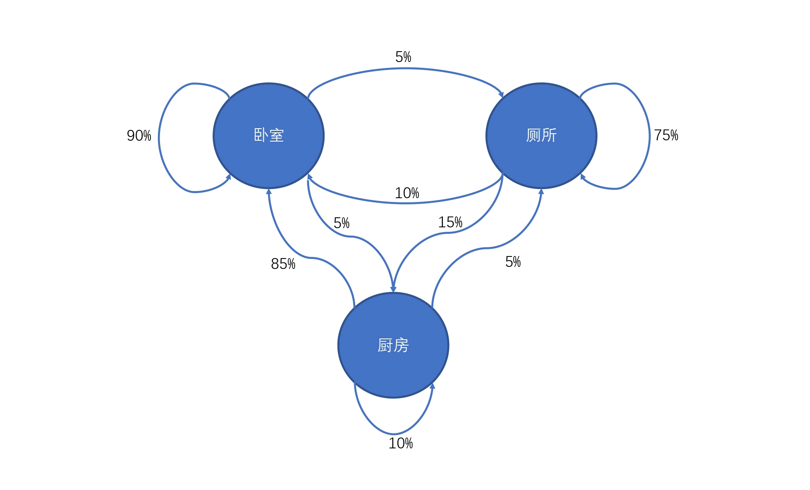
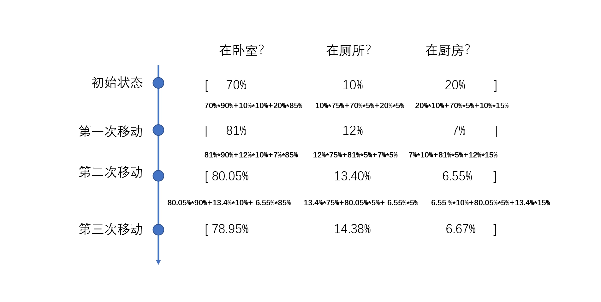

# 18 | 马尔科夫链：将来和当下
一件事情发生后会影响另外一件事情的结果，而这些事情往往是按照某一个规律发生的。
马尔科夫链专门研究现实生活当中这一系列的事件，找到它们的内部运行规律，从而当这一系列事件达到平衡时，当前状态的下一步最可能发生的情况。

## 马尔科夫链算法定义与场景
马尔可夫链因俄国数学家安德烈·马尔可夫得名，它的定义是：状态空间中经过从一个状态到另一个状态的转换的随机过程。该过程要求具备“无记忆”的性质，也就说下一状态的概率分布只能由当前状态决定，在时间序列中它前面的事件均与之无关。

马尔可夫同学在最开始建立马尔可夫链的时候，最著名的应用就是从一份俄罗斯诗歌作品中数出几千个两字符对，他使用这些两字符对计算了每个字符出现的概率。也就是在这诗歌里我们给一个字符，就能预测关于下一个字符可能是什么。

比如著名的谷歌创始人拉里·佩奇和谢尔盖·布林在98年提出的谷歌搜索的网页排序算法PageRank就是由马尔科夫链定义提出的。

在经济金融领域，詹姆斯.D. 汉密尔顿在 1989 年用马尔可夫链来对高 GDP 增长速度时期与低 GDP 增长速度时期（也就是经济扩张与紧缩）的转换进行建模，帮助美国在经济萧条中对 GDP 的恢复情况进行预测。

同样，在互联网公司里，要去做一些推荐的时候，也会用到马尔可夫链的一些算法。我们去浏览网站，其实无外乎就是在浏览、购买、收藏商品。其实这些行为也可以变成和上述移动房间类似的马尔可夫链形式，这样我们可以根据每一个不同的行为状态来预测下一步用户可能会做什么，然后这个时候我们给用户最方便的一些行为指导和预测，就可以促进用户的购买。

这也就是你在淘宝上看到的“猜你喜欢”和首页推荐列表里其中的一个核心算法。我们可以根据用户的“特征喜好状态转移矩阵”

## 应用场景

现在有人把马尔可夫链用于分析生物的 DNA 序列，还有人用马尔可夫链算法来预测双色球和其他彩票，以及做炒币的自动化交易，以及我们在前面讲的用马尔可夫链来作曲等等。

总之在跟序列相关的反馈机制预测问题上，马尔可夫链是非常有帮助的。
不过马尔可夫链和其他数据算法联系非常紧密，它的预测结果好坏其实都依赖于我们刚才提到的概率转移矩阵是否准确，而这个概率转移矩阵的准确性最后又依赖于算法估算方法的合理性。

**不过马尔科夫链和其他数据算法联系非常紧密，它的预测结果好坏都去依赖于概率转移矩阵**.
而这个状态转移矩阵的准确性最后有依赖于算法估算方法的合理性。所以马尔可夫链要算准确，需要建立在前面我们提到的基本算法（回归、分类、聚类、关联等）预测概率的准确性上。

其二，马尔可夫算法除了受到其他算法的限制之外，本身也有局限性。它的前提是后一个状态值和前一个状态值相关，而和更前面的状态无关。

## 小结
《飘》电影结尾郝思嘉说的那句话，我觉得它诠释了“马尔可夫链”在生活哲学中的真谛：“Tomorrow is another day”——你的未来只取决于你当下在做什么，而不是过去你曾经做过什么，毕竟“明天，是新的一天”。

