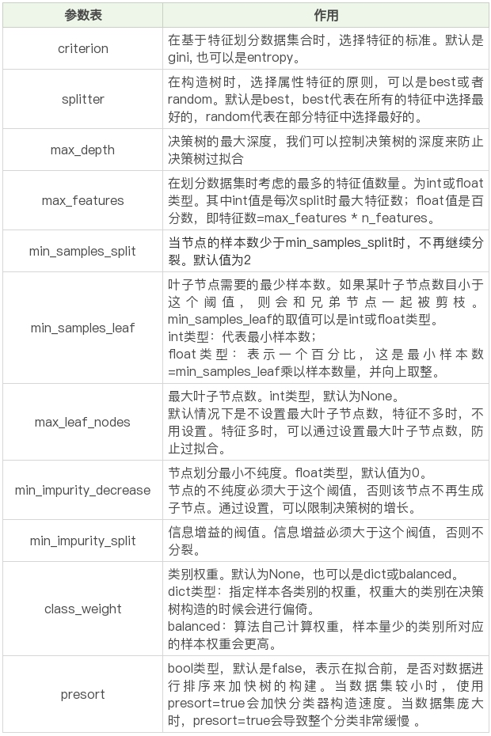

# 12 | 决策树（下）：泰坦尼克乘客生存预测

## sklearn 中的决策树模型
    sklearn中暂时只实现了ID3与CART决策树
· criterion 标准
· ebtropy 信息熵，也就是ID3算法，实际结果与C4.5相差不大；
· gini, 默认参数基于基尼系数。CART算法是基于基尼系数做属性划分的，所以criterion=gini时，实际上执行的是CART算法

这里我们看到了很多参数，除了设置 criterion 采用不同的决策树算法外，
一般建议使用默认的参数，默认参数不会限制决策树的最大深度，不限制叶子节点数，认为所有分类的权重都相等等。
当然你也可以调整这些参数，来创建不同的决策树模型。

----
#### 决策分类树之后，使用fit方法进行拟合

