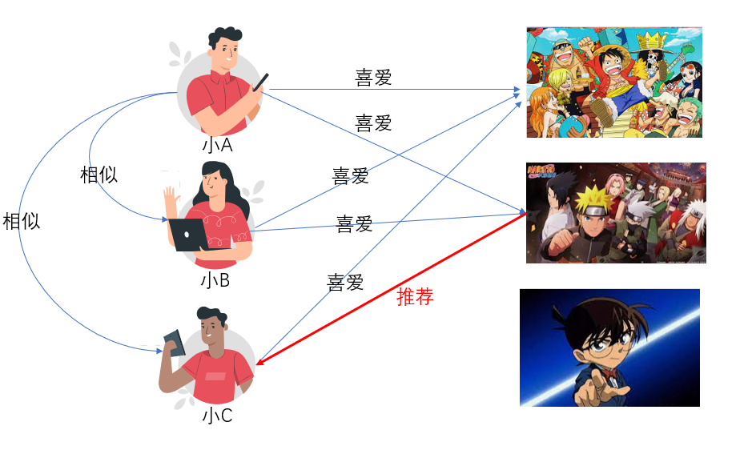
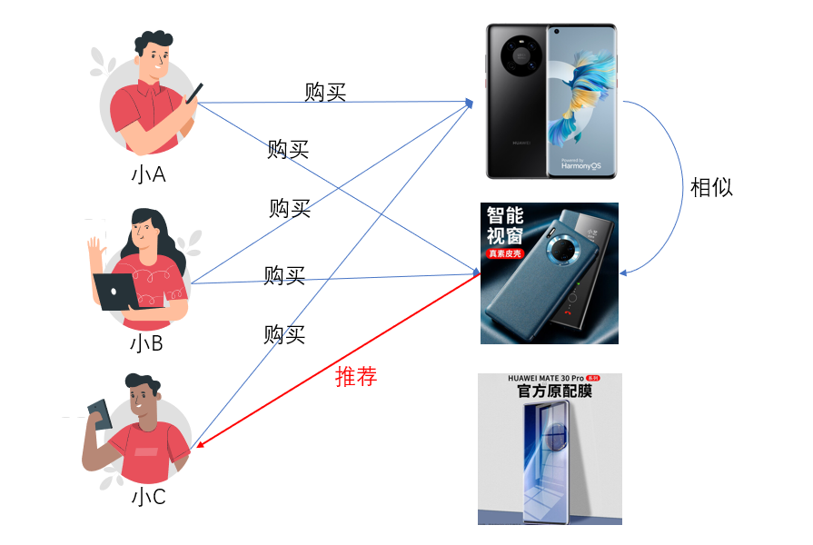
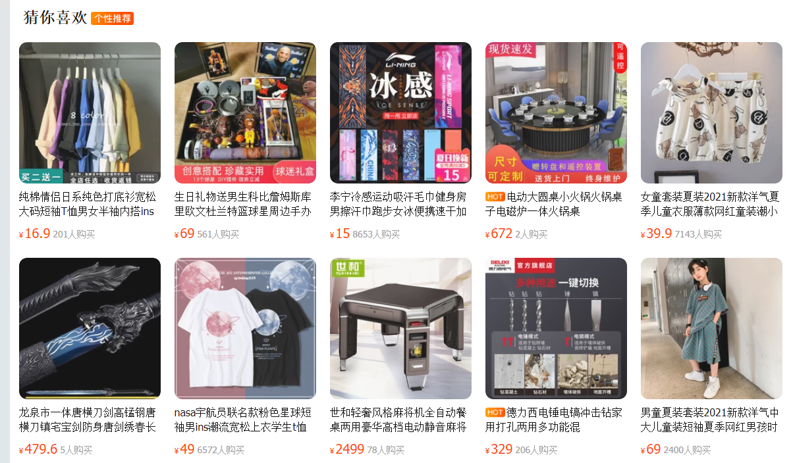
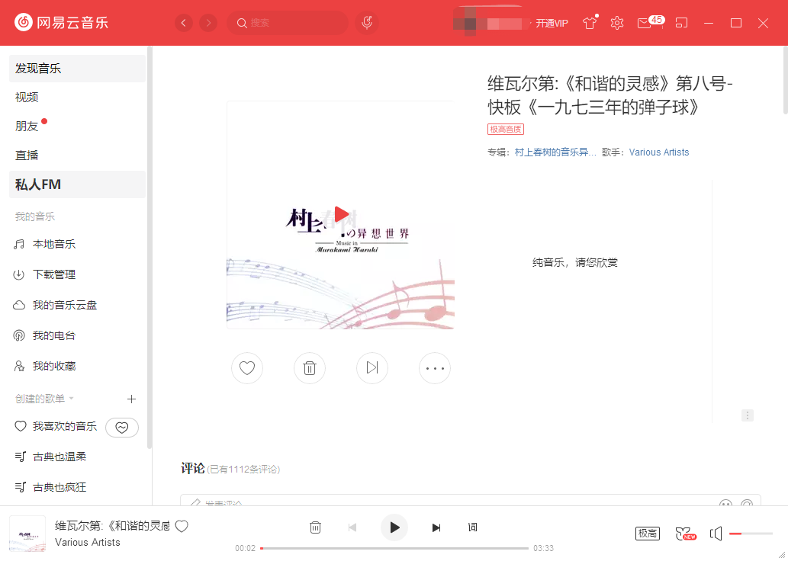

# 19 | 协同过滤:短视频
复合算法的使用

## 协同过滤算法定义与场景
协同过滤算法，就是用户可以齐心协力，通过不断地和算法互动，在多如牛毛的选择当中，过滤掉自己不感兴趣的选择，保留自己感兴趣的选择。

这个源于1992年，最早被施乐公司发明并用于个性化推送的邮件系统。
最早这个算法是让用户从几十种主题里面去选3~5种自己感兴趣的主题，然后通过协同过滤算法，施乐就根据不同的主题来帅选人群发送邮件，最终达到个性化邮件的目的。

到 1994 年的时候，协同过滤算法开始引入集体智慧的概念，也就是用更多的人群和数据去获取相关的知识。它允许用户贡献自己的一些行为和反馈，从而创造一个比任何个人和组织更强大机制，自动给用户发送喜欢的文章。基于这个思路，施乐发明了著名的 GroupLens 系统。

在这个系统里面，用户每读完一条新闻都会给一个评分，系统会根据这些评分来确定这些新闻还可以推送给谁。你看，今日头条的想法其实施乐在 1994 年就实现了。

所以，今日：B站推荐视频，推荐书籍等等。

## 协同过滤算法简述
-   基于用户的协同过滤算法(User-Based Collaborative Filtering)
-   基于物品的协同过滤算法(Item-based Collaborative Filtering)
-   基于数据模型的协同过滤算法(Model-based Collaborative Filtering)

### 基于用户的协同过滤算法
**基于用户与用户之间的相似，推荐你喜欢的东西，过滤你不喜欢的东西。**

### 基于物品的协同过滤算法
这种算法就是**根据用户群对于物品的购买或者评价发现物品和物品之间的相似程度，然后再根据具体用户历史使用的类似物品推荐给这个用户。**

### 基于数据模型的协同过滤算法
**复用前面所学到的算法,做出模型，再进行有关的协同过滤。**
用关联算法来去做物品之间的相似度评估，然后根据置信度、提升度或者其他评分规则推荐给用户。

## 协同过滤算法的使用场景与缺点
在 2016 年的双十一，阿里巴巴平台取得了 20% 的增长；Youtube 上 70% 的用户时长都是协同过滤算法贡献的。

网易音乐私人FM。

