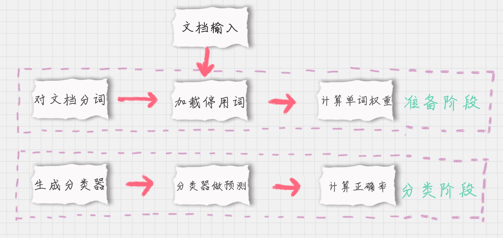

# 20_21丨朴素贝叶斯分类 ：如何让机器判断男女？

>贝叶斯原理是英国数学家托马斯·贝叶斯提出的。

它的core：并不其清楚这个东西是啥子，从已知的表现来推测这个东西
比如：***视其所以，观其所由，察其所安，人焉廋哉？人焉廋哉？***

别人也称这个是逆向概率

## 先验概率
通过经验判断事情发生的概率
    比如：南方梅雨季是6-7月
## 后验概率
结果发生之后，推测原因的概率；后验概率属于条件概率的一种。

## 条件概率
受限于**环境**，该事件发生的概率

## 似然函数(likelihood function)
>似然函数就是统计参数的函数，你可以把概率模型的训练过程理解为求参数估计的过程。
---
>https://zhuanlan.zhihu.com/p/42598338

似然函数可以来定事物的性质，比如定为***闲暇***的人(参数)，那么做事就倾向于有条理(后验概率）

## 通用的贝叶斯公式

## 朴素贝叶斯

环境（前提）是:事物的各个性质是相互独立的，当然这个有些扯淡。
但是由于使用起来简单且易行，就放郭过它呗。

### 朴素贝叶斯模型
-   由两种类型的概率组成：
    -   每个类别的概率P(Cj)；
    -   每个属性的条件概率P(Ai|Cj)。
### tips

### 连续型数据处理
需要看成正态分布，然后计算期望和方差，来计算概率。

### 朴素贝叶斯分类器工作流程

朴素贝叶斯分类常用于文本分类，尤其是对于英文等语言来说，分类效果很好。它常用于垃圾文本过滤、情感预测、推荐系统等。

### sklearn 机器学习包
Scikit-learn,给我们提供了 3 个朴素贝叶斯分类算法，分别是高斯朴素贝叶斯（GaussianNB）、多项式朴素贝叶斯（MultinomialNB）和伯努利朴素贝叶斯（BernoulliNB）
-   高斯朴素贝叶斯
    -   连续变量
-   多项式朴素贝叶斯
    -   离散变量，符合多项分布；如文档分类中特征向量体现在一个单词出现的次数，或者是单词的TF-IDF值等。
-   伯努利朴素贝叶斯
    -   特征变量是布尔变量，符合0/1分布，在文档分类中特征是单词是否出现。
----
伯努利朴素贝叶斯是以`文件`为粒度；多项式朴素贝叶斯是以`单词`为粒度。
### TF-IDF值
TF-IDF是 Term Frequency 和Inverse Document Frequency的总称。
-   **词频**
    -   单词在文档中出现的次数，它认为单词的重要性和它在文档中出现的次数成正比。
-   **逆向文档频率**
    -   单词在文档中的区分度。它认为一个单词出现在`所有文档`中的频率越少，就越能通过这个单词把该文档和其他文档分开。

TF-IDF = TF * IDF

只要TF-IDF的值越高，这样的单词就适合区分。
#### TF-IDF的计算

### 计算 TF-IDF 
sklearn 中我们直接使用TfidfVectorizer 类

### 停用词的处理
`停用词`就是在分类中没有用的词，这些词一般`词频 TF`高，但是 `IDF 很低`，起不到分类的作用。为了节省空间和计算时间，我们把这些词作为停用词 stop words，告诉机器这些词不需要帮我计算。
### 对文档进行分类

1.**基于分词的数据准备**
-   包括分词、单词权重计算、去掉停用词

2.**应用朴素贝叶斯分类进行分类**
-   通过训练集得到朴素贝叶斯分类器，然后将分类器应用于测试集，并与实际结果做对比，最终得到测试集的分类准确率。

模块 1：对文档进行分词
    在英文文档中，最常用的是 NTLK 包。
    在中文文档中，最常用的是 jieba 包。

模块 2：加载停用词表

模块 3：计算单词的权重

模块 4：生成朴素贝叶斯分类器

模块 5：使用生成的分类器做预测

模块 6：计算准确率

### 数据挖掘神器 sklearn

从数据挖掘的流程来看，一般包括了`获取数据`、`数据清洗`、`模型训练`、`模型评估`和`模型部署`这几个过程。

sklearn 中包含了大量的数据挖掘算法，比如三种`朴素贝叶斯算法`，我们只需要了解`不同算法的适用条件`，以及创建时所需的参数，就可以用模型帮我们进行训练。在模型评估中，sklearn 提供了 `metrics 包`，帮我们对预测结果与实际结果进行评估。
    