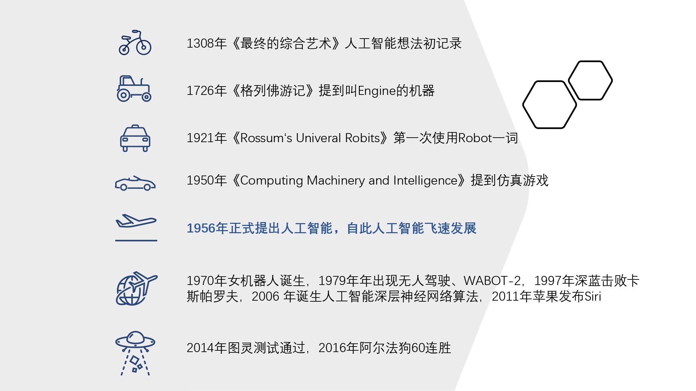

# 20 | 人工智能初探

人工智能算法是所有算法的集合。

## 发展历史

最近 10 年出现可以打败人类自身的算法，是得益于 2006 年加拿大多伦多大学教授、机器学习领域泰斗、神经网络之父—— Geoffrey Hinton 和他的学生 Ruslan Salakhutdinov 在顶尖学术刊物《科学》上发表了一篇文章，该文章提出了深层网络算法，并在 2012 年利用 CNN 算法碾压了过去数年的分类等机器学习算法，取得 AlexNet 第一名，引起了人工智能的新一轮潮流。

## CNN 和 RNN
还记得我们在分类算法里讲过，人类本身就是一个非常复杂的分类器。深度学习算法简单来说就是模拟人的脑神经网络来制造一个和人特别接近的分类器。

现在最流行的两个深度学习的算法就是 RNN（Recurrent Neural Network）循环神经网络和 CNN（Convolutional Neural Network）卷积神经网络，它们都是模拟人脑的多个神经元多层次连接方式，通过大量反复的反馈和计算来实现最后效果。

RNN 能够处理这种序列的数据，因为它其中有一个“反馈环”，能够模拟人脑使得前面的输入也能影响到后面的输出，相当于在模拟人脑当中的记忆功能。

CNN 其实模拟的就是人眼睛和头脑识别的原理。
<!-- 没看懂，暂时不写 -->
