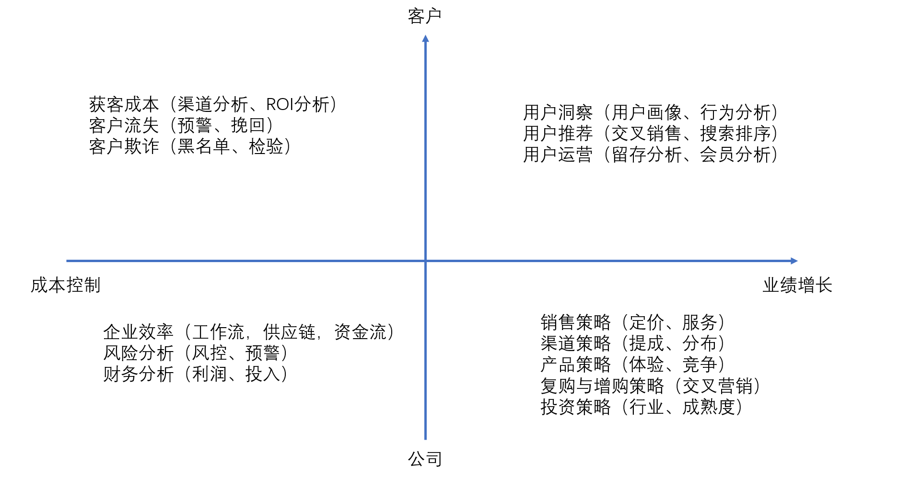
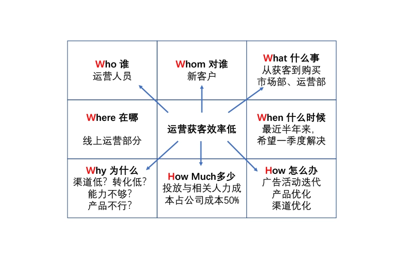
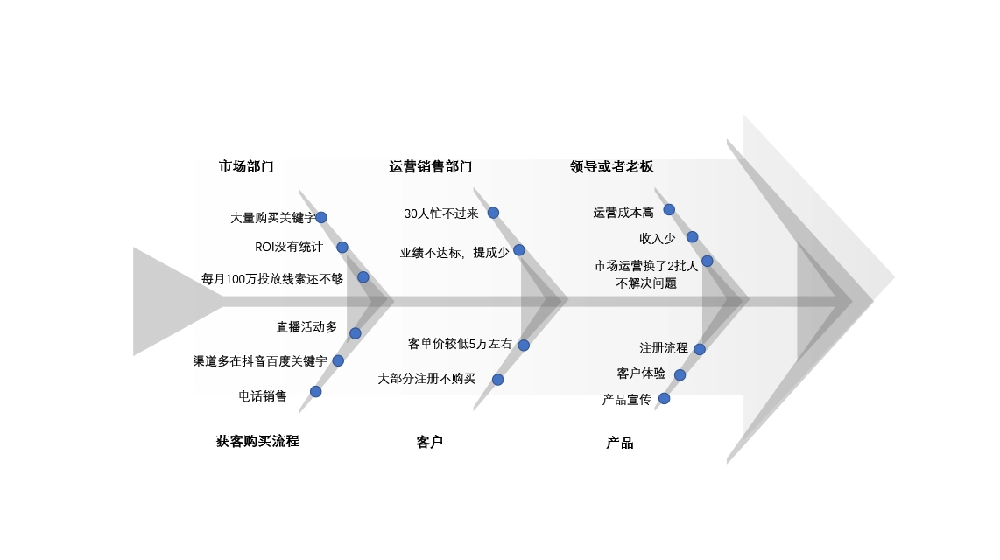
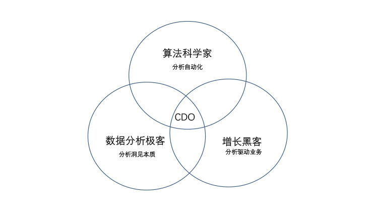

# 21 确定问题

前面学习了很多工具，那么究竟怎么用呢？

## 没有目的的问题都不值得分析

具体到细节，并不想陈述。
欲探其精微，需要一番作为。

-   第一步，把理想与现状对比
-   进行第二步了，那就是 6W2H 法。

附录：数据行业个人发展方向

这三类人就像下面这个图一样，技能结合到一起的就是一个企业的 CDO，也就是首席数据官，哪一条路径都可以让你走到最顶点的位置，取决于你坚持学习的程度和认知的广度。

