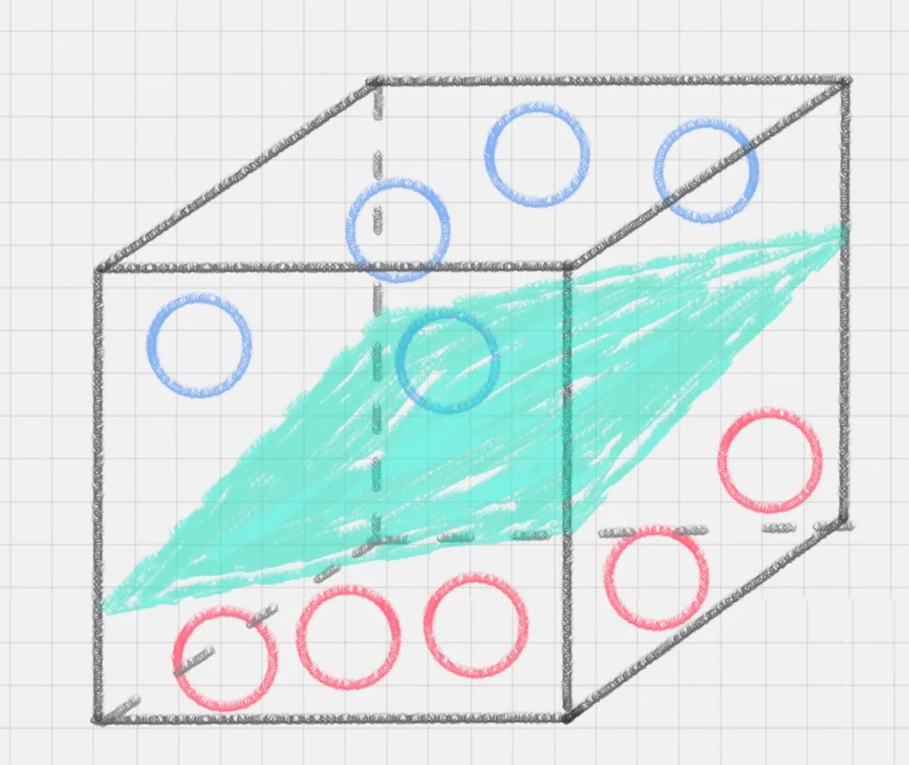
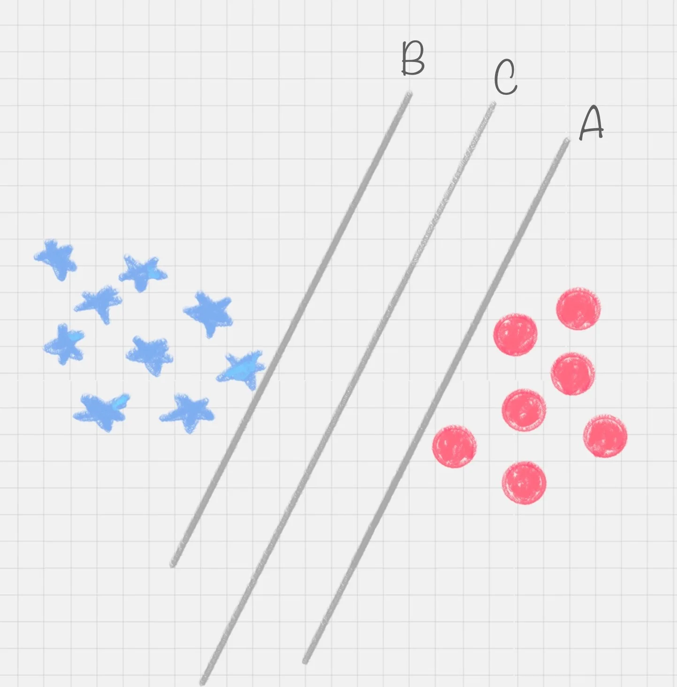
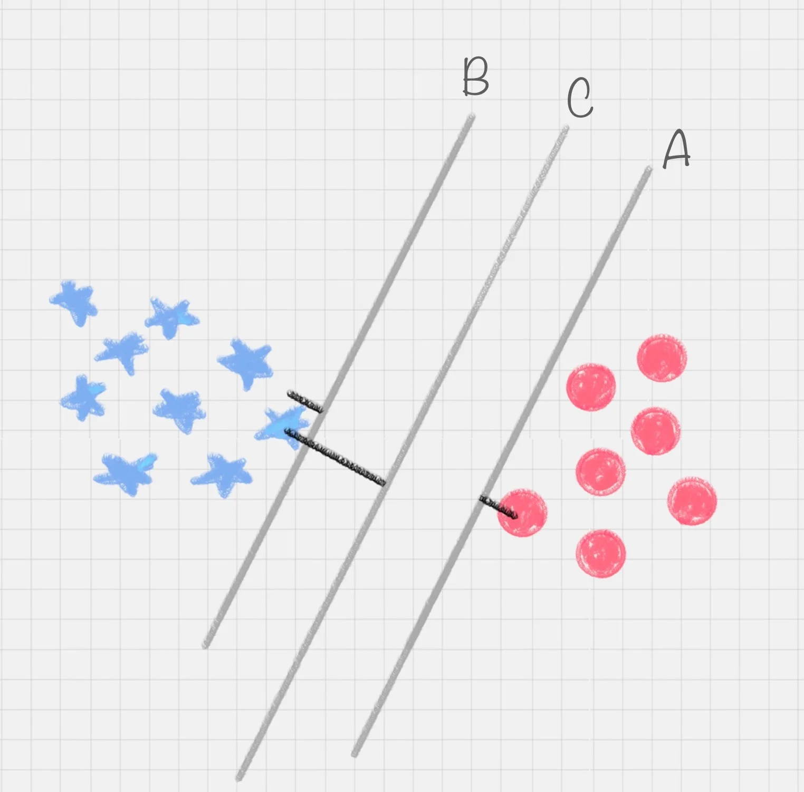
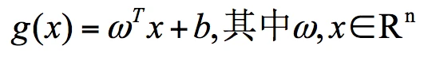
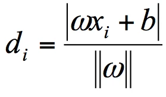
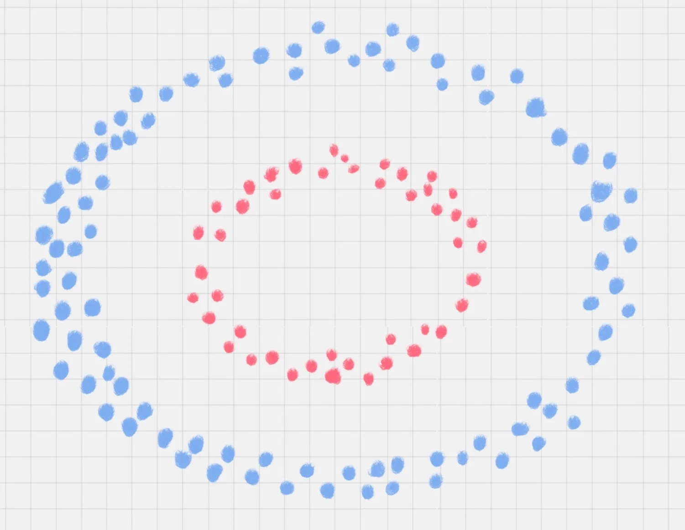

# 22 | SVM(上):如何用棍子将蓝红两色球分开？

SVM ---> Support Vector Machine
支持向量机。
SVM是有监督的学习模型。
## 有监督的学习模型
事先对数据打上分类标签，机器就知道这个数据属于哪个分类。
无监督学习，就是数据没有打上分类标签。这可能是我们不具备先验证的知识，或者打标签的成本很高。

### SVM分类举例

## SVM的工作原理
SVM计算的过程就是帮助我们找到那个超平面的过程

那么怎样找到直线C这个更好的答案呢？

这里，有一个SVM特有的概念：**分类间隔**。
分类环境不是在二维平面中的，而是在多维空间中，这样决策线就成为了决策面。

当转动这个最优决策面，会发现可能存在多个2最优2决策面，它们都能把数据集分开，但是这些最优决策面的间隔可能是不同的，而那个拥有"最大间隔"（max margin）的决策面就是SVM要找的最优解。

### 数学表达式
**点到超平面的距离公式**

w、x是n维空间里的向量，其中x是函数变量；
w是法向量<法向量指的是垂直于平面的直线所表示的向量，它决定了超平面的方向>

`SVM` 就是帮我们找到一个**超平面**，这个超平面能将不同的样本划分开，同时使得样本集中的点到这个分类超平面的最小距离（即分类间隔）最大化。

在这个过程中，**支持向量**就是离**分类超平面**最近的样本点，实际上如果确定了支持向量也就确定了这个超平面。

我们用代表点Xi到超平面Wxi + b=0的欧式距离。因此要求出di的最小值。

其中||w||为超平面的范数，di 的公式可以用解析几何知识进行推导，这里不做解释。最大间隔的优化模型。
<!-- 这里我也看不懂啊 -->

### 最大间隔的优化模型

中间的求解过程会用到**拉格朗日乘子**,`KKT(Karush-Kuhn-Tucker)`条件。

### 硬间隔、软间隔和非线性SVM
硬间隔：分类完全正确
软间隔：允许一定量的样本分类错误

软间隔（差不多就行）

---
另外的情况，就是非线性支持向量机

核函数。**它可以将样本从原始空间映射到一个更高维的特质空间中，使得样本在新的空间中线性可分。**
升维法。~(￣▽￣)~*看起来很厉害的样子。

最常用的核函数有线性核、多项式核、高斯核、拉普拉斯核、sigmoid 核，或者是这些核函数的组合。(又是看不懂的)

### 用SVM解决多分类问题
SVM本身是一个二值分类器，（True or False)

所以可以把二分类器组合起来形成多分类器，以四个为例子。
-   一对多法
    -   一个为君的话，三个就是臣；总共就四种情况。
-   一对一法
    -   任意的两个样本之间，构造分类器。
