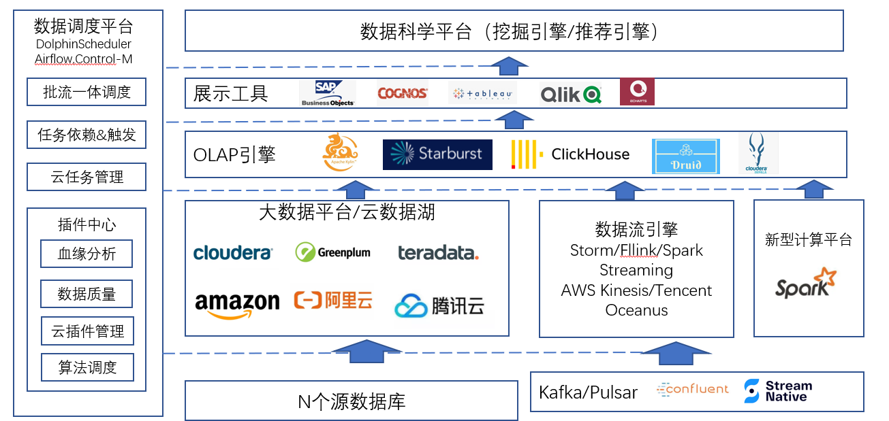
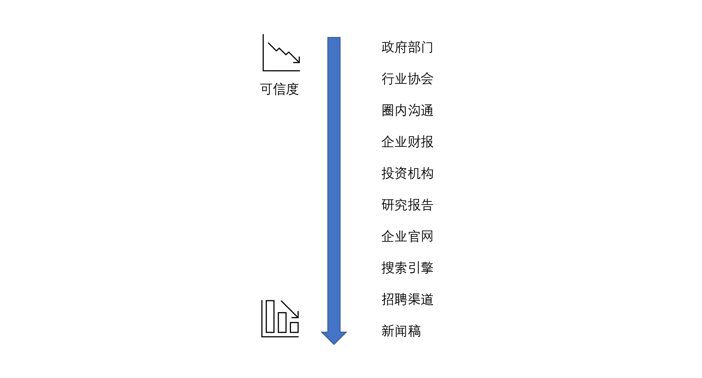

# 22 | 采集数据：一手数据和二手数据

有，故能观其小；无，故能观其大。
执古之道，以遇今之有。

## 采集数据类型

1. 一手数据。
一手数据主要来自企业内部的大数据平台、数据仓库以及相关系统，还有部分数据来自用户访谈和调研问卷以及内部沉淀的历史文档。

一手数据的特点就是数据可控，也正是因为数据都掌握在自己企业手中，理论上只要付出成本，我们可以拿到所有的想要的数据。

-   数字化升级转型应该先从核心或者创新业务流程开始

-   数据的采集和计算一定要从最明细的数据开始

数据分析师都是可以在分钟级甚至秒级来给出相关数据统计分析答案，而不是通过层层数据二次加工获得。数据分析师可以直接自己定义计算口径，针对明细数据进行数据探索，这是数据分析的基础要求。

-   数据的质量要求要大于数据量的要求

2. 二手数据
二手数据主要来自行业内的数据，往往不是自己企业内部产生的。

一般二手数据来自政府部门的报告、行业协会、企业财报、投资机构还有企业官网和一些新闻稿，同时也会来自圈内的沟通或者行业内专业咨询公司出的专业分析报告。

## 数据探索
趋势分析法、快照扩展法和衍生指标法。

-   趋势分析法
    -   趋势延伸法就是我们找到某一个类型的数据之后，捕捉这个数据一个时间段以内的变化。通过这些数据变化，我们去知道曾经有哪些变化、对结果数据会有哪些影响，这样可以找到其中关键的问题和原因。这个时候我们经常会用前面介绍的折线图、散点图和回归来分析趋势并确定离群点。

-   快照扩展法
    -   快照扩展法是截取某个时点的情况，然后通过下钻的方式来扩展这个指标的分布情况。我们会看在这个时点里面我们各部分对于整体的占比和影响程度。这里我们会经常用到曾经讲过的直方图、散点图、聚类分类和数据分布当中的方法，来看各个细分渠道、细分部门分布情况，从而找到我们重点要分析的部门、渠道或一些重点的原因。

-   衍生指标法
    -   如果用上面两种分析方法还没有找到其中的原因，我们可以进一步进行数据的加工，制造出一些衍生指标来拨开迷雾，这也就是衍生指标法。

进行数据探索的时候：
-   数据质量的把控
-   避免辛普森悖论
-   避免因果倒置

## 附录

互联网数据Alexa： https://alexa.chinaz.com/

百度指数： https://index.baidu.com/

微指数： https://data.weibo.com/index/

淘宝指数： https://shu.taobao.com/

阿里价格指数：http://topic.aliresearch.com/

Similarweb：https://www.similarweb.com/

netmarketshare：https://netmarketshare.com/

Statcounter：https://gs.statcounter.com/
