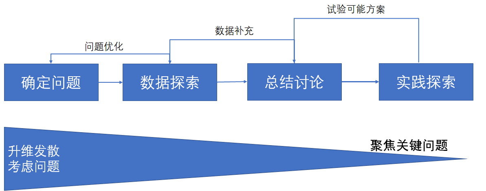

<!--
 * @Author: your name
 * @Date: 2021-09-24 08:57:55
 * @LastEditTime: 2021-09-24 09:17:09
 * @LastEditors: Please set LastEditors
 * @Description: In User Settings Edit
 * @FilePath: \geekbang\bioinformatics\dataanalsis\23_写个故事.md
-->
# 23 | 写好故事线：用数字来说明

一份报告做得既要有高度还要亲民。

## 回顾发现

从数据里面看到的情况，如果你只是把这些数字直接摆到老板的面前，老板肯定会问“然后呢？”所以现在你要设计整个的故事线，你要多想几步。

-   我们把目标提升 10%，我们可以做哪些事情？
-   如果我们想获得 100 倍的成果，那我们应该怎么办？
-   我们这些分析背后是有哪些假设，在什么条件下我们的模式和假设是无效的。

## 设计故事线

易懂,讲究个起承转合。

在这里我给你分享一个经典的故事三段论结构，也就是**情节（陈述） - 起伏（惊喜） - 结尾（结论）**，那些广泛传播的寓言故事也是受益于这个结构。在讲我们的数据分析时，也是要陈述我们发现的事实，中间要讲到一些我们发现但其他人还没有发现的知识，然后给出具体实施措施，最终快速给一个明确的结论，这样才能让整个分析报告掷地有声，传播较广。

在**陈述部分**，我们可以由以下内容来进行陈述：
-   开场，用 30 秒陈述痛点和整体问题的背景；
-   针对问题本身的分析，也就是我们定义问题的部分；
-   结合内外部数据针对问题举例说明。

在**起伏部分**我们可以采取以下类似内容进行阐述：
-   阐述要提升 10% 的话有哪些办法和选择，并给出不采取行动或不发生变化会怎样？
-   阐述更高倍数的提升办法和潜在选择是什么？
-   还有哪些你发现而别人没有发现的观点问题？能带来什么？

在**结论部分**：
-   用简要的话或者数据分析思维导图进行总结和升华；
-   结尾不要用谢谢，要用召唤型的语言或强有力的金句对整个分析报告进行收尾。

### 篇幅
一般来讲根据汇报层次的不同，粒度和整个汇报的篇幅会有所不同。对于数据分析报告来说，高层汇报一般建议在 20~30 分钟，PPT 在 10~20 页；中层和执行层面汇报可以 40~60 分钟左右，整体内容可以在 30~40 页。

### 标题
把所有的内容去掉，只是看PPT的标题，就能明白故事

### 换位思考
让参与这场数据分析的人员可以快速融入角色当中。你需要考虑的写出的内容是否更有利于对方理解，而不是只顾着炫技。

需要的故事只是术的层面，言尽于此，不可多纠结。

