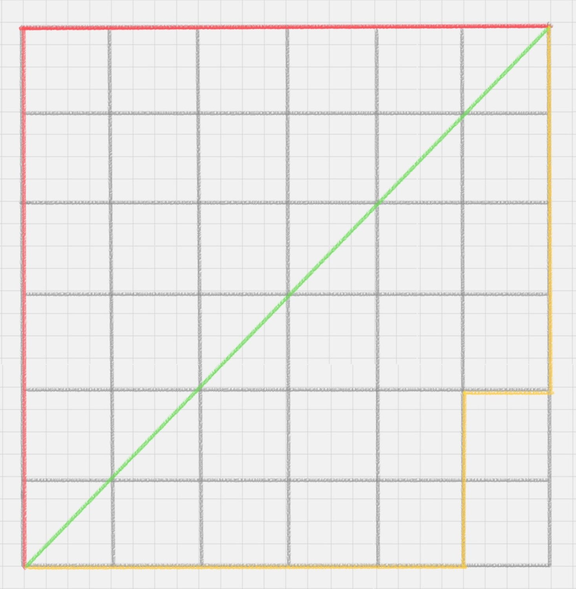

# 24 | KNN 划分电影类型
KNN 的英文名叫K-Nearest Neighbor。

## KNN的工作原理
"近朱者赤，近墨者黑"可以说是KNN的工作原理。
-   1.计算分类物体与其他物体之间的距离
-   2.统计`距离最近`的K个邻居
-   3.对于K个最近的邻居，它们属于哪个分类最多，待分类物体就属于哪一类

## K值如何选择
K值比较小，邻居点是个噪声点时，就很难说了哈；
K值比较大，相当于距离过远的点也会对未知物体的分类产生影响，鲁棒性强，但是先天不足也明显，会产生过拟合情况。
---
所以K值应该是个实践出来的结果。
工程上，采用**交叉验证**的方式取K值。

## 距离如何计算
KNN算法中，一个重要的计算就是关于距离的度量。两个样本点之间的距离代表了这两个样本之间的相似度。距离越大，差异性越大；距离越小，相似度越小。
距离计算方式：
-   欧氏距离

-   曼哈顿距离

-   闵可夫斯基距离
**闵可夫斯基距离**不是一个距离，而是一组距离的定义。对于 n 维空间中的两个点 x(x1,x2,…,xn) 和 y(y1,y2,…,yn) ， x 和 y 两点之间的闵可夫斯基距离为

-   切比雪夫距离
两个点为例，两个点之间的切比雪夫距离就是这两个点坐标数值差的绝对值的最大值，max(|x1-y1|,|x2-y2|)。
-   余弦距离
两个向量的夹角，是在方向上计算两者的差异。
在兴趣相关性比较上，角度关系比距离的绝对值更重要，于是余弦值距离可以用来衡量用户对内容兴趣的区分度。

## KD树
KNN 的计算过程得经过大量计算的。为了减少计算距离次数，提升KNN的搜索效率，人们提出了KD树(K-Dimensional)
在 KD 树的构造中，每个节点都是 k 维数值点的二叉树。既然是二叉树，就可以采用二叉树的增删改查操作，这样就大大提升了搜索效率

## 用KNN做回归
首先看一下要分类的未知电影，离它最近的K部电影大多数属于哪个分类，这个电影就属于哪个分类。
其实是根据已有的经验来判断它的分类。

