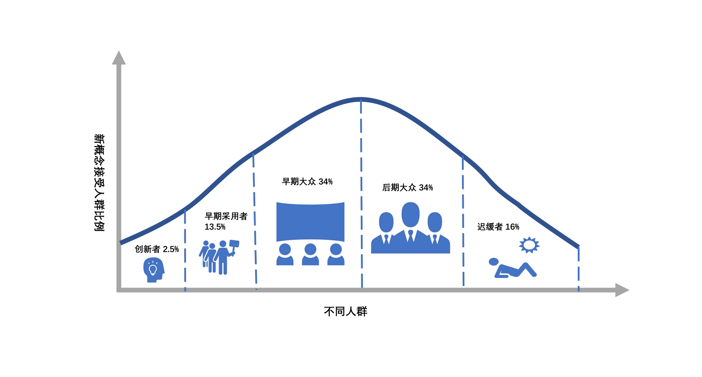
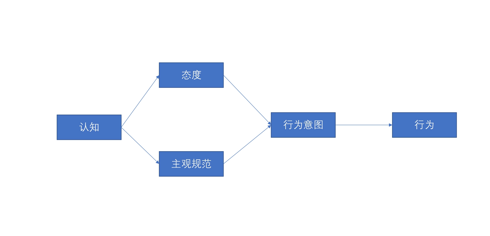

# 24 | 实践你的理论（笃行之）：数据驱动

过去做数据决策的时候，往往采取由上而下的执行方式，就是汇报之后让老板先进行决策，
然后推动全公司的全面改革。但是这种方式往往会面临巨大的风险，但凡之前的某一个环节出现了一些偏差
(或者对业务的认知出现了一些问题)，就会差之毫厘，谬之千里。因此，如果反复论证，那个时间点就已经过去了。

所以现在进行数据驱动实践的时候，都会采用一种方法叫做“精益”的方法。少则得，多则惑。

## 精益的方法
图难于其易，为大于其细。天下难事必作于易，天下大事必作于细。
将目标变小，选择一系列快速的试验，小布快跑来迭代验证结论。

一般来讲，一个设计实验验证的时间不要超过两周，也就是现在在研发里面叫做一个迭代（Srpint）。如果修改时间超过两周，那就证明定的这个实验还是过大了，你需要再把它拆分成更细小的实验，逐步进行迭代。调整往往是通过一个或多个部门并行的几个迭代来观察对数据的影响是否正向，再进行新的迭代。如果出现偏差，那就进行快速调整和迭代。

理论上，前面所有的设计数据实验过程都会比较愉快，但一涉及落地，一般业务部门都是不愿意去改变的。

>无论多坏的改变都会有人受益，不论多好的改变都会使一些人受损。不害人的需求是不完整的需求。 

>——Gerald M. WeinBerg《探索需求》

所以很多时候得趁势，抓住时间点，应时而动。

## 创新扩散模型

数据驱动实践无可避免地会对公司做出一些内部的改变和创新。而改变和创新的扩散过程是要有一个周期的，你可以参考埃弗雷特·罗杰斯（E.M.Rogers）提出创新扩散模型，如下图所示。

当然，在具体说服创新者和早期采用者的时候，也经常会遇到一些困难。例如一些早期的支持者他在会议上很认同你的观点，但是往往没有产生一些具体的配合和行动。这样很多数据分析的实践就只停留在了 PPT 里面，“叫好不叫卖”，没有产生实践结果。

这是因为从观点的认知到具体落实到行动，还有很长的距离。这里我再给你分享一个推动数据驱动落地的方法：理性行为理论。这个理论是在 1975 年由 Fishbein 与 Ajzen 提出的，你可以看看下面这个图。

## 总结
做事业也好、做人也好，都要把我时间与空间，这个就叫做机会。
>  《悦心语》

