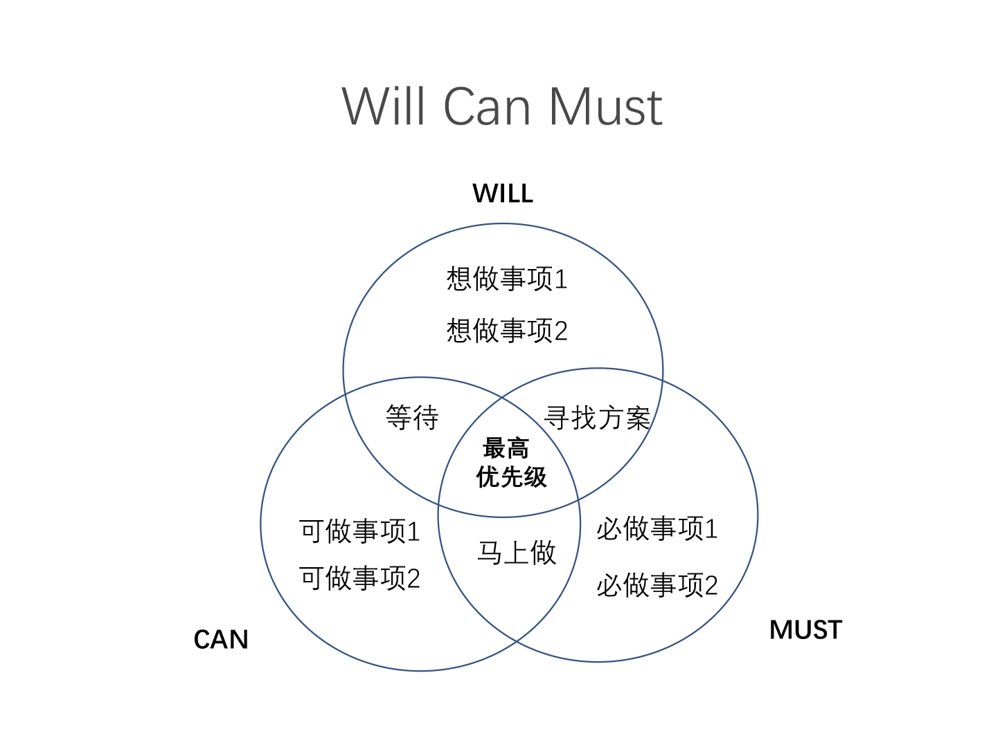

# 25_26: 15种思维图

从大的战略部分入手，介绍一些常用的数据思维图
-   VRIO分析
    -   分析自身业务
-   五力模型
    -   分析整体业务赛道与竞争情况
-   SWOT分析
    -   分析整体业务场景与竞争优劣态势
-   同理心地图
    -   如何打动决策者
-   4P竞争分析
    -   产品市场营销
-   奥斯本检验表
    -   拓展思路，获得新观点
-   SYCCESs表
    -   新观点创意和商业模式评估
-   产品组合矩阵
    -   分析产品布局，产品当中的业务布局

在形成商业模式前，我们还需要去做获客、拆解和执行
-   商业模式画布
    -   分析商业模式
    -   
-   AIDMA
    -   设计整体客户营销策略
    -   
-   AARRR
    -   获取用户的各个阶段
    -   
-   SMART
    -   确定目标是否明确
    -   
-   PDCA
    -   反思和改进自己的业务
    -   
-   RACI
    -   分拆工作职责,进行工作协调
    -   
-   Will, Can, Must
    -   寻找做事情的优先级和边界
    -   

### 两种思维框架
TAPS 思维衍生出来的，当然你还可以用PREP 思维框架衍生的分析思路。
TAPS思维是根据立项与现实的差距组织想传达的内容
-   T To be（理想状态）：最终理想目标应该是怎样的
-   A As is（现实状态）：现状如何，与理想的差距如何
-   P Problem（问题）：这些问题都出在哪里
-   S Solution（解决方案）：我们如何解决它们。

在做观点表达的时候，有一种方法叫做PREP框架：
-   P(point) 结论：让你的听众先明确你要讲的内容
-   R（Reason）依据：讲整个结论的依据，论证结论的可信性
-   E（Excample）示例：给出示例、数据来支撑你的观点。
-   P（Point）重申结论：首尾呼应，重申你要解释的观点。
## 小结
不同于言，勿求于心；不同于心，勿求于气。
找人合作，多为志同道合的；而后才有各种花里胡哨的方式。