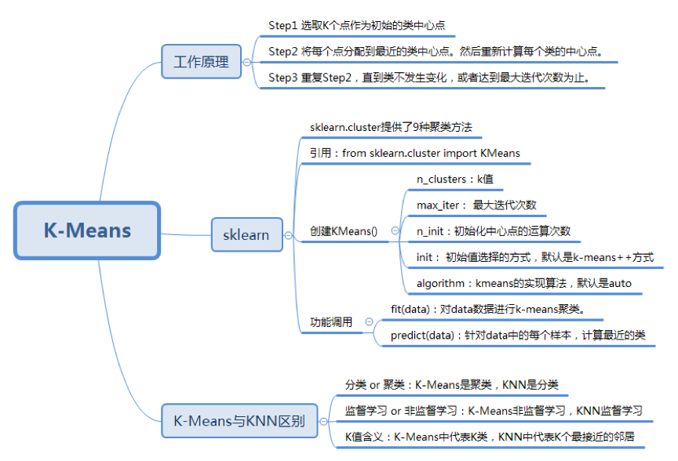

# 26 | K-Means 球队和图像聚类

K-Means是一种监督学习，解决的是聚类问题。K代表的是K类，Mean代表的是中心->K类的中心点。
找到中心点，也就完成了聚类。

如何？
-   中心点
-   将点划分到K类中
-   区分K-Means与KNN

## K-Means的工作原理
我们是依据生活中的经验判断食物的
，当然一开始可以随机指派的，一旦找到了中心点，就可以持经达变。

1. 选取K个点作为初始的类中心点，这些点一般都是从数据集中随机抽取的；
2. 将每个点分配到最近的类中心点，这样形成了K个类，然后重新计算每个类的中心点；
3. 重复第二步，直到类不发生变化，也可以设置最大迭代次数，这样即使类中心点发生变化，但是只要达到最大迭代次数就会结束。

## 随机抽取中心点，计算距离

-   欧式距离
-   曼哈顿距离
-   切比雪夫距离
-   余弦距离

重新计算类的中心点，最简单的方式就是去平均值

## K-Means类创建，主要的参数
1. **`n_clusters`**:K值，慢慢试呗；
2. **`max_iter`**:最大迭代次数，如果聚类很难收敛，设置最大迭代次数可以得到反馈结果;
3. **`n_init`**:初始化中心点的运算次数，默认是10.程序是否快速收敛，这个的关系非常大;
4. **`init`**:初始值选择的方式，默认是采用优化过的k-mean++ 方式，当然自己也可以指定;
5. **`algorithm`**:k-means的实现算法，有"auto" "full" "elkan"三种。一般来说建议使用默认的auto
   1. full 传统的K-Means算法;
   2. auto 会根据数据的特点自动选择"full" 还是 "elkan";

## K-Means与KNN算法的区别
咋不谈。。
