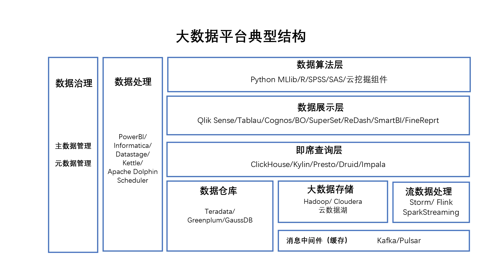

# 27 |  常用的数据分析工具图谱

从个人数据分析工具一直到大型企业的大数据平台，各种工具琳琅满目。

## 幼儿园

典型场景：个人数据分析，小公司进行数据统计

关键词：Excel、SQL Server、云、Power BI

-   在工作中很多看上去非常复杂的数据分析案例，其实都可以用Excel手到擒来
-   Excel 的缺点是它自己的数量级还不够大，往往十几万条数据可能就会非常慢了。
-   这时候，可以通过Excel 连接数据库(Microsoft SQL Server或某某云的）提高效率。

如果Excel处理和展示还不够强劲，微软还有一个个人版本的数据分析西神器：
[PowerBI桌面版](https://powerbi.microsoft.com/zh-cn/desktop/)

## 中学
典型场景:中型传统企业，200+人规模民营企业

数据团队规模：5-10人

关键词：数据仓库、MySQL、Oracle、Greenplum、Teradata、Informatica、Datastage、Apache DolphinScheduler、Kettle、BO、Cognos、Tableau、QlikTech

-    如果有比较简单的互联网业务，完全可以使用网上免费的互联网分析工具。这里光掌握Excel和SQL
-    就不够了，需要学点儿Python或者R
        -   Python 对各类数据平台driver都支持
        -   支持各种挖掘算法库
        -   支持流式计算框架

## 大学
典型场景：中大型传统企业，500+人规模民营企业

数据团队规模: 人数20+

关键词：Apache、Hadoop、Spark、HBase、ClickHouse、Presto、Hive、Kafka、Apache DolphinScheduler、数据挖掘、R、SPSS、SAS、Python MLlib

这个时候企业就需要上大数据平台了，因为大部分使用的都是开源组件，一般的大数据平台需要专人维护。

这些数据挖掘应用你可以使用开源的库例如 PythonMLlib 或者是 R，也可以使用一些收费软件，例如 SPSS、SAS 或者云上的一些算法服务。

## 博士
典型场景：超大型传统企业，大型互联网公司

数据团队规模：人数100+

关键词：融合框架、融合算法、自建开源社区

到这个阶段一般是超大型的传统企业或者大型的互联网公司，他们将数据贯彻到企业业务过程当中，已经完全融合了数据驱动的思路。

## 附录：
数据组件名词解释表Excel：
-   微软 Office 套件里面专门针对数据处理的组件，有云同步的 Office 365 和本地的 Office 版本。（https://www.office.com/）

-   SQL Server：微软的数据库系统，在阿里云、腾讯云以及微软的云上都有按时和按需购买的实例。（https://www.microsoft.com/en-in/sql-server/）

-   云：不用安装软件，可以直接订阅，就可以使用相关的公有云服务，典型的有 aws 微软、Azure、阿里云、腾讯云、华为云。

-   Power BI：微软的数据处理和数据展示套装，桌面版是免费的，云版和服务器端是收费的。（https://powerbi.microsoft.com/cn）

-   数据仓库：传统数据存储的小数据比较集中的地方，将企业内部所有的格式化数据全都聚集到一起，方便数据分析师和内部决策者进行辅助决策。

-   MySQL： Oracle 公司免费的小型的数据库系统。(https://www.mysql.com/)

-   Oracle：Oracle 公司大型的数据存储和数据库系统，也提供 Oracle 的云上服务。（https://www.oracle.com/in/index.html）

-   Greenplum：Pivotal 公司的开源的数据仓库、存储系统。（https://greenplum.org/）

-   Teradata：收费的软件和硬件一体化的数据仓库系统。（https://www.teradata.com/）

-   Informatica：收费的数据处理和数据调度系统。（https://www.informatica.com/）

-   Datastage： IBM 公司收费的数据处理和数据调度系统。（https://www.ibm.com/in-en/products/datastage）

-   Apache：全球顶级的开源基金会，旗下所有的软件都是开源钱可以免费使用的，大部分大数据组件都是来自这家开源基金会的组建。（https://Apache.org）

-   Apache DolphinScheduler：中国人贡献的阿帕奇基金会的免费可视化大数据调度系统，可加微信 Leonard-ds 进入社区。（https://dolphinscheduler.apache.org/ ）

-   Kettle：免费的可视化数据调度系统。（(https://spark.apache.org/mllib/)

