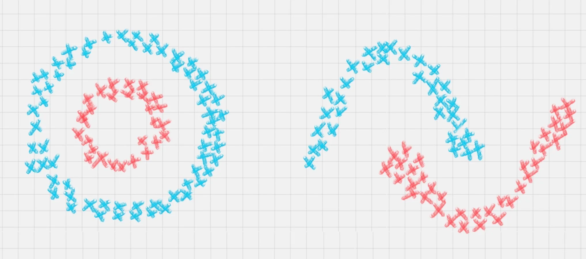

# EM聚类 | 王者荣耀人物的划分
最大似然法，Maximum Likelihood

日常我们根据经验来判断事物，这就有点儿最大似然法的味道啦...

EM算法和最大似然法，EM算法是一种求解最大似然估计的方法，通过观测样本，来找出样本的模型参数。

使用该模型时，不断修正(估计)参数，直到参数没有什么变化的时候，就可以
完善模型了。

## EM聚类的工作原理
EM算法最直接的应用就是参数估计。
如果把潜在类别当作隐藏变量，样本看做观察值，就可以把聚类问题转化为参数估计问题。

相比于K-Means算法，EM聚类更加灵活。

### 区分
K-Means 是通过距离来区分样本之间的差别的，且每个样本在计算的时候只能属于一个分类-->硬分类算法

EM在聚类求解的时候，实际上每个样本都有一定的概率和聚类相关-->软聚类算法

### EM 和 KMEANS的差异
EM算法相当与一个框架，可以采用不同的模型来聚类,比如:GMM（高斯混合模型)或者HMM(隐马尔可夫模型)来进行聚类。

- E步骤
  - 1.初始化参数
  - 2.计算期望
- M步骤
  - 重新估计参数

EM 得到的概率分布，结果差不多就行(计算概率)
KMEANS 那是一定要得到结果，达到目的（计算距离)

相同点：随机生成期望值，反复试探，获得理想中的结果，并且聚类个数清晰。

