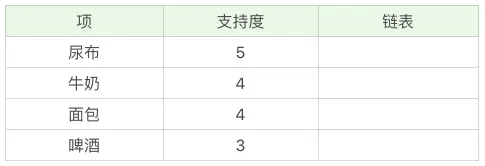
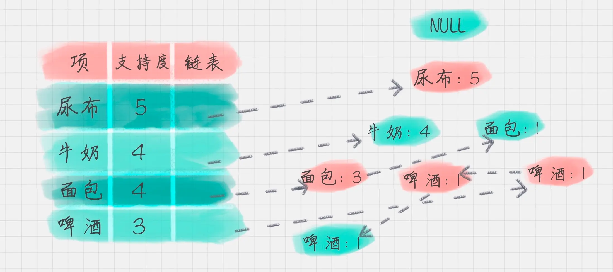
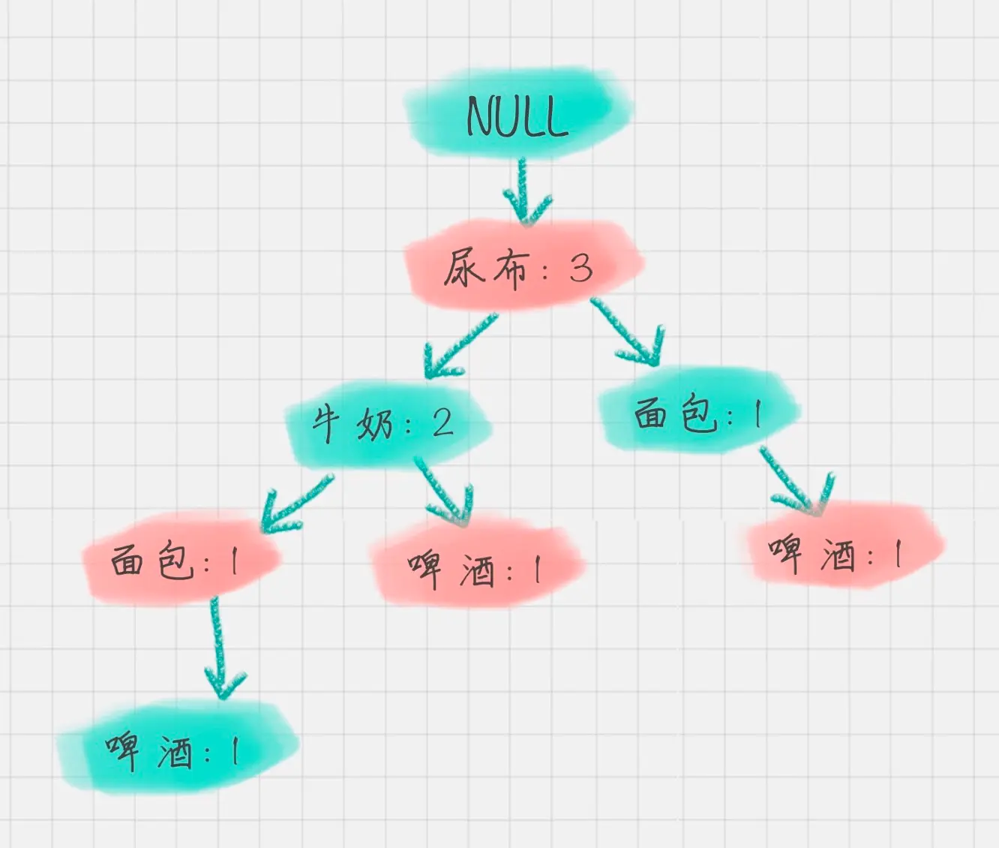

<!-- -!--coding='utf-8'-- -->
# 30| 关联用户规则,Apriori

关联规则，最早是由Agrawal等人在1993年提出来的。在1994年Agrawal等人又提出了基于关联规则的Apriori算法，至今Apriori仍然是关联规则挖掘的重要算法。

关联规则挖掘 可以让我们从数据集中发现项(item)与项(item)之间的关系。例如：购物篮分析。

## 概念

- 支持度
  - 商品组合出现的次数与总次数之间的比例。支持度越高，代表这个组合出现的频率越大

- 置信度
  -  条件概念，就是说在A发生的情况下，B发生的概率是多少。

-  提升度
   -  商品推荐时，商品A的出现，对商品B的出现概率提升的程度
   -  提升度（A → B) = 置信度 （A → B) / 支持度(B)

其实，是在衡量A出现的情况下，是否对B出现的概率有所提升。

提升度大于1时：代表有提升。

## Apriori的工作原理
Apriori算法其实就是查找频繁集(frequent itemset)的过程。
而，频繁项集就是支持度大于等于最小支持度(Min Support)阈值的项集，所以小于最小值支持度的项目就是非频繁项集，而大于最小支持度的项集就是频繁项集。

项集，itemset,可以是单个，也可以是商品的组合。

## Apriori的改进算法:FP-Growth算法

Aprori算法在计算的过程中

1. 可能产生大量的候选集。由于采用排列组合的方式，把可能的项集都组合出来了；
2. 每次计算都需要重新扫描数据集，来计算每个项集的支持度。
   
所以时间复杂度和空间复杂度都非常高。

为此，人们提出了FP-Growth算法
1. 创建一颗FP树来存储频繁项集。在创建前对不满足最小支持度的项进行删除，
2. 整个生成过程只遍历数据集2次，大大减少了计算量。

### 1.创建项头表(item header table)
项头表的作用是为了FP构建以及频繁集挖掘提供索引

### 2. 构建FP树

### 3.通过FP树挖掘频繁项集
FP树的根节点记为NULL节点
在这里，得到了一个存储频繁项集的FP树,以及一个项头表。
可以依据每个项头表来挖掘频繁集。

条件模式集：以要挖掘的节点为子节点，子底向上求出FP子树，然后将FP子树的祖先节点设置为叶子节点之和。
以"啤酒”为例，从FP树中可以得到一颗子树，

