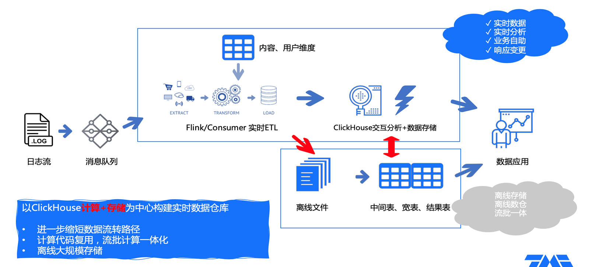
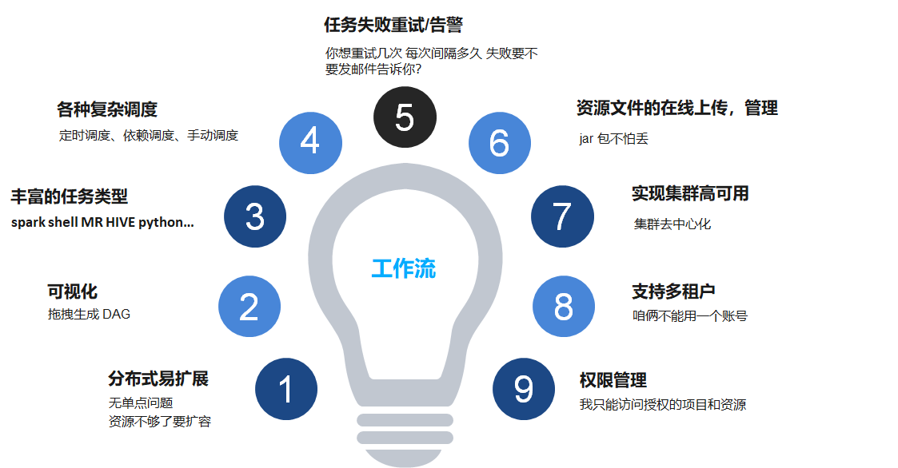
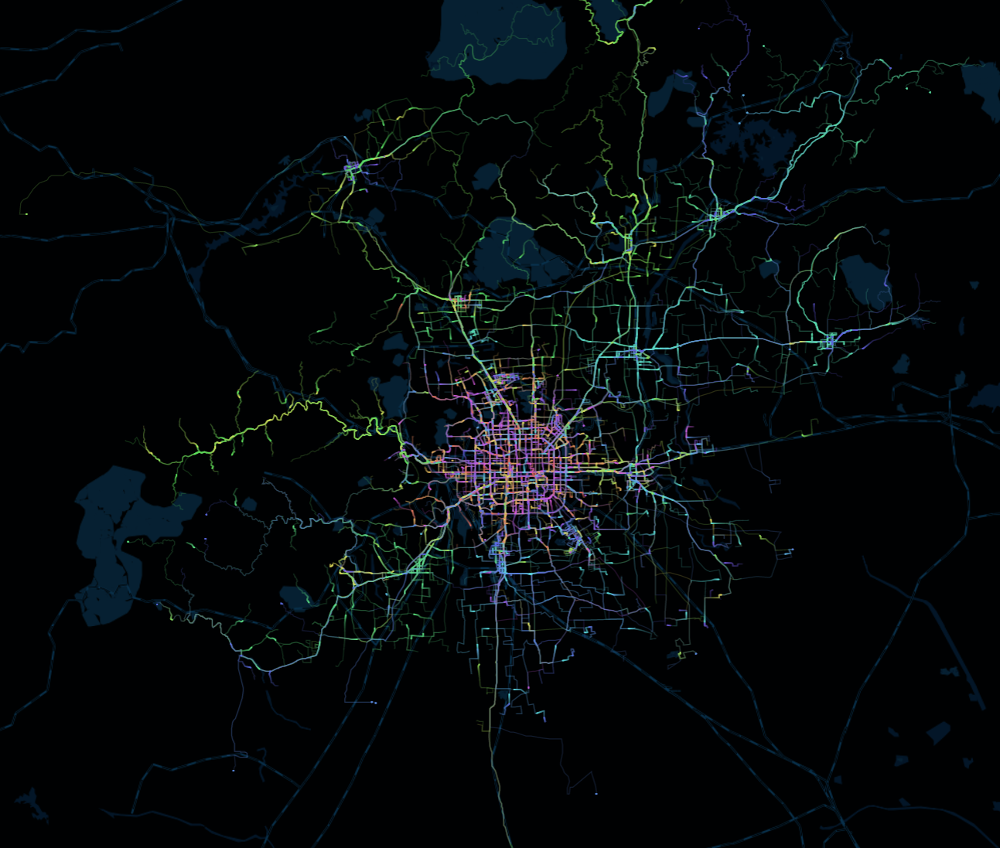

# 31 先进的数据分析工具展望

整个大数据框架离不开三个基础的技术部分：数据储存、数据处理、数据展示

## 数据存储与分析引擎--ClickHouse

-   并不是非常复杂的NoSQL编程语言，而是很简单的SQL语言
-   宽表查询速度非常快
-   ClickHouse整体部署和维护安装比较简单,在数据量不是特别大的时候，一台服务器就可以搞定

腾讯音乐把 ClickHouse 作为了实时分析数据仓库，你在使用腾讯音乐的推荐和点击的时候，背后的大数据平台就是 ClickHouse 来提供的。

腾讯把数据放到消息队列里，然后通过一个叫做 Flink 的工具实时装载到 ClickHouse 当中，同时把一些离线文件传入传统的数据仓库里。最终我们数据分析师使用的数据，看到的是实时的数据，既可以看到上一秒的系统情况，还可以做各种自定义的 SQL 查询，数据还是秒回。这样帮助腾讯音乐自助进行汇总、筛选查询，也能快速地响应各种各样的原始数据变更。

## 数据处理与调度平台--Apache DolphinScheduler
其中一个互联网用户叫做“奇安信”，他是这样反馈的：Apache DolphinScheduler 是一个可视化非常好的工具，无需代码就可以调度任务。降低使用门槛；它底层用了分布式、易扩展的方式实现了集群高可用；所有的资源文件都是在线的，不用登陆带服务器就可以看到日志错误调试脚本、管理上传的脚本文件；同时它的支持多租户也支持权限管理分给不同部门使用。

除了 Apache DolphinScheduler，类似的还有美国 AirB&B 开源的 Apache Airflow 和 Cloudera 开源的 Apache OOzie 等等，这些都还需要编一部分代码来执行相关的任务，所以**你可以根据自己的情况去测试一下哪个工具最适合你的场景，最后通过数据平台部门来帮你实现**。

## 数据展示工具--EChart

国内最牛的数据展示工具--Apache ECharts

当然类似像 Echarts 这样的工具，海外还有 D3 或者是一些其他的收费工具，数据分析最后的颜面还是要找一个漂亮的图形让更多人喜爱。

>https://echarts.apache.org/zh/index.html
