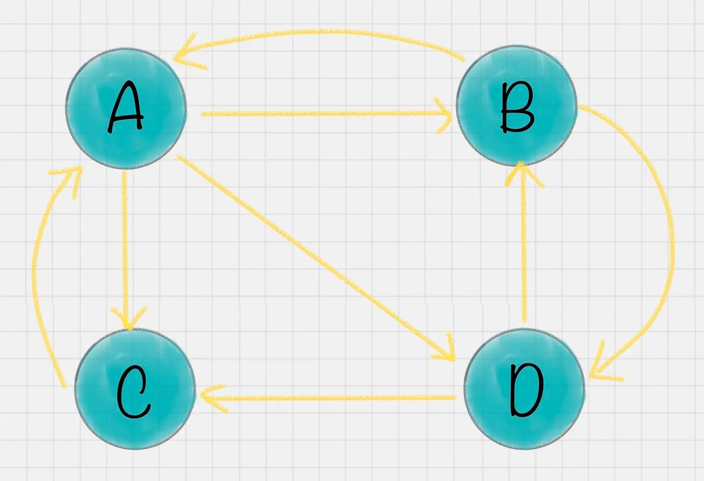
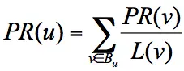
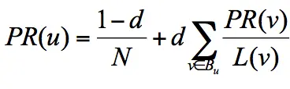

# 32 | PageRank ：Google的算法
圈子

有人的地方，就有入世和出世
有网络的地方，就有入链和出链。

入世，德行足够，可安一方百姓，可成就一番事业；
网站也是如此；
 
入世太久，或长袖善舞，或作茧自缚。
入链或者出链太多，升降失常，气机不畅，终究会败坏。(熵增嘛)
是故，君子以裒多益寡，称物平施. 裒（póu），减也；益，加也。
引入阻尼因子，也是这般道理。

早期的搜索引擎：
-   返回质量不高，因为基于时间排序
-   容易钻空子，页面中的检索词出现的频次越高，匹配度越高，有些网页为了增加排名。

当时Google的创始人拉里·佩奇提出了PageRank算法，他们受到了论文影响因子的启发。

## PageRank的简化模型
4个网页A、B、C、D

A有2个入度，3个出度。
一个网页的影响力 = 所有入链集合的页面的加权影响力之和：

u 为待评估的页面，Bu​ 为页面 u 的入链集合。针对入链集合中的任意页面 v，它能给 u 带来的影响力是其自身的影响力 PR(v) 除以 v 页面的出链数量，即页面 v 把影响力 PR(v) 平均分配给了它的出链，这样统计所有能给 u 带来链接的页面 v，得到的总和就是网页 u 的影响力，即为 PR(u)

## 面临的两个问题
1.等级泄露（rank Leak):一个网页没有出链，吸收了其他网页的影响力而不释放，
2.等级沉没（Rank Sink):如果一个网页只有出链，没有入链，一顿操作下来，会导致整个网页的PR值为0

---
## 引入了PageRank的随机浏览模型

1. 拉里·佩奇的假设：用户并不都是按照跳转链接的方式来上网，还有一种可能是不论处于哪个页面，都有概率访问到其他任意的页面，比如说用户就是要直接输入网址访问其他页面，虽然这个概率比较小。
---
2. 由此，引入了阻尼因子：

所以他定义了阻尼因子 d，这个因子代表了用户按照跳转链接来上网的概率，通常可以取一个固定值 0.85，而 1-d=0.15 则代表了用户不是通过跳转链接的方式来访问网页的，比如直接输入网址。

N:网页总数