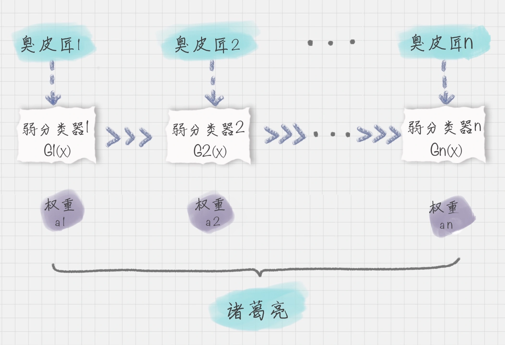
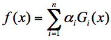
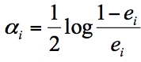
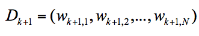

# 34丨AdaBoost - 分类的升华

AdaBoost的英文全称是Adaptive Boosting,中文含义是自适应提升算法。
它由Freund等人于1995年提出，是对Boosting算法的实现。

## 工作原理
Boosting算法是集成算法的一种，同时也是一类算法的总称。

这种强分类器是由一些弱分类器构成;

假设弱分类器为 Gi​(x)，它在强分类器中的权重 αi​，那么就可以得出强分类器 f(x)：

那么问题就来了：
-   如何得到弱分类器，也就是在每次迭代训练的过程中，如何得到最优弱分类器？
-   弱分类器的权重是如何处理的？

「凡是有的，还要加给他，叫他有余。没有的，连他所有的，也要夺过来。」,差的采取降低权重，好点儿的逐渐提高即可。

所以我们需要基于这个弱分类器对样本的分类错误率来决定它的权重：

其中 ei​ 代表第 i 个分类器的分类错误率。

如何在每次训练迭代的过程中选择最优的弱分类器？实际上，AdaBoost 算法是通过改变样本的数据分布来实现的。

我们可以用 Dk+1​ 代表第 k+1 轮训练中，样本的权重集合，其中 Wk+1,1​ 代表第 k+1 轮中第一个样本的权重，以此类推 Wk+1,N​ 代表第 k+1 轮中第 N 个样本的权重，因此用公式表示为：

## 总结
同样的原理在我们的学习生活中也经常出现，比如善于利用错题本来提升学习效率和学习成绩。

