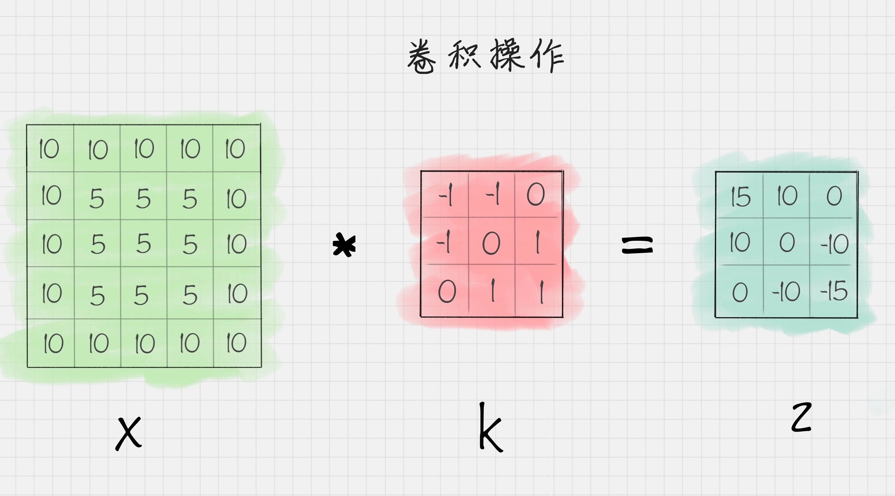
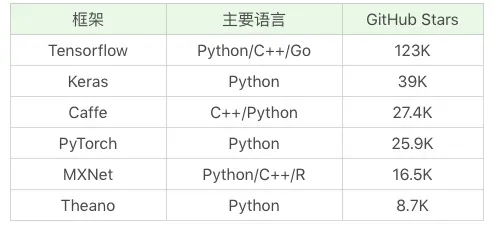

# 43 | 深度学习：keras 手写数字识别

## CNN网络中的卷积作用
CNN的网络结构由三种层组成：卷积层、池化层和全连接层

卷积本身是一种矩阵运算

此时，应该将卷积核翻卷180°

## 激活函数的作用
做完卷积操作之后，通常还需要使用激活函数对图像进一步处理。

激活函数通常是非线性的函数，使用它们把线性数值映射到非线性空间中。只有经过非线性的激活函数运算之后，才能映射到非线性空间中。

## 池化层的作用
池化层通常在两个卷积层之间，它的作用相当于对神经元数据做降维处理，这样就能降低整体计算量。

## 全连接层的作用
全连接层将前面一层的输出结果与当前层的每个神经元都进行了连接。

## LeNet和AlexNet网络
你能看出 CNN 网络结构中每一层的作用：它通过卷积层提取特征，通过激活函数让结果映射到非线性空间，增强了结果的表达能力，再通过池化层压缩特征图，降低了网络复杂度，最后通过全连接层归一化，然后连接 Softmax 分类器进行计算每个类别的概率。

通常我们可以使用多个卷积层和池化层，最后再连接一个或者多个全连接层，这样也就产生了不同的网络结构，比如 LeNet 和 AlexNet。

## 常用的深度学习框架

