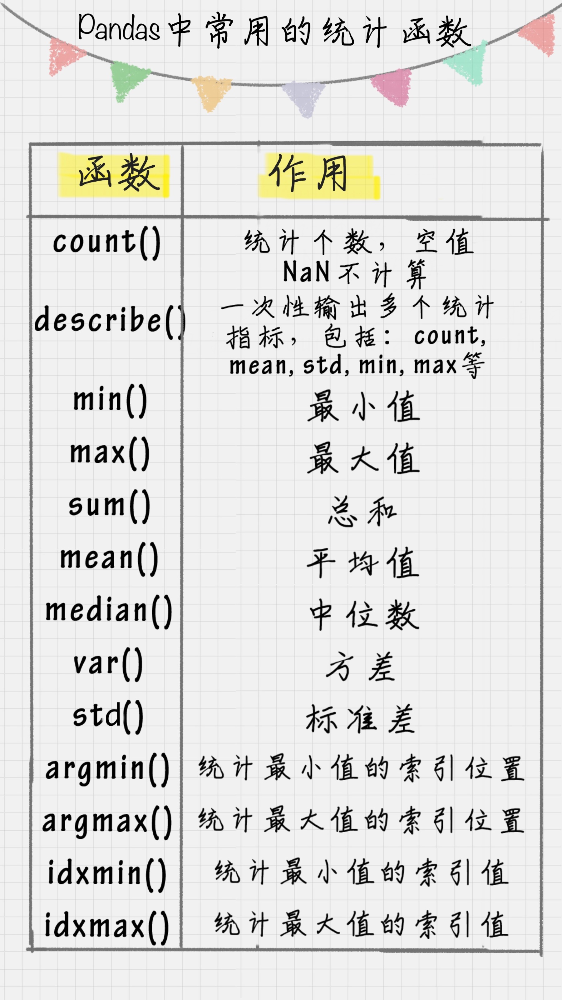

# 05 | Python 科学计算：Pandas
    Pandas提供的基础数据结构DataFrame与json的契合度很高，
    转换起来就很方便。

    Pandas 基于Numpy构建的含有更高级数据结构和分析数据能力的工具包。
    在Numpy中数据结构是围绕ndarray展开的，那么在Pandas中的核心数据结构是什么呢。

    
## 数据结构: Series和DataFrame

### Series
**Series是个定长的字典序列**
    说是定长是因为在存储时，相当于两个ndarray,这也是和字典结构最大的不同

    Series有两个基本属性:index和values。
```python
import pandas as pd
from pandas import Series, DataFrame
x1 = Series([1,2,3,4])
x2 = Series(data=[1,2,3,4], index=['a', 'b', 'c', 'd'])
print x1
print x2

import pandas as pd
from pandas import Series, DataFrame
x1 = Series([1,2,3,4])
x2 = Series(data=[1,2,3,4], index=['a', 'b', 'c', 'd'])
print x1
print x2
```

### DataFrame
DataFrame 类型数据结构类似`数据库表`
    它包括了行索引和列索引，我们可以将 DataFrame 看成是由相同索引的 Series 组成的字典类型。

```python
import pandas as pd
from pandas import Series, DataFrame
data = {'Chinese': [66, 95, 93, 90,80],'English': [65, 85, 92, 88, 90],'Math': [30, 98, 96, 77, 90]}
df1= DataFrame(data)
df2 = DataFrame(data, index=['ZhangFei', 'GuanYu', 'ZhaoYun', 'HuangZhong', 'DianWei'], columns=['English', 'Math', 'Chinese'])
print df1
print df2
```

### 数据导入和输出
    Pandas 允许直接从 xlsx，csv 等文件中导入数据，也可以输出到 xlsx, csv 
    

### 数据清洗
    在数据清洗过程中，一般都会遇到以下这几种情况，下面我来简单介绍一下。
-   1. 删除 DataFrame 中的不必要的列或行
    -   Pandas 提供了一个便捷的方法 drop() 函数来删除我们不想要的列或行
-   2. 重命名列名 columns，让列表名更容易识别
    -   如果你想对 DataFrame 中的 columns 进行重命名，可以直接使用 rename(columns=new_names, inplace=True) 函数，比如我把列名 Chinese 改成 YuWen，English 改成 YingYu。
-   3. 去重复的值
    -   数据采集可能存在重复的行，这时只要使用 drop_duplicates() 就会自动把重复的行去掉。
-   4. 格式问题
    -   更改数据格式这是个比较常用的操作，因为很多时候数据格式不规范，我们可以使用 astype 函数来规范数据格式
    -   数据间的空格
    -   大小写转换
    -   查找空值


###  使用 apply 函数对数据进行清洗

    apply 函数是 Pandas 中自由度非常高的函数，使用频率也非常高。

    大写转化，定义个函数都是常规操作

### 数据统计
    表格中有一个 describe() 函数，统计函数千千万，describe() 函数最简便。它是个统计大礼包，可以快速让我们对数据有个全面的了解。



### 数据表合并
    这个比较类似数据库操作，暂且放一放。。
    两个 DataFrame 数据表的合并使用的是 merge() 函数，有下面 5 种形式：
1. 基于指定列进行连接
2. inner 内连接
3. left 左连接
4. right 右连接
5. outer 外连接

### 如何用 SQL 方式打开 Pandas
    Pandas 的 DataFrame 数据类型可以让我们像处理数据表一样进行操作，比如数据表的增删改查，都可以用 Pandas 工具来完成。

    事实上，在 Python 里可以直接使用 SQL 语句来操作 Pandas。

    pandasql 中的主要函数是 sqldf，它接收两个参数：一个 SQL 查询语句，还有一组环境变量 globals() 或 locals()。这样我们就可以在 Python 里，直接用 SQL 语句中对 DataFrame 进行操作，举个例子：
```python
import pandas as pd
from pandas import DataFrame
from pandasql import sqldf, load_meat, load_births
df1 = DataFrame({'name':['ZhangFei', 'GuanYu', 'a', 'b', 'c'], 'data1':range(5)})
pysqldf = lambda sql: sqldf(sql, globals())
sql = "select * from df1 where name ='ZhangFei'"
print pysqldf(sql)
```
---