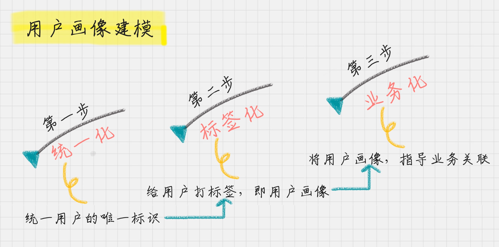
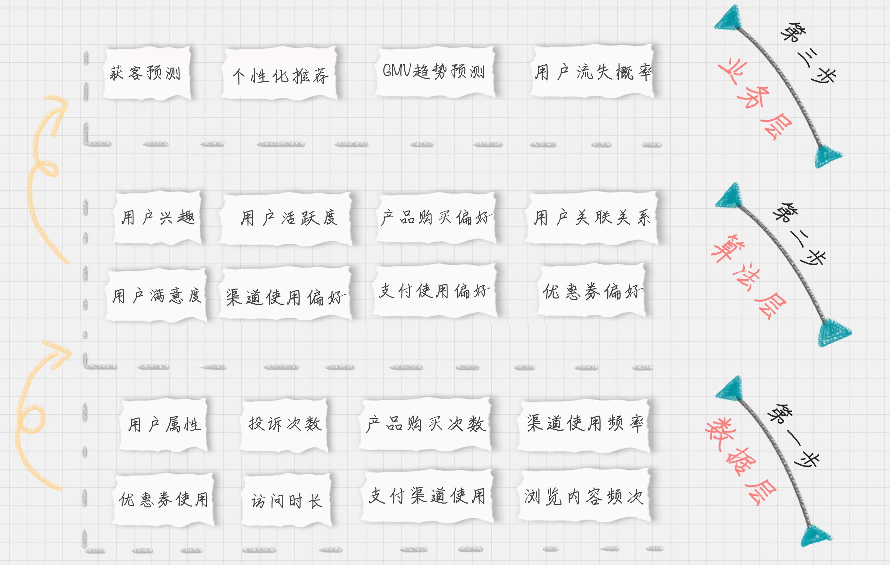

# 07 | 用户画像：标签化就是数据的抽象能力
    精细化运营将是长久的主题

## 用户画像的准则

### 设计唯一标识
    用户唯一标识是整个用户画像的核心

`其次，给用户打标签`
    其实是，用户消费行为分析
    用户标签
    消费标签
    行为标签
    内容浏览

    从而建立起用户的数学模型,从已有的数据来预测未来的行为。

### 实际案例
    美团外卖
    滴滴

