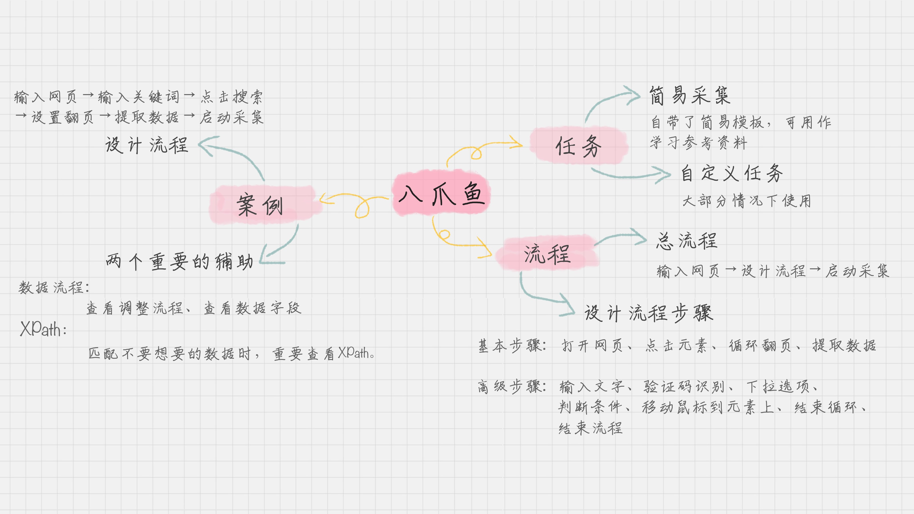

# rules
我们的工作流程通常很长，所以更应该专注`工作的核心`，
    
    比如说数据分析这块，所有的辅助都可以采用第三方工具来做。如果老板让你统计微博上的评论，实际上老板最想知道的不是采集的过程，而是整体的概况，比如说影响了多少人，评论如何，是否有 KOL 关注等等。
    
    如果你之前没有数据采集的经验，那么第三方工具，以及采用可视化的方式来进行采集应该是你的首选。可视化的方式可以让你迅速上手，了解到整个数据采集的过程。

如果你之前没有数据采集的经验，那么第三方工具，以及采用可视化的方式来进行采集应该是你的首选。可视化的方式可以让你迅速上手，了解到整个数据采集的过程。
    我们应该从基础步骤开始，遇到特定需求的时候再学习了解高级步骤。这篇文章只介绍了基本的流程，但你可以上手操作了。在实际操作中，你可能会遇到各种问题，这个时候再对高级步骤进行学习，如果要进阶的话，还需要你掌握 XPath 的使用。

