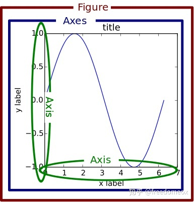
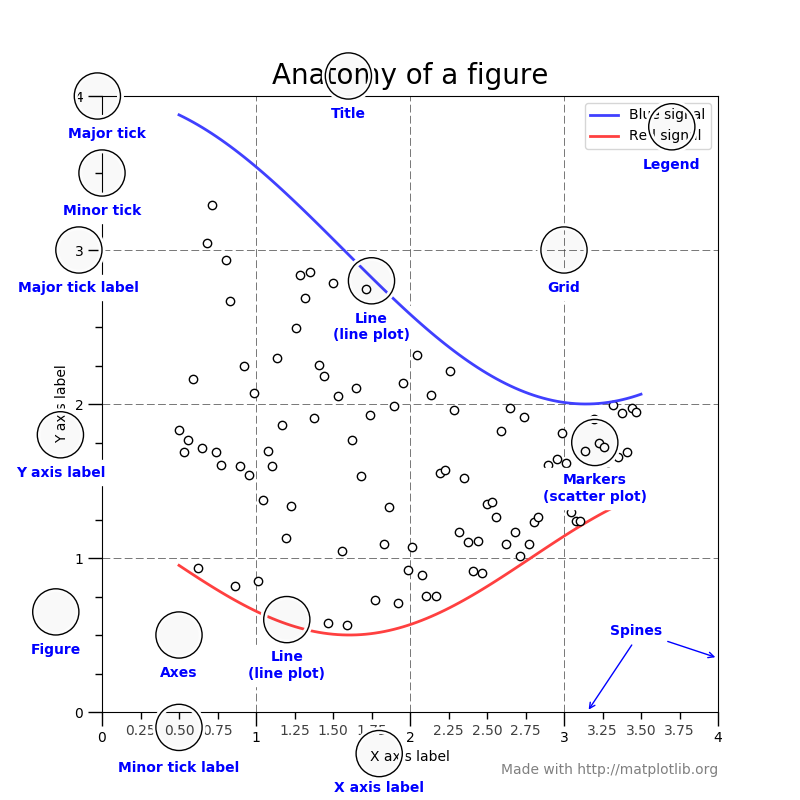

# basis
其实它是来记载，我画图时的一些问题;
首先，它是面向对象的，有自己的风格，画大数据时，不好操作

借花献佛，先用别人的回答：

看出来了答主使劲想把 .plt 和 ax.plot 分开，但还是没有讲到点子上，没能触及为什么matplotlib 能用不同方式来实现同一功能的原因。

首先 matplotlib 架构上分为三层
底层：backend layer
中层：artist layer
最高层：scripting layer

在任意一层操作都能够实现画图的目的，而且画出来还都一样。但越底层的操作越细节话，越高层越易于人机交互。

.plt 对应的就是最高层 scripting layer。这就是为什么它简单上手，但要调细节就不灵了。

ax.plot 是在 artist layer 上操作。基本上可以实现任何细节的调试。

backend layer, 至今，我还没有见有人在这个layer上操作过。

另外，对于axes (翻译就是 坐标系)，我看到有个评论写了很多，说的没有错，但也没说到点子上。
如果大家学过大学物理的话，会知道每一个物体都有一个独立的坐标系。而matplotlib 就是引用这一理念。所以在artist layer上画多条曲线时，你会用 ax1.plot, ax2.plot ... 而最后显示在一张图上是因为所有独立坐标系对齐的结果。

## matplotlib：先搞明白plt. /ax./ fig再画

### plt.***和 ax.***的区别

-   Figure fig = plt.figure(): 可以解释为画布。
    -   画图的第一件事，就是创建一个画布figure，然后在这个画布上加各种元素。
-   Axes ax = fig.add_subplot(1,1,1): 

    -   如果你的figure只有一张图，那么你只有一个axes。如果你的figure有subplot，那么每一个subplot就是一个axes
    -   axes是matlibplot的宇宙中心！axes下可以修改编辑的变量非常多，基本上能包含你的所有需求。
-   Axis ax.xaxis/ax.yaxis: 对，这才是你的xyz...坐标轴。
-   每个坐标轴实际上也是由竖线和数字组成的，每一个竖线其实也是一个axis的subplot，因此ax.xaxis也存在axes这个对象。对这个axes进行编辑就会修改xaxis图像上的表现。

>https://zhuanlan.zhihu.com/p/93423829

>[matplotlib parts-of-a-figure](https://matplotlib.org/1.5.1/faq/usage_faq.html#parts-of-a-figure)

>[matplotlib tutor](https://matplotlib.org/stable/tutorials/introductory/usage.html)