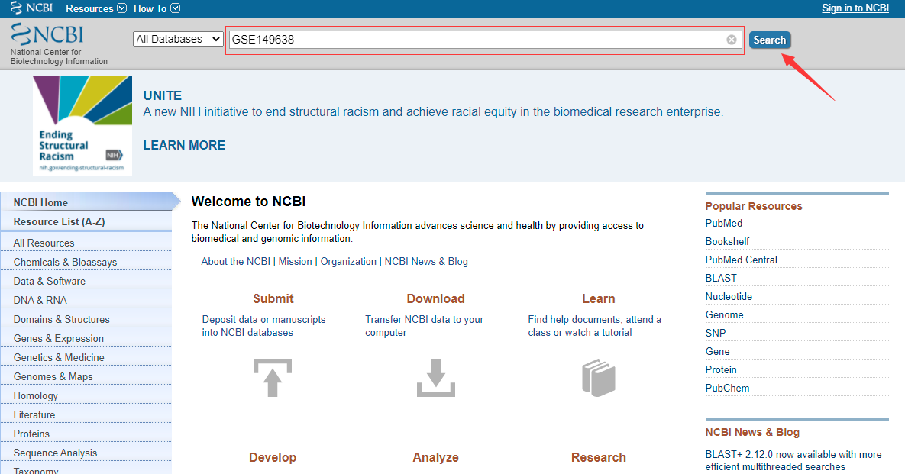
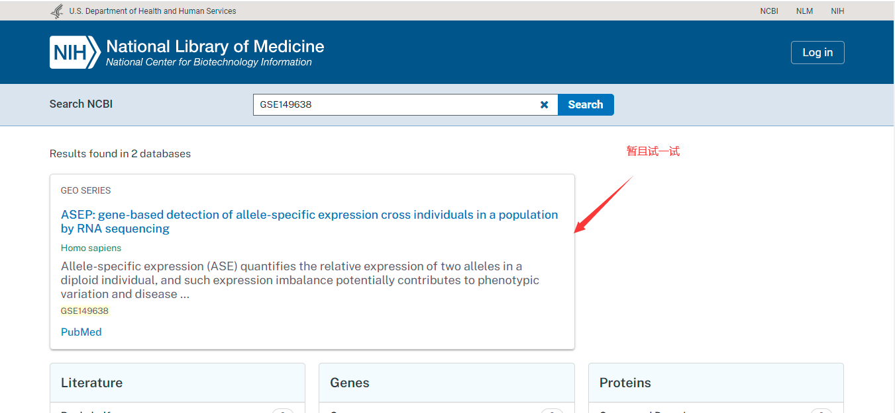
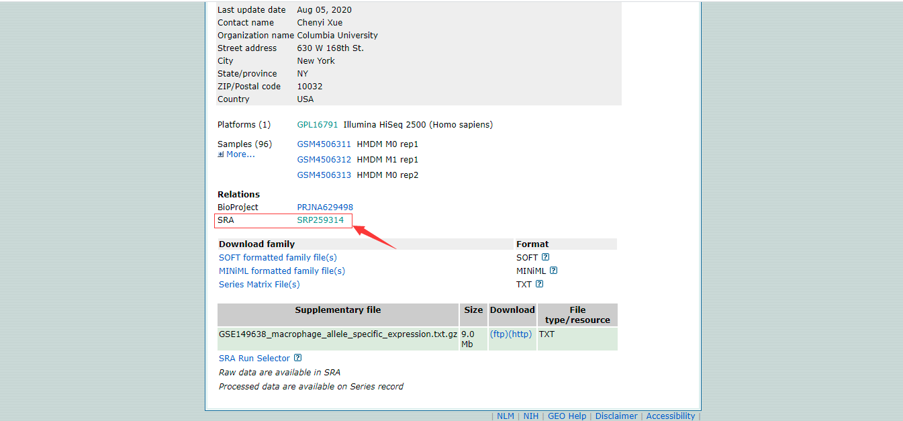
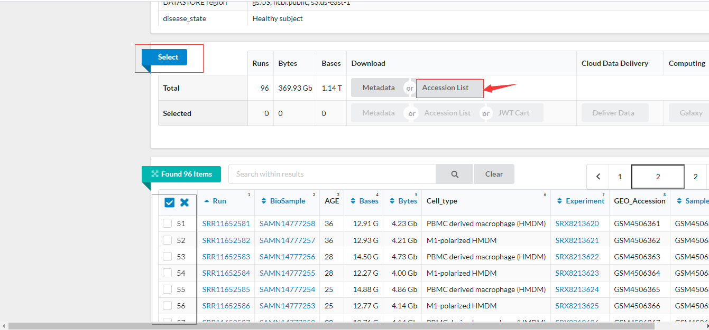
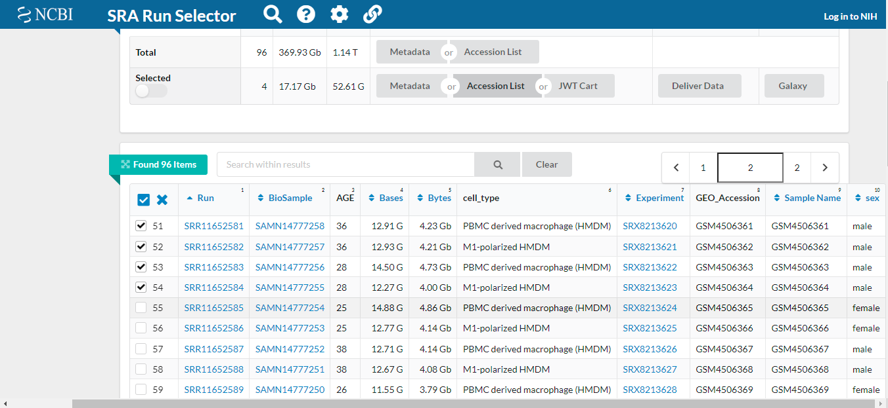

# 转录组数据(Transcriptome data)练习01
当做高通量数据分析时，常要从公共数据库如 NCBI、EBI 下载他人提交的高通量测序数据。

## 数据来源？

为了方便操作，我们以GSE149638这个为例子
-  口口相传的NCBI,当年上课时就听说过这个，不妨试试


- 2. 如果没有，可以问问百度百度呗。

## 获取Accession List

在NCBI中，原始数据被储存为sra格式，把页面拉到最下方。

如果我点击Aceesion List 会下载一个文件，包含了序列号。


## 正式下载
第一眼看到这么多的数据时，想到emm，下载会很麻烦。如果有个工具就好了。
NCBI自然是有的，sra toolkit
且看:
>https://trace.ncbi.nlm.nih.gov/Traces/sra/sra.cgi?view=software

从NCBI上下载SRA原始数据，使用SRA TOOLKIT 进行下载和转化。
### sra toolkit

```bash
## 建议在专用的 data 目录下
## 2021，06，21
## 记得查看环境变量中有没有这些工具的路径

# 自己的家目录哈
echo $HOME

mkdir -p  $HOME/rna/test/small_raw/
# 在 23.GSE149638 这个公共数据集里面是96个双端测序的转录组数据
# 注意，我把 SRR_Acc_list.txt放在这里，ヾ(￣▽￣)
cd  $HOME/project/23.GSE149638/raw
cat ./SRR_Acc_List.txt | while read id
do
echo prefetch ${id} -O ./
done > downloadsra.sh

less downloadsra.sh
nohup bash downloadsra.sh &
```




文件比较大，谨慎使用，这里为了方便演示，只下载了
SRR11652581
SRR11652582
SRR11652583
SRR11652584

## 将SRA格式的数据转换为fastq格式
SRA（Sequence ReadArchive）数据库是用于存储二代测序的原始数据，这种数据格式不能直接进行处理，需要转换成fastq或fasta文件格式才能进行质控以及去adapt等处理。


```bash
# 为了方便演示，就在当前文件夹下操作
# 查看文件内容，对每一个文件操作
cat ./SRR_Acc_List.txt | while read id
do
echo "fasterq-dump -e 32 --split-files -O ./ --outfile ${id}.fastq ${id}.sra"    # 这一步使用fastq-dump或fasterq-dump都可以
echo "pigz -p 16 -f ./${id}_1.fastq"
echo "pigz -p 16 -f ./${id}_2.fastq"
done > sra2fq.sh

# 查看脚本文件内容
less sra2fq.sh
nohup bash sra2fq.sh &
```
## 常见问题
1. preftech 下载很慢，有别的推荐吗？
Aspera试试呗；这篇文章有介绍
>[RNA-seq数据分析完全指北-01：数据下载](https://mp.weixin.qq.com/s?__biz=MzUzMTEwODk0Ng==&mid=2247496322&idx=2&sn=f9c78a63e8fd4d9f28b86d028d9c2f1c&chksm=fa4537bfcd32bea9417ef4766344019431743f90171f675c425b6ba0e81c91860e0d60ba88bc&scene=178&cur_album_id=1749887454125293572#rd)

2. 你的命令太复杂，我看不懂，比如read是什么意思。
(⊙﹏⊙)，使用 man read瞅一瞅；
的确，比较复杂，写多了，就好些啦。

## 总结：
<!-- 这里该画张图，就可以啦，但是不清楚怎么画图 -->
## references
>[RNA-seq数据分析完全指北-01：数据下载](https://mp.weixin.qq.com/s?__biz=MzUzMTEwODk0Ng==&mid=2247496322&idx=2&sn=f9c78a63e8fd4d9f28b86d028d9c2f1c&chksm=fa4537bfcd32bea9417ef4766344019431743f90171f675c425b6ba0e81c91860e0d60ba88bc&scene=178&cur_album_id=1749887454125293572#rd)

>[NCBI sratoolskits](https://github.com/ncbi/sra-tools)
>