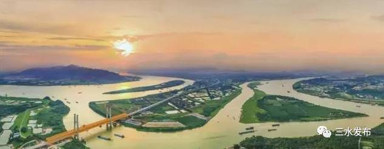
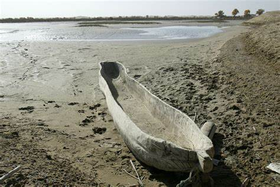
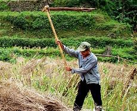

# 处暑闲谈
-   谦谦君子，利涉大川。

>川：
流水（`大江大河`)的样子,山等也行。

>

那么过大河咋办，一般想的是船，古人没那么多选择的。条件好点儿的，用舟。

舟：
>将`木头中间`挖**空**。

-   谦谦君子，卑以自牧。

卑：
>人拿着工具，或者甲,向上的。

>

感觉很有力量，对呗。

>向下的,则相反:

>

>牧，牧马人？ 放牛的，大致的意思是管理。用现代的话说，叫自律。

>谦谦君子，指的是：美好德行的人。

----
## 总结：
古人（很久很久以前的，周), 想翻过大江大河，是没什么选择的。

这两句话的意思：大致就是说：面对困境Σ(っ °Д °;)っ（大江大河）时候，该怎么办。
诚然，更详细的操作，得依据各人情况而定

认认真真生活，脚踏实地，自然心中有力量，自然是物来就我，境随心转。

>《周易·谦》