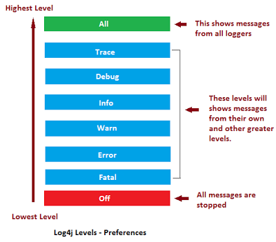

# 日志
这里说的是服务器日志(server log),记录服务器电脑软件,如：网站的记录
>在计算机的领域里，日志文件指的是：操作系统或者其他软件在运行时的记录，如发生的事件；或者用户之间传递消息。日志就是来保存这些记录的，消息通常会存储在单独的文件中。
>广泛使用的日志的一般标准：syslog, 它由互联网工程任务组（IETF）的RFC 5424中定义。syslog标准使专门的标准子系统得以生产生、过滤、记录和分析信息。

## 日志记录
这里以python的日志处理为例
-   四个组件
    -   Loggers:日志记录的处理类/对象，一个Logger可以有多个Handler
    -   Handlers:对于每一条日志消息如何处理，记录到文件，控制台，还是网络
    -   Filters:定义过滤器，用于Logger/Handler之上
    -   Formmaters:定义文本记录的格式

## 引用
>[日志](https://zh.wikipedia.org/wiki/%E6%97%A5%E5%BF%97)
>[Server_log](https://en.wikipedia.org/wiki/Logging_(software)#Server_log)
>[log 4 image](https://javafindings.wordpress.com/2013/06/12/integrating-log4j-with-spring-3-0-mvc/)