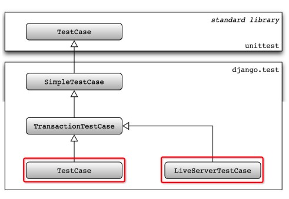
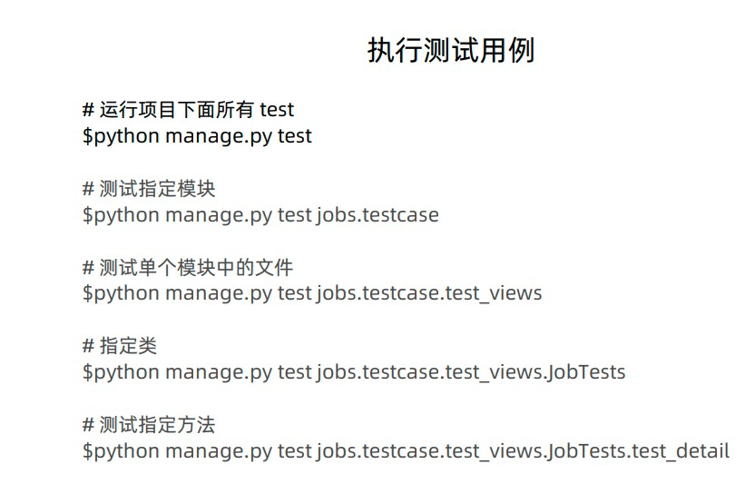
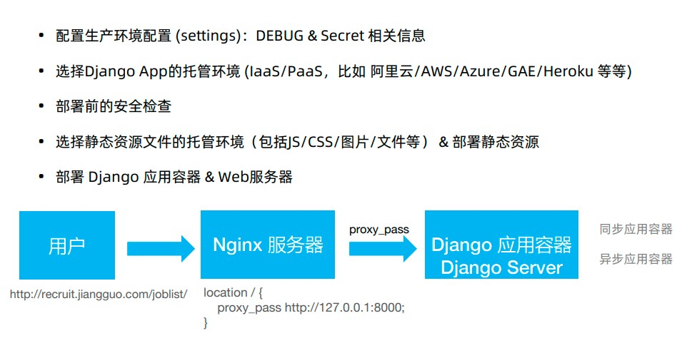

# 生产环境部署
-   单元测试
-   生产环境Django配置

-   SimpleTestCase: 可以发起HTTP请求，跟页面，模板，URL交互，禁止了数据库的访问
-   Transaction TestCase: 在用例运行之后，清理所有表来重置数据库；可以以提交、回滚来观察中间状态（需要测试事务时）使用
-   TestCase：测试用例执行完后不清理表数据；在一个事务中执行用例，最后回滚事务。
-   LiveServerTestCase：在后台自动启动一个Server，以便使用外部工具如Selenium做测试


-   哪些逻辑需要测试
    -   Django自带的代码（框架中实现的）逻辑不需要测试
    -   自己写的代码测试，比如自定义的页面的访问，自定义的功能菜单

-   测试用例目录组织
    -   Django使用unitest模块的内置测试查找机制
    -   它将在当前工作目录下，查找任何匹配模式test*.py命名的文件作为Test Case。
    -   job/
        -   /testcase/
        -   __init__.py
        -   test_forms.py
        -   test_views.py


## 生产环境与开发环境配置分离
-   生产环境与开发环境配置隔离开，开发环境允许Debugging
-   敏感信息不提交到代码库，比如数据库连接，secret key, LDAP连接信息等
-   生产、开发环境使用的配置可能不一样，比如 分别使用MySQL/Sqlite数据库

## 发布到生产环境的步骤


Nginx服务器
1.  处理静态资源
2.  处理后端服务的代理（路由转发）

需要调整的关键配置
-   DEBUG.在生产环境中设置为False(DEBUG = False)。避免在web页面上显示敏感的调试跟踪和变量信息
-   SECRET_KEY.这是用于CRSF保护的随机值。
-   ALLOWED_HOSTS，生产环境必须设置允许访问的域名。
-   生成SECRET_KEY
```python
python -c 'from django.core.management.utils import get_random_secret_key;
print(get_random_secret_key())'
```

## 配置生产环境：密钥的存储和管理
-   从环境变量读取配置，或从配置文件中读取
-   从KMS系统中读取配置的密钥
    -   自己部署的KMS系统
    ```python
    import os
    DEBUG = FALSE
    SECRET_KEY = os.environ.get('DJANGO_SECRET_KEY', 'xxxxzz')
    ALLOWED_HOSTS = ['127.0.0.1', 'www.baid.com']
    ```

    -   云服务的KMS服务：阿里云/AWS的KMS服务

### 部署到生产环境
部署前的安全检查
```shell
python manage.py check --deploy
```

静态资源文件的托管环境
-   静态内容Web服务器: Apache/Nginx
-   CDN服务器

collectstatic工具：用来收集静态资源文件，settings中的相关设置:
-   STATIC_URL：能够访问到静态文件的URL路劲。
-   STATIC_ROOT: collectstatic工具用来保存收集

```python
python manage.py collectstatic --settings=setting.local
```
收集完成后，可以将这些静态文件，上传到托管文件的服务器/CDN。
python 处理动态资源

## Django应用容器
-   同步应用
    -   uWSGI：C实现的Python Web容器;Web服务器Apache/Nginx与django-uwsgi进程通信来提供动态的内容。
    -   gunicorn:纯Python实现的高性能Python应用容器，无外部依赖，简单容易配置；不追求性能的时候，推荐使用gunicorn
-   异步应用
    -   Daphne：twisted实现
    -   Hypercorn：基于sans-io hyper, h11, h2, wsproto实现
    -   Uvicorn：基于uvloop and httptools实现

## Django 应用容器 - 异步支持Roadmap
-   Django的异步支持Roadmap
    -   Django 3.0 - ASGI Server
    -   Django 3.1 - Async Views
    -   Django 3.2/4.0 - Async ORM

异步处理，可以节省线程资源，提高了吞吐量
```python
# 异步视图
async def view(request):
    await asyncio.sleep(0.5)
    return HttpResponse("Hello, async world!")

```

## 启动服务器
-   同步应用服务器，以gunicorn为例
```
python -m pip install gunicorn
export DJANGO_SETTINGS_MODULE=settings.local
gunicorn -w 3 -b 127.0.0.1:8000 recruitment.wsgi:application
```
以上启动3个worker进程，绑定到本机的8000端口

-   异步应用服务器，以uvcorn为例
```python
python -m pip install uvcorn
export DJANGO_SETTINGS_MODULE=settings.local
uvicorn recruiment.asgi:application --workers 3
```

静态资源提供服务的功能是放在前端的Web服务器上去的
比如说Nginx、Tengine
同时在Nginx或者Appache2
做一个URL的路由分发，做一个proxy_pass
将请求转发到后面的容器服务

<!-- django_prometheus的作用是啥 -->
使用异步容器的代码时，所有的调用都应该是异步的


## 应用水平扩展：使用负载均衡
WAF做防火墙挺好的
Apache和Nginx的区别:
-   Apache是多线程模型，单独处理
-   Nginx 异步处理
-   Tengine是淘宝开发的分支
    -   https://tengine.taobao.org/
    -   Tengine完全兼容Nginx, 同时提供了额外的强大功能
    -   增强了相关运维、监控能力，比如异步打印日志及回滚，本地DNS缓存，内存监控
    -   动态脚本语言Lua支持。扩展功能简单高效
    -   更加强大的负载均衡能力，包括一致性hash模块、绘画保持模块
    -   主动健康检查，根据服务器状态自动上线下线，以及动态解析upstream中出现的域名
    -   输入过滤器机制支持，更强大的防攻击（访问速度限制）模块；方便实现应用防火墙
    -   ...

最简单配置：路由转发请求到Gunicorn/uwsgi请求
```bash
server {
    listen 80;
    server_name recruit.ww.com

    location / {
        # 转发请求 到gunicorn进程处理
        proxy_pass http://127.0.0.1:8000

        proxy_set_header Host               $http_host;
        proxy_set_header X-Real-IP          $remote_addr;

        # 包含了 客户端地址，以及各级 代理 IP的完整 IP 链
        proxy_set_header X-Forwarded-For    $proxy_add_x_forwarded_for;
    }
}

```
tmux attach 
## 上传大量文件到数据库
数据量不大，但是数量多，实际上不适合hdfs来存储的。
-   第三方模块处理，pymysql模块
-   以文件导入的方式加载

## 文件和图片上传 
-   本地存储
-   使用分布式文件存储，如：hdfs
-   使用云OSS存储
    -   复用前面创建好的类，把存储替换为OSS存储
    -   提升系统扩展性、可靠性

    -   使用OSS存储文件/图片
    -   安装OSS库
    -   OSS的依赖项目添加django_oss_storage到APPS
    -   settings里面添加OSS设置

## 数据建模 & 企业级数据库设计原则
3个基础原则，4个扩展性原则，3个完备性原则
基础原则，构建数据表都会用
扩展性原则，根据实际应用来判断，可以根据应用的数据量和支持的并发量来评估
面向C端的大数据量高并发的互联网应用

3个基础原则
-   结构清晰：表名、字段命名没有歧义，能一眼看懂
-   唯一职责：一表一用，领域定义清晰，不存储无关信息，相关数据在一张表中
-   主键原则：设计不带物理意义的主键；有唯一约束，确保幂等

4个扩展性原则（影响系统的性能和容量）
-   长短分离：可以扩展，长文本独立存储；有合适的容量设计
-   冷热分离：当前数据与历史数据分离
-   索引完备：有合适索引方便查询
-   不适用关联查询：不使用一切的SQL Join操作，不做2个表或更多表的关联查询

3个完备性原则
-   完整性：保证数据的准确性和完整性，重要的内容都有记录
-   可追溯性：可追溯创建时间，修改时间，可以逻辑删除
-   一致性原则：数据之间保持一致，尽可能避免同样的数据存储在不同表中


## 报错
```bash
mysql.connector.errors.DatabaseError: 2068 (HY000): LOAD DATA LOCAL INFILE file request rejected due to restrictions on access
```

## 参考
>[python 大数据实践之一:导入大批量数据文件到mysql](https://zhuanlan.zhihu.com/p/133680339)

>[ERROR 2068 (HY000): LOAD DATA LOCAL INFILE file request rejected due to restrictions on access](https://stackoverflow.com/questions/63361962/error-2068-hy000-load-data-local-infile-file-request-rejected-due-to-restrict)

>[Python并发编程入门：(一)概览](https://zhuanlan.zhihu.com/p/438107406)

>[若谷学院技术分享 ](https://www.ruoguedu.com/post/django-course-faq/)
