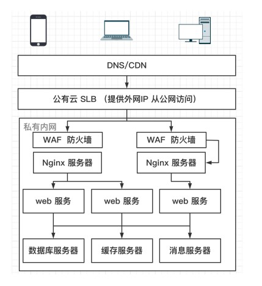

# 主要是安全防护
## CSS (Crosss-site scripting, XSS)
代码注入的一种。用户登陆并访问页面，利用网页开发时留下的漏洞，通过特殊的方法注入指令到网页，使特殊的用户加载并执行这种程序。通常这种程序是JavaScript编写的，可以获取较高的权限和内容。
    使用自带的特殊函数(render)，或者通用视图，会将所有的HTML转义，所有的自带的脚本不会执行
    如果需要执行，可以用弱函数转义...

## CSRF 跨站请求伪造和SQL注入攻击
-   Cross-site request forgery, also known as one-click attack or session riding and abbreviated as CSRF or XSRF.
-   恶意攻击者在用户不知情的情况下，使用用户的身份来操作

-   hacker schedule..
    -   创建一个请求A类的URL的Web页面，放在恶意网站B中，这个文件包含了一个创建用户的表单。这个表单加载完毕就会立即进行提交。
    -   黑客创建一个请求网站A类的URL的Web页面，放在恶意网站B中，这个文件包含了一个创建用户的表单。这个表单加载完毕就会立即进行提交。比如：获取cookie
    -   黑客把这个Web页面的URL发送至超级管理员，诱导超级管理员打开这个Web页面
    -   解决：服务端设置token
-   SQL注入漏洞：用户直接对网站数据库执行任意的SQL语句，在无需用户权限的情况下即可对数据访问、修改和删除
-   Django的ORM系统自动规避了SQL注入攻击
-   注意使用原始的SQL语句，切记避免拼接字符串
 ```Django
 <!-- 变量绑定的 -->
 <!--  -->
    name_map = {'first': 'first_name', 'last':'last_name', 'bd': 'birth_date'}
    Person.objects.raw('SELECT * FROM employee',
    translations=name_map)
 ```

## 数据安全
通常使用SSL协议和HTTPS来传输数据
数据的存储和日志的记录，敏感的数据可以加密

CA证书的颁发机构
Let's Encrypt SSL证书的使用
-   云厂商购买
-   Let's Encrypt是一家非盈利机构，免费提供SSL证书
-   Let's Encrypt的目标是为了构建一个安全的互联网
-   Let's Encrypt的证书被各大主流的浏览器和网络服务商支持
-   提供的证书90天过期，需要重新申请。有相应的工具可以使用。


-    Cerbot的两种方式
    -   Webroot方式
    -   Standalone方式
        -   会自动运行web server 来进行验证。

比如：基本各大厂商都用HTTPS，apple的App store 只允许HTTPS的连接🔗跟服务端交互了。

敏感数据加密
-   比如用户提交的内容，财务报告，第三方合同等数据进行加密
-   比如Python的cryptography库

日志脱敏
在日志记录中，过滤掉敏感信息存储，避免敏感性息泄漏
-   用户名
-   密码
-   手机号
-   地址
-   sensitive_variables装饰器可以

## 密码与业务安全
-   权限控制
    -   遵循最小原则，长时间没用自动回收
    -   思路：定时任务检查所有用户，找到长时间没有登陆的用户，回收相应的权限或删除账号
-   密码策略
    -   密码复杂度策略
    -   定期更新策略

Django密码中间件，密码验证策略AUTH_PASSWORD_VALIDATORS

密码过期策略：可以使用django-user-accounts插件

## 应用安全
    - 大量非正常的并发请求
    - 密码攻击，大量的密码去破解，尝试登陆
      - 在用户连续登陆n次后，要求输入验证码，短信登陆
      - 比如：使用 simple captcha插件
        - 一般步骤:
        - 添加登陆验证Form和Views视图
        - 添加登陆模板页
        - 添加登陆失败的频次控制
        - 设置管理员的登陆页，默认使用带连续失败需要验证码的页面
    - 访问限流
      - Rest Framework API限流
      - 应用限流：对页面的访问频次进行限流
      - 对特定的ip或者用户
        - 可以对匿名用户，一般的用户限流
        - 可以设置峰值流量（如每分钟60次请求）
        - 也可以设置连续一段事件的流量限制（比如每天3000次）
```python
REST_FRAMEWORK = {
    'DEFAULT_THROTTLE_CLASSES': [
        'rest_framework.throttling.AnonRateThrottle',
        'rest_framework.throttling.UserRateThrottle',
    ],
    'DEFAULT_THROTTLE_RATES': {
        'anon': '2/min',
        'user': '10/min'
    }
}
```

-   应用限流：对页面的访问频次进行限流
    -   示例策略:
    -   一分钟最多请求5次登录页，防止
    -   可选:django-ratelimit插件

## 架构安全
-   应用的部署架构
    -   典型中小型应用部署架构
    -   服务器内部组成私有网络

-   密钥的存储原则
    -   基础的用法：使用环境变量/独立的配置文件，不放在代码库
    -   使用Key Server: 使用开源的Key Server,或阿里云/AWS的KMS服务
        -   容器环境，启动容器作为环境变量传入 - 密钥不落地到容器存储中


## 引用
>[Cross-site scripting](https://en.wikipedia.org/wiki/Cross-site_scripting)

>[Cross-site request forgery](https://en.wikipedia.org/wiki/Cross-site_request_forgery)

>[SQL injection](https://en.wikipedia.org/wiki/SQL_injection)
