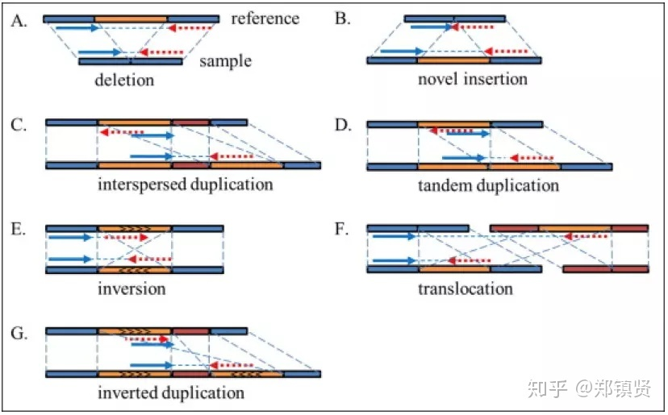

# **WGS初探**

    全基因组测序（WGS, Whole Genome Sequencing）是下一代测序技术，一次确定生物体基因组DNA序列的全部或几乎全部的过程，用于快速，低成本地确定生物体的完整基因组序列。
    这需要对生物体的所有染色体DNA以及线粒体和植物叶绿体中包含的DNA进行测序。

[全基因组测序不应与DNA谱图相混淆，DNA谱图只能确定遗传物质来自特定个体或群体的可能性，并且不包含有关遗传关系，起源或对特定疾病的易感性的其他信息。](https://en.wikipedia.org/wiki/Whole_genome_sequencing)

## 一般流程
    WGS分析流程能分为三大块，数据处理、检测变异和综合分析。

1. **基因组对齐**.本质上就是大规模的字符串匹配问题,求解两个序列的相似度, 可以通过动态规划的方法以及大名顶顶的blast算法来解决. 
2. 
<em style="color:red; font-weight:bold;">变异检测</em>其中先搞清楚变异的种类,目前主要包括几种: 
 
   1. **单碱基变异**，即单核苷酸多态性(SNP)  
   2. 较短的连续的**插入(Insertion)**或者**缺失(Deletion)**,简称 **Indel**,这里的较短指的是不超过50 base pair(bp)的线性长度  
   3. **基因组结构性变异(SVs, Structure Variantions)**,这个就相对复杂,包括50bp以上的长片段序列插入或者删除（Big Indel）、串联重复（Tandem repeate）、染色体倒位（Inversion）、染色体内部或染色体之间的序列易位（Translocation)等等,

### 一些可以用的工具
<ul>
<li>samtools ,这是一个用于操作原始数据的工具,包括堆基因数据的查看,排序和合并等等,十分强大 </li>
<li>bwa, 这是一个序列比对到参考基因组上的工具,能够快速的进行基因组比对.</li>
<li> GATK, 强大的工具包,用于分析变异信息</li>
<li>sratoolkit,用于将NCBI数据装换的工具包tabix, 压缩和解压工具</li>
</ul>
