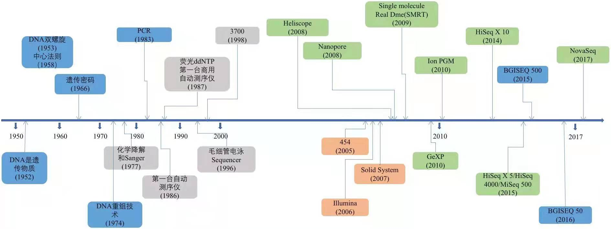
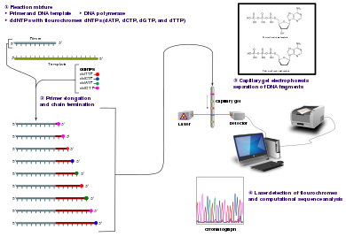
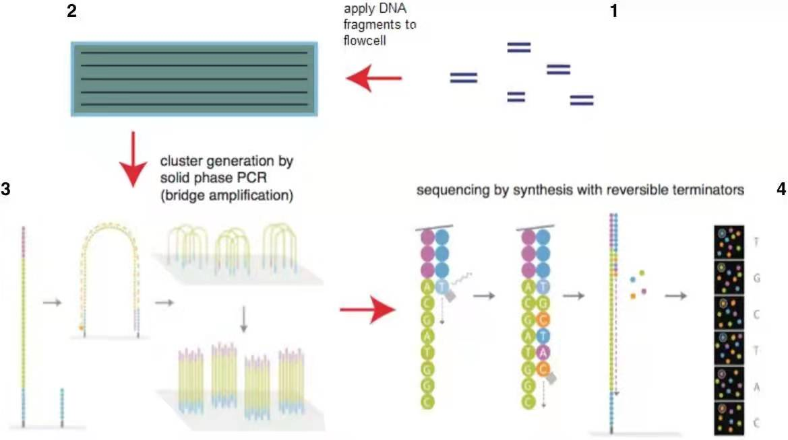
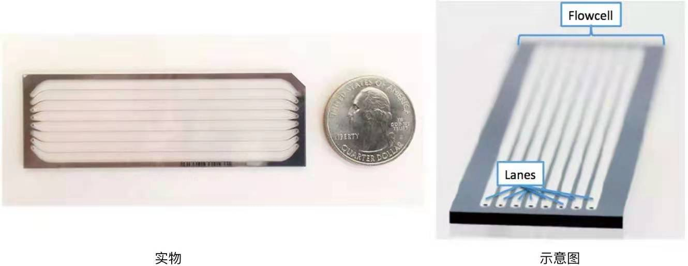
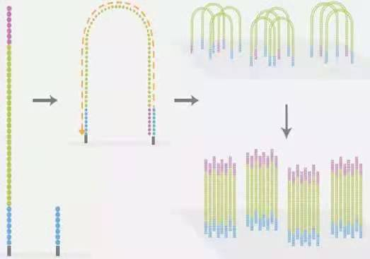
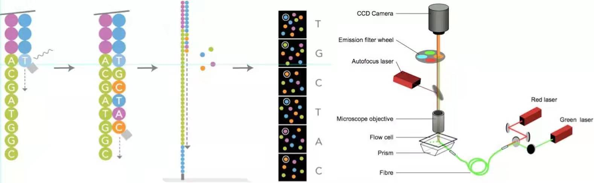
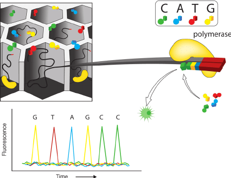

# 全基因组测序分析 chapter 01
    资料来源 公众号<碱基矿工>，google...
## 测序技术
    中国大型测序平台(HiSeq X 10)
-   全基因组（Whole Genome Sequencing, WGS)
    -   把物种细胞中的完整基因组序列从第1个DNA开始一直到最后一个DNA,完完整整地检测出来，并排列好，

## NGS测序技术
    高通量测序技术（High-throughput sequencing）又称“下一代”测序技术（"Next-generation" sequencing technology）

    诞生于1977年的第一代Sanger技术，在整个技术发展的更迭过程中，测序读长从长变短
    再从短变长。
    虽然目前是第二代，但是第三代测序技术也快速的发展中。

    
     
    
测序技术的发展

## 第一代测序技术
    1975年，桑格(Sanger)和考尔森(Coulson)开创的链终止法
    或者是1976-1977年由马克西姆(Maxam)和吉尔伯特(Gilbert)发明的化学法（链降解）

    1977年，Sanger老人家测定了第一个基因组序列---噬菌体phiX-174,5,375个碱基。

    2001年，完成的首个人类基因组图谱就是器技术的改进版。

### Sanger法的核心
    由于ddNTP（4种带有荧光标记的A,C,G,T碱基）的2’和3’都不含羟基，其在DNA的合成过程中不能形成磷酸二酯键，因此可以用来中断DNA的合成反应，在4个DNA合成反应体系中分别加入一定比例带有放射性同位素标记的ddNTP（分别为：ddATP,ddCTP,ddGTP和ddTTP），然后利用凝胶电泳和放射自显影后可以根据电泳带的位置确定待测分子的DNA序列。

    Sanger sequencing is a method of DNA sequencing based on the selective incorporation of chain-terminating dideoxynucleotides by DNA polymerase during in vitro DNA replication.[1][2] After first being developed by Frederick Sanger and colleagues in 1977, it became the most widely used sequencing method for approximately 40 years. It was first commercialized by Applied Biosystems in 1986.[3] More recently, higher volume Sanger sequencing has been replaced by "Next-Gen" sequencing methods, especially for large-scale, automated genome analyses. However, the Sanger method remains in wide use, for smaller-scale projects, and for validation of Next-Gen results. It still has the advantage over short-read sequencing technologies (like Illumina) in that it can produce DNA sequence reads of > 500 nucleotides.

    
     
    
Sanger测序技术（来源：wiki ）

## 第二代测序技术

    第一代技术，成本高了些。严重影响了其真正大规模应用

    Rocha公司的454技术、illumina公司的Solexa/Hiseq技术和ABI公司的SOLID技术为代表的技术应运而生。

    以前完成一个基因组的测序时间需要3年----->变成1年，但是序列读长更短。
    大多只有100bp-150bp

### illumina公司的技术为基础简单介绍

<a href="https://www.illumina.com/techniques/sequencing/dna-sequencing.html">DNA Sequencing Methods Review</a>

-   构建DNA文库

-   测序流动槽（flowcell)

-   桥式PCR扩增与变性

-   测序

    测序方法采用边合成边测序的方法。
    
**向反应体系中同时添加DNA聚合酶、接头引物和带有碱基特异荧光标记的4中dNTP（如同Sanger测序法）。这些dNTP的3’-OH被化学方法所保护，因而每次只能添加一个dNTP，这就确保了在测序过程中，一次只会被添加一个碱基。同时在dNTP被添加到合成链上后，所有未使用的游离dNTP和DNA聚合酶会被洗脱掉。接着，再加入激发荧光所需的缓冲液，用激光激发荧光信号（图illumina4.jpg），并有光学设备完成荧光信号的记录，最后利用计算机分析将光学信号转化为测序碱基。**
    
    这样荧光信号记录完成后，再加入化学试剂淬灭荧光信号并去除dNTP 3’-OH保护基团，以便能进行下一轮的测序反应。

## 第三代测序技术
    PacBio公司的SMRT和Oxford Nanopore Technologies的纳米孔单分子测序技术

    单分子测序，测序过程无需进行PCR扩增，超长读长

    不想写了，乏了，用到再写。。。
    
    在一个反应管(SMRTCell:单分子实时反应孔)中有许多这样的圆形纳米小孔,，即 ZMW(零模波导孔)，外径100多纳米，比检测激光波长小(数百纳米)，激光从底部打上去后不会穿透小孔进入上方的溶液区，能量会被限制在一个小范围(体积20X 10-21 L)里（图10-A），正好足够覆盖需要检测的部分，使得信号仅仅只是来自于这个小反应区域，孔外过多的游离核苷酸单体依然留在黑暗中，从而实现将背景噪音降到最低的目的。

### PacBio SMRT
    边合成边测序的思想，并以SMRT芯片为测序载体（如同flowcell)

    基本原理是： DNA聚合酶和模板结合，用4色荧光标记A,C,G,T这4种碱基（即是dNTP）。在碱基的配对阶段，不同的碱基加入，会发出不同的光，根据光的波长与峰值可判断进入的碱基类型。
