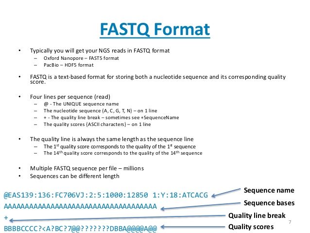
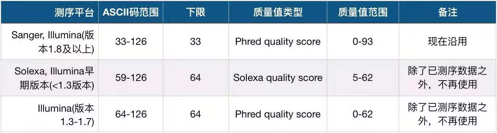

# 全基因组测序分析 chapter 02
## FASTA 和FASTQ

存储核酸序列信息（`DNA序列`）或者`蛋白质序列信息`最常使用,但却完全是纯文本文件
-   FASTA,发音fast-A
-   FASTQ,发音fast-Q

### FASTA
    1988年，这由William.R.Pearson和David.J.Lipman所编写，目的用于生物序列数据的处理。

    这个A代表的Alignment

    自那之后，生物学家和遗传学家们也没做过多的考虑，就草率地决定（其实类似的‘草率’行为在组学领域经常碰到）把FASTA作为这种存储有顺序的序列数据的文件后缀【注】，
    
    这包括我们常用的参考基因组序列、蛋白质序列、编码DNA序列（coding DNA sequence，简称CDS）、转录本序列等文件都是如此，文件后缀除了.fasta之外，也常用.fa或者.fa.gz（gz压缩）。

#### FASTA文件构成
    FASTA文件主要由两个部分构成：序列头信息（有时包括一些其它的描述信息）和具体的序列数据。头信息独占一行，以大于号（>）开头作为识别标记，


-   第一，除了序列内容之外，FASTA的头信息并没有被严格地限制。
-   这对于程序处理来说，凌乱的格式显然是不合适的。因此后来在业内也慢慢地有一些不成文的规则被大家所使用，那就是，用一个空格把头信息分为两个部分：第一部分是序列名字，它和大于号（>）紧接在一起；第二部分是注释信息，这个可以没有，就看具体需要，
-   第二，FASTA由于是文本文件，它里面的内容是否有重复是无法自检的，在使用之前需要我们进行额外的检查。

### FASTQ文件
    这是目前存储测序数据最普遍、最公认的一个数据格式，另一个是uBam格式，但这篇文章中不打算对其进行介绍。上面所讲的FASTA文件，它所存的都是已经排列好的序列（如参考序列），FASTQ存的则是产生自测序仪的原始测序数据，它由测序的图像数据转换过来，也是文本文件，文件大小依照不同的测序量（或测序深度）而有很大差异，小的可能只有几M，大的则常常有几十G上百G，文件后缀通常都是.fastq，.fq或者.fq.gz（gz压缩）




-   第一行：以‘@’开头，是这一条read的名字，这个字符串是根据测序时的状态信息转换过来的，中间不会有空格，它是每一条read的唯一标识符，同一份FASTQ文件中不会重复出现，甚至不同的FASTQ文件里也不会有重复； 

-   第二行：测序read的序列，由A，C，G，T和N这五种字母构成，这也是我们真正关心的DNA序列，N代表的是测序时那些无法被识别出来的碱基；

-   第三行：以‘+’开头，在旧版的FASTQ文件中会直接重复第一行的信息，但现在一般什么也不加（节省存储空间）；

-   第四行：测序read的质量值，这个和第二行的碱基信息一样重要，它描述的是每个测序碱基的可靠程度，用ASCII码表示。
  
----
碱基质量值就是能够`定量描述`碱基`好坏程度`的一个数值。

#### 碱基质量值
    测序错误为p_error,质量值为Q
```python
    Q = -10 * log(p_error)
```
    碱基的测序错误率:0.01   ----> 质量值 20 (俗称Q20)
    碱基的测序错误率:0.001  ----> 质量值 30 (俗称Q30)

#### Q:为什么用ASCII码值表示？
    方便存储、处理
    不过用于计算机所带的字符集和编码规则的限制
    小于33的ASCII码值所表示的都是不可见字符，比如：空格、换行符等
**所以得避开这些字符**

    33 ---> Phred33
    64 ---> Phred64(Solexa的除外，它叫Selexa64)

    不过现在一般都是使用Phred33这个体系，而且33也恰好是ASCII的第一个可见字符('!'),完美 +2。
```bash
less $1 | head -n 1000 | awk '{if(NR%4==0) printf("%s",$0);}' \| od -A n -t u1 -v \
| awk 'BEGIN{min=100;max=0;} \  {for(i=1;i<=NF;i++) {if($i>max) max=$i; if($i<min) min=$i;}}END \  {if(max<=126 && min<59) print "Phred33"; \  else if(max>73 && min>=64) print "Phred64"; \  else if(min>=59 && min<64 && max>73) print "Solexa64"; \  else print "Unknown score encoding"; \  print "( " min ", " max, ")";}'
```

